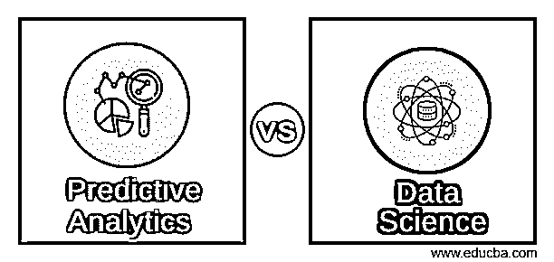
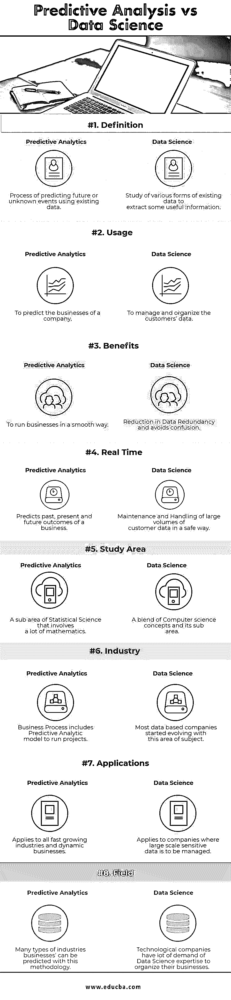

# 预测分析与数据科学

> 原文：<https://www.educba.com/predictive-analytics-vs-data-science/>

## 预测分析与数据科学的区别

[预测分析是从](https://www.educba.com/what-is-predictive-analytics/)[数据挖掘](https://www.educba.com/data-mining-techniques/)、[机器学习](https://www.educba.com/statistics-vs-machine-learning/)和预测建模中得出的统计技术的过程，获取当前和历史事件，以预测未来事件或未来未知的结果。

[数据科学是对各种类型数据的研究](https://www.educba.com/what-is-data-science/)，例如[结构化](https://www.educba.com/what-is-structured-finance/)，任何形式或格式的半结构化和非结构化数据，以便从中获取一些信息。

<small>Hadoop、数据科学、统计学&其他</small>

预测分析是统计科学中的一个领域，现有信息将被提取和处理，以预测趋势和结果模式。该学科的核心在于分析现有的背景来预测未知的事件。

数据科学由用于研究数据的不同技术组成，如数据挖掘、数据存储、数据清除、数据存档、数据转换等。，以使其高效有序。

[预测分析](https://www.educba.com/predictive-analytics-tool/)不仅可用于预测未知的未来事件，也可用于预测现在和过去的事件。

数据科学通过从用户的互联网流量和搜索历史中收集信息来研究互联网用户的行为和习惯。这是推荐广告在用户的网页浏览页面上显示的方式，无需用户输入。

### 预测分析和数据科学之间的直接比较(信息图表)

以下是预测分析和数据科学之间的八大区别:

### 预测分析和数据科学的主要区别

以下是预测分析和数据科学之间的区别

1.  预测分析是统计科学的一个领域，其中数学元素的研究被证明是有用的，以便预测不同的未知事件，无论是过去、现在还是未来。数据科学是多种科学方法和过程的跨学科领域，用于从现有数据中提取知识。
2.  预测分析有不同的阶段，如[数据建模](https://www.educba.com/data-modeling-tools/)、数据收集、统计和部署，而数据科学有数据提取、数据处理和数据转换阶段，以从中获取一些有用的信息。
3.  预测分析中使用了许多技术，如数据挖掘、[人工智能](https://www.educba.com/artificial-intelligence-tools-applications/)、机器学习、统计和建模等。，分析现有数据，预测未来未知事件。数据科学是对现有信息进行处理，以便按照要求的方式进行组织和存储。
4.  预测分析揭示了结构化、非结构化和半结构化数据等不同类型数据之间的关系。结构化数据来自关系数据库，非结构化数据类似于文件格式，半结构化数据类似于 JSON 数据。数据科学由处理不同类型数据的不同工具组成，例如数据集成和操作工具。
5.  预测分析的步骤包括数据收集、分析和报告、监控以及预测分析，预测分析是决定未来结果事件的主要阶段，而数据科学包含数据收集、[数据分析](https://www.educba.com/course/data-analysis-pandas-python/)，从分析的数据中提取洞察力，将提取的数据用于业务目的。
6.  预测分析在银行和金融服务、[欺诈检测](https://www.educba.com/fraud-detection-analytics/)、降低风险和改善运营等行业中有许多应用。[数据科学应用](https://www.educba.com/data-science-applications/)是数字广告、互联网搜索、推荐系统、图像和语音识别、价格比较、路线规划和物流等。,
7.  预测分析应用涵盖石油、天然气、零售、制造、医疗保险和银行等行业。数据科学主要涵盖技术行业。
8.  预测分析是数据科学的子集。数据集成和数据建模来自预测建模。从 IT 管理到数据分析，数据科学无所不包。
9.  预测分析是创建预测模型并复制应用程序或系统或业务模型的行为的过程，而数据科学是用于研究即将被预测的已创建模型的行为的科学。
10.  例如，一家银行或金融机构拥有大量客户，将通过从现有信息中收集数据来分析客户行为，并预测未来的业务和潜在客户，其中客户将对银行产品表现出更大的兴趣。通过使用预测模型，这有助于银行业务的有效增长。
11.  预测分析的最终目标是通过创建一些预测模型，从已知的事物中预测未知的事物，以便成功地推动业务目标，而数据科学的目标显然是为我们实际上不知道的信息提供确定性的见解。

### 预测分析和数据科学对照表

下面是预测分析和数据科学的对照表。

| **BASIS FOR****比较** | **预测分析** | **数据科学** |
| **定义** | 利用现有数据预测未来或未知事件的过程 | 研究各种形式的现有数据，从中提取一些有用的信息 |
| **用途** | 预测公司的业务 | 管理和组织客户数据 |
| **好处** | 平稳地经营企业 | 减少数据冗余并避免混乱 |
| **实时** | 预测企业过去、现在和未来的结果 | 以安全的方式维护和处理大量客户数据 |
| **研究区域** | 涉及大量数学的统计科学的一个分支 | 计算机科学概念及其子领域的融合 |
| **行业** | 业务流程包括运行项目的预测分析模型 | 大多数基于数据的公司都是从这个领域开始发展的 |
| **应用程序** | 适用于所有快速增长的行业和充满活力的企业 | 适用于需要管理大规模敏感数据的公司 |
| **字段** | 用这种方法可以预测许多类型的行业 | 科技公司需要大量数据科学专业知识来组织他们的业务 |

### 结论

预测分析是从现有数据中捕捉或预测未来结果或未知事件的过程，而数据科学是从现有数据中获取信息。预测分析对于公司从现有数据集中预测未来的业务事件或未知事件非常有用。

数据科学将有助于对来自现有信息的数据进行处理和研究，从中获取有用和有意义的信息。[预测分析](https://www.educba.com/what-is-predictive-analytics/)和数据科学都在研究和推动公司未来走向成功的道路中发挥着关键作用。

预测分析是向经理、业务分析师和公司领导展示业务模型的最佳方式，以一种简单而出色的方式展示业务在日常会议中是如何发展的。

### 推荐文章

这是预测分析与数据科学的指南。在这里，我们讨论了预测分析与数据科学的直接比较、关键差异以及信息图表和比较表。您也可以阅读以下文章，了解更多信息——

1.  [13 种最佳预测分析工具](https://www.educba.com/predictive-analytics-tool/)
2.  [预测分析与预测的区别](https://www.educba.com/predictive-analysis-vs-forecasting/)
3.  [数据科学与软件工程| 8 大有用对比](https://www.educba.com/data-science-vs-software-engineering/)
4.  [5 个最有用的数据科学 vs 机器学习](https://www.educba.com/data-science-vs-machine-learning/)

