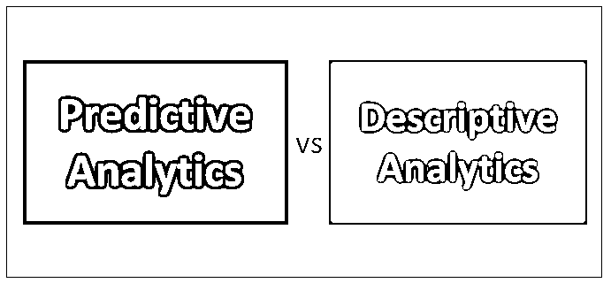
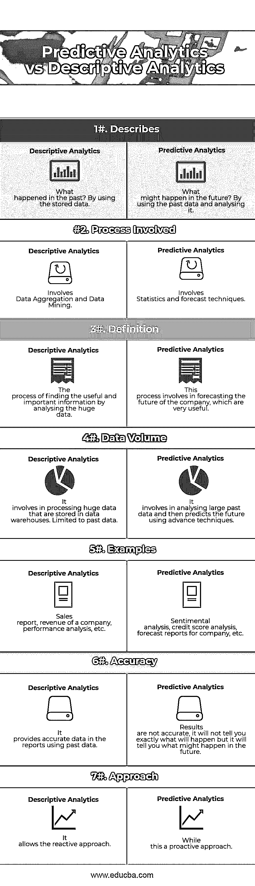

# 预测分析与描述分析

> 原文：<https://www.educba.com/predictive-analytics-vs-descriptive-analytics/>

## 预测分析与描述分析的区别

**预测分析**

预测分析将帮助组织了解接下来可能会发生什么，[它根据当前可用的数据预测未来](https://www.educba.com/what-is-predictive-analytics/)。它将分析数据，并提供尚未发生的语句。它做出各种你想知道的预测，所有的预测本质上都是概率性的。

<small>Hadoop、数据科学、统计学&其他</small>

**描述性分析**

描述性分析将帮助组织了解过去发生了什么，它将使用存储的数据为您提供过去的分析。对于一个公司来说，有必要了解过去的事件，帮助他们根据使用历史数据的统计数据做出决策。例如，您可能想知道您因欺诈损失了多少钱以及其他更多信息。

### 预测性分析和描述性分析之间的直接比较(信息图表)

以下是预测性分析和描述性分析的 7 大对比:

### 预测性分析和描述性分析的主要区别

以下是预测性分析和描述性分析的详细说明:

*   描述性分析会让你看到过去，并告诉你:发生了什么？而预测分析将识别未来，并告诉你:未来可能会发生什么？
*   描述性分析使用数据聚合和[数据挖掘技术](https://www.educba.com/data-mining-techniques/)来提供关于过去的知识，而预测性分析使用统计分析和预测技术来了解未来。
*   当您需要分析和解释组织的不同方面时，会使用描述性分析，而当您需要了解未来并填充您不知道的信息时，会使用预测性分析。
*   描述性模型将利用存储在数据库中的过去的数据，并为您提供准确的报告。在[预测模型](https://www.educba.com/predictive-modeling/)中，它识别在过去和交易数据中发现的模式，以发现风险和未来结果。
*   描述性分析将帮助一个组织了解他们在市场中的地位，展示事实和数据。而预测分析将帮助组织了解他们在未来的市场中的地位，并预测有关公司的事实和数据。
*   由描述性分析生成的报告是准确的，但由预测性分析生成的报告不是 100%准确，这种情况将来可能会发生，也可能不会发生。

### 预测分析和描述性分析对照表

用一个例子比较预测分析和描述分析。

一个国王雇佣了一个数据科学家在森林里寻找动物进行狩猎。数据科学家可以访问[数据仓库](https://www.educba.com/data-warehouse-interview-questions/)，其中有关于森林、其栖息地以及森林中正在发生的事情的信息。

第一天，数据科学家向国王提供了一份报告，报告显示了过去一年中他在森林中发现动物数量最多的地方。这份报告帮助国王决定在哪里可以找到更多的猎物。这是一个描述性分析的例子。

第二天，数据科学家确定了使用创新工具在特定地点和时间找到特定动物的可能性。这是预测分析的一个例子。这有助于国王不费吹灰之力就找到动物。

| **比较依据** | **描述性分析** | **预测分析** |
| **描述** | 过去发生了什么？通过使用存储的数据。 | 未来可能会发生什么？通过使用过去的数据并进行分析。 |
| **所涉及的过程** | 涉及数据聚合和数据挖掘。 | 涉及统计和预测技术。 |
| **定义** | 通过分析大量数据找到有用和重要信息的过程。 | 这个过程涉及到对公司未来的预测，这非常有用。 |
| **数据量** | 它涉及到处理存储在数据仓库中的大量数据。限于过往数据。 | 它包括分析大量过去的数据，然后使用先进的技术预测未来。 |
| **例题** | 销售报告、公司收入、业绩分析等。 | 情感分析、信用评分分析、公司预测报告等。 |
| **精度** | 它使用过去的数据在报告中提供准确的数据。 | 结果是不准确的，它不会告诉你到底会发生什么，但它会告诉你未来可能会发生什么。 |
| **接近** | 它允许被动的方法 | 虽然这是一种主动的方法 |

### 结论

在这篇博客中，我只指出了预测性分析和描述性分析之间的一些特征差异，结果表明这两种分析过程之间有着重要的实质性差异。

市场对分析的需求有所增加。如今，每个组织都在谈论[大数据](https://www.educba.com/big-data-interview-questions/)，但这只是为组织数据创造有价值且可操作的见解的起点。因此，预测分析和描述性分析等分析流程将帮助组织确定公司的表现如何，在市场中的地位，任何缺陷，任何需要注意的问题等等。通过在商业中应用这些分析过程，你将了解你的商业的洞察力和远见。

需要记住的要点是:

*   描述性分析的中心是数据的呈现，对管理前景的可视化。而预测分析是以帮助预测未来的统计模型为中心的。
*   预测分析具有更大的风险，因为它涉及根据过去的事件来分析未来到底会发生什么，但出于同样的原因，某些情况可能不会在未来完全发生。
*   在描述性分析中，风险较小，因为它涉及分析过去的数据并提供实际发生情况的报告。
*   对于任何组织来说，利用[预测分析](https://www.educba.com/what-is-predictive-analytics/)和描述分析非常重要，这样他们才能在市场中取得成功。

### 推荐文章

这是预测分析与描述分析的指南。在这里，我们讨论了预测性分析与描述性分析的直接比较、关键差异以及信息图表和比较表。您也可以阅读以下文章，了解更多信息——

1.  [预测分析与数据科学——了解 8 个有用的对比](https://www.educba.com/predictive-analytics-vs-data-science/)
2.  [预测分析与数据挖掘——哪个更有用](https://www.educba.com/predictive-analytics-vs-data-mining/)
3.  [通用分析与谷歌分析的重要区别](https://www.educba.com/universal-analytics-vs-google-analytics/)
4.  [预测分析与统计](https://www.educba.com/predictive-analytics-vs-statistics/)

