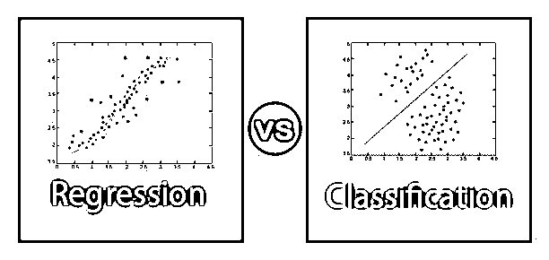
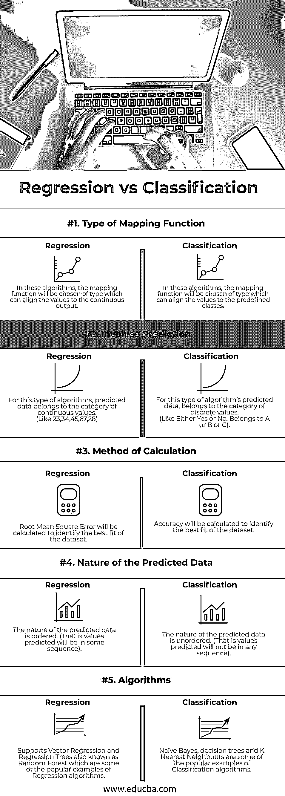

# 回归与分类

> 原文：<https://www.educba.com/regression-vs-classification/>

## 回归和分类的区别

在本文回归与分类中，让我们讨论回归和分类之间的主要区别。机器学习大致分为两种类型，它们是监督机器学习和非监督机器学习。在有监督的机器学习中，我们在数据集中有一个已知的输出值，我们基于这些训练模型并使用它进行预测，而在无监督的机器学习中，我们没有一组已知的输出值。在此之前，为了区分分类和回归，让我们了解一下这个术语在机器学习中是什么意思。回归是监督机器学习中的一种算法，可以被训练来预测实数输出。分类是监督机器学习中的一种算法，它被训练来识别类别并预测新值属于哪个类别。

### 回归和分类之间的直接比较(信息图)

下面是回归与分类的前 5 个比较 **:**

<small>Hadoop、数据科学、统计学&其他</small>

### 回归和分类的主要区别

让我们从以下几点来讨论回归与分类之间的一些关键差异:

1.  分类就是预测一个标签或类别。分类算法将所需数据集分类到一个或多个标签中；处理两个类或类别的算法称为二元分类器。如果有两个以上的类，那么可以称之为多类分类算法。
2.  回归就是找到一个最佳函数来识别连续实数值的数据，并对该数量进行预测。使用多个变量作为输入或特征来训练算法的回归称为多元回归问题。如果在回归问题中，输入值依赖于时间或按时间排序，则称为时间序列预测问题。
3.  但是，分类模型还会预测一个连续值，该值是属于相应输出类的事件发生的概率。在这里，事件的概率代表一个给定的例子属于一个特定类别的可能性。通过选择具有最高概率的类标签，可以将预测概率值转换为类值。
4.  让我们通过看一个例子来更好地理解这一点，假设我们正在训练模型根据一些特征来预测一个人是否患有癌症。如果我们得到一个人患癌症的概率为 0.8，而未患癌症的概率为 0.2，我们可以将 0.8 的概率转换为患癌症的类别标签，因为它具有最高的概率。
5.  正如上面在分类中提到的，为了了解分类模型的性能，我们计算了准确度。让我们看看计算是如何进行的，分类的准确性可以通过将正确预测与总预测的比率乘以 100 来进行。如果做了 50 个预测，其中 10 个是正确的，40 个是错误的，那么准确率将是 20%。

**准确率=(正确预测数/预测总数)* (100)**

*   准确度= (10/50) * (100)
*   准确度= **20%**

6.  如上文回归中所述，要了解回归模型的表现，最常用的方法是计算均方根误差(RMSE)。让我们看看计算将如何进行。

回归模型预测值为 4.9，而实际值为 5.3。

回归模型预测值为 2.3，而实际值为 2.1。

回归模型预测值为 3.4，而实际值为 2.9。

现在，可以使用公式计算均方根误差。

误差平方是(5.3-4.9)^2 = 0.16，(2.1-2.3)^2 = 0.04，(2.9-3.4)^2 = 0.25

误差平方的平均值= 0.45/3 = 0.15

均方根误差= 0.15 的平方根= 0.38

也就是 RMSE = 0.38。有许多其他方法来计算模型的效率，但 RMSE 是最常用的，因为 RMSE 提供的误差分数与预测值的单位相同。

**例子:**

大多数数据科学家工程师在职业生涯的起步阶段发现很难在回归和分类之间做出选择。为了简单起见，让我们看看分类问题和回归问题是怎样的，

**分类**

1.  预测明天是否会下雨。
2.  预测一个人是否应该购买该商品来获利。
3.  预测一个人是否有疾病。

如果您注意到这里的每种情况，输出预测值可能是“是”或“否”。

**回归**

1.  预测土地价格。
2.  预测股票价格。

如果你注意到这里的每种情况，大多数都有预测输出的数值。

### 回归与分类对照表

下表总结了回归与分类之间的比较 **:**

| **参数** | **回归** | **分类** |
| **映射功能的类型** | 在这些算法中，映射函数将被选择为能够将值与连续输出对齐的类型。 | 在这些算法中，映射函数将被选择为能够将值与预定义的类对齐的类型。 |
| **涉及预测** | For this type of algorithms, predicted data belongs to the category of continuous values.(比如 23，34，45，67，28) | For this type of algorithm’s predicted data, belongs to the category of discrete values.(像要么是要么不是，属于 A 或 B 或 C)。 |
| **计算方法** | 将计算均方根误差，以确定数据集的最佳拟合。 | 将计算精度以确定数据集的最佳拟合。 |
| **预测数据的性质** | 预测数据的性质是有序的。(也就是说，预测值将按一定顺序排列)。 | 预测数据的性质是无序的。(也就是说，预测的值不会按任何顺序排列)。 |
| **算法** | 支持向量回归，回归树也称为随机森林，是回归算法的一些流行示例。 | 朴素贝叶斯、决策树和 K 近邻是分类算法的一些流行的例子。 |

### 结论

这些是分类和回归之间的一些关键区别。在某些情况下，回归中预测的连续输出值可以分组到标签中，并更改为分类模型。因此，我们必须清楚地了解根据情况选择哪一个，以及我们希望预测的输出是什么。

### 推荐文章

这是回归和分类之间最大区别的指南。在这里，我们还将讨论信息图和比较表的主要区别。您也可以看看以下文章，了解更多信息–

1.  [七大密码类型](https://www.educba.com/types-of-cipher/)
2.  [c#中的 StringBuilder 有什么优点](https://www.educba.com/what-is-stringbuilder-in-c-sharp/)
3.  [string buffer vs StringBuilder |前 4 名比较](https://www.educba.com/stringbuffer-vs-stringbuilder/)
4.  [最大差异——吉拉 vs Github](https://www.educba.com/jira-vs-github/)
5.  [什么是回归分析？](https://www.educba.com/what-is-regression-analysis/)
6.  [多元回归](https://www.educba.com/multivariate-regression/)
7.  [分类算法](https://www.educba.com/classification-algorithms/)
8.  [创建具有优势的决策树](https://www.educba.com/create-decision-tree/)

