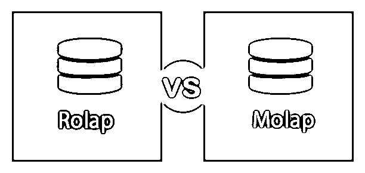
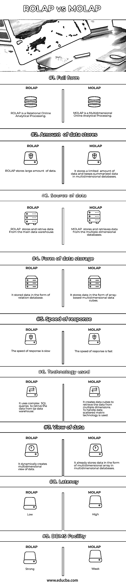

# ROLAP vs MOLAP

> 原文：<https://www.educba.com/rolap-vs-molap/>

## ROLAP 和 MOLAP 的区别

ROLAP 是一种关系型联机分析处理，其中数据以表格、列和行的形式存储。MOLAP 是一种多维在线分析处理，其中数据存储在多维格式化数据库中，即所谓的“数据立方体”。因为 ROLAP 允许所有的关系数据，所以在这个系统中数据的数量没有限制。MOLAP 只允许一致的规范化数据，因此这个系统中允许的数据量是有限的。

### 什么是 ROLAP？

它可以使用关系数据库模型处理大量数据。ROLAP 位于系统的前端和后端之间，高效地存储每个仓库数据。

<small>Hadoop、数据科学、统计学&其他</small>

#### ROLAP 的优势

*   由于使用关系数据库模型，ROLAP 服务器可以很容易地与关系数据库管理系统集成。
*   ROLAP 有效地处理大量数据
*   微软的 DSS 服务器遵循 ROLAP 方法来有效地处理数据。

#### ROLAP 的缺点

*   对查询的响应速度很慢。
*   存在一些可伸缩性限制。

### MOLAP 是什么？

MOLAP 是多维在线分析处理。它[创建数据立方体](https://www.educba.com/what-is-data-cube/)来从多个维度检索数据。为了处理数据，使用了分散矩阵技术。

#### MOLAP 的优势

*   对查询的响应速度很快，因此有助于连接到网络的用户以更好的方式分析数据。
*   因为界面简单，所以很好用。因此与有经验和无经验的用户都兼容。
*   它允许对先前汇总的数据进行更快的索引。

#### MOLAP 的缺点

*   MOLAP 不包含关于数据的详细信息，因此对于那些需要处理关于数据的详细信息的人来说，它是兼容的。
*   如果数据集分散，MOLAP 的存储利用率会很低。

### ROLAP 和 MOLAP 的面对面比较(信息图表)

以下是 ROLAP 与 MOLAP 的 9 大对比:

### ROLAP 和 MOLAP 的主要区别

两者都是 OLAP 的形式。让我们讨论一下它们之间的一些重要的关键区别。

*   ROLAP 是关系在线分析处理，而 MOLAP 是多维在线分析处理。
*   ROLAP 中的数据是关系型的。另一方面，数据是分层的。
*   ROLAP 存储大量数据，而 MOLAP 存储有限数量的数据，并将汇总数据保存在多维数据库中。
*   ROLAP 和 MOLAP 都存储在主数据仓库中，但是 ROLAP 从主数据仓库中存储和检索数据，而 MOLAP 从多维数据库中存储和检索数据。
*   ROLAP 以关系数据库的形式存储数据，但是在 MOLAP 中，数据以基于数组的多维数据立方体的形式存储。
*   因为 ROLAP 中的数据存储在关系数据库中，所以我们可以实时查看数据。而在 MOLAP 中，它存储在数据立方体中，与数据库没有实时连接，因此我们需要频繁地更新数据。
*   与 MOLAP 中的服务器相比，ROLAP 服务器的可伸缩性更强。
*   ROLAP 对查询的响应速度较慢，而在 MOLAP 的情况下，与 ROLAP 相比，对查询的响应速度较快。
*   ROLAP 使用复杂的 SQL 查询从主数据仓库中检索数据，而对于 MOLAP，它创建数据立方体来从多个维度中检索数据。为了处理数据，MOLAP 使用分散矩阵技术来检索数据。
*   ROLAP 动态创建数据的多维视图，MOLAP 已经在多维数据库中以多维数组的形式存储数据

### ROLAP 与 MOLAP 的比较表

让我们讨论一下最大的区别

| **目标** | **ROLAP** | 莫拉普 |
| 完全形式 | ROLAP 是一种关系在线分析处理。 | MOLAP 是多维在线分析处理。 |
| 数据存储量 | ROLAP 存储大量数据 | 它存储有限数量的数据，并将汇总数据保存在多维数据库中。 |
| 数据来源 | ROLAP 从主数据仓库存储和检索数据。 | MOLAP 从多维数据库中存储和检索数据。 |
| 数据存储形式 | 它以关系数据库的形式存储数据。 | 它以基于数组的多维数据立方体的形式存储数据。 |
| 反应速率 | 反应速度慢 | 反应速度很快 |
| 使用的技术 | 它使用复杂的 SQL 查询从数据仓库中检索数据。 | 它创建数据立方体来从多个维度检索数据。为了处理数据，使用了分散矩阵技术。 |
| 数据视图 | 它动态地创建数据的多维视图。 | 它已经在多维数据库中以多维数组的形式存储数据。 |
| 潜伏 | 低的 | 高的 |
| 数据库管理系统设施 | 强烈的 | 无力的 |

### 结论

ROLAP 和 MOLAP 的应用和实现取决于数据的复杂性和两种模型的性能。如果用户想要存储大量数据，那么推荐使用 ROLAP。而当用户想要更快的处理时，建议使用 MOLAP。由于 ROLAP 动态创建多维数据视图，因此它处理数据的速度比不创建多维数据视图的 MOLAP 慢。

### 推荐文章

这是 ROLAP 和 MOLAP 之间最大区别的指南。在这里，我们还讨论了 ROLAP 和 MOLAP 的关键区别，包括信息图和比较表。您也可以看看以下文章，了解更多信息–

1.  [冒烟测试与健全性测试](https://www.educba.com/smoke-testing-vs-sanity-testing/)
2.  [Scrum 与看板——主要差异](https://www.educba.com/scrum-vs-kanban/)
3.  [OLAP 工具](https://www.educba.com/olap-tools/)
4.  [数据仓库 vs Hadoop](https://www.educba.com/data-warehouse-vs-hadoop/)
5.  [ROLAP vs MOLAP vs HOLAP](https://www.educba.com/rolap-vs-molap-vs-holap/)
6.  什么是健全性测试，它是如何工作的？

