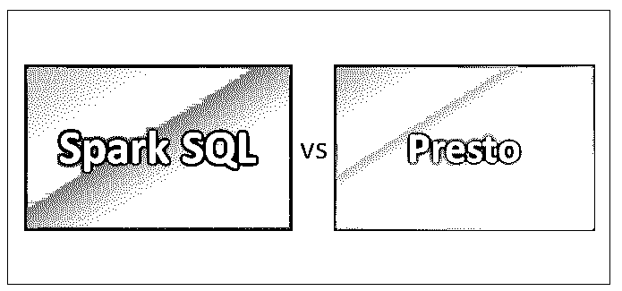
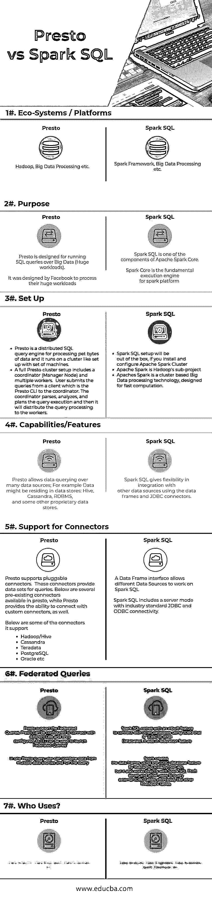

# Spark SQL vs Presto

> 原文：<https://www.educba.com/spark-sql-vs-presto/>

## Spark SQL 和 Presto 之间的区别

Presto 简单来说就是“SQL 查询引擎”，最初是为 [Apache Hadoop](https://www.educba.com/hadoop-vs-apache-spark/) 开发的。这是一个开源的分布式 SQL 查询引擎，旨在针对各种规模的数据集运行交互式分析查询。

[Spark SQL](https://www.educba.com/apache-hive-vs-apache-spark-sql/) 是一个分布式内存计算引擎，在结构化和半结构化数据集之上有一个 SQL 层。因为它是内存处理，所以在 Spark SQL 中处理会很快。

<small>Hadoop、数据科学、统计学&其他</small>

### Spark SQL 和 Presto 之间的直接比较(信息图表)

以下是 Spark SQL 和 Presto 的 7 大对比:

### Spark SQL 和 Presto 之间的主要区别

下面列出了 Presto 和 Spark SQL 的主要区别:

*   [Apache Spark](https://www.educba.com/apache-spark-vs-apache-flink/) 引入了一个用于处理结构化数据的编程模块，称为 Spark SQL。Spark SQL 包含一个称为数据帧的编码抽象，它可以充当分布式 SQL 查询引擎。
*   Presto 开始的动机是支持交互式分析和接近商业[数据仓库](https://www.educba.com/10-popular-data-warehouse-tools/)的速度，并有能力扩展与脸书相匹配的组织规模。
*   Spark SQL 是 Spark Core 之上的一个组件，它引入了一种新的数据抽象，称为 SchemaRDD(弹性分布式数据集)，它提供了对结构化/半结构化数据的支持。
*   Presto 被设计为使用 [MapReduce](https://www.educba.com/mapreduce-interview-questions/) jobs 如 [Hive](https://www.educba.com/hive-vs-hue/) 或 Pig 查询 [HDFS](https://www.educba.com/hdfs-vs-hbase/) 数据的工具的替代品，但是 Presto 并不局限于 HDFS。
*   Spark SQL 遵循内存处理，这提高了处理速度。Spark 旨在处理各种工作负载，如批处理查询、迭代[算法](https://www.educba.com/software-development/courses/java-course/)、交互式查询、流等。
*   Presto 能够执行联邦查询。**下面是 Presto 联邦查询的例子**

让我们假设任何 RDBMS 都有表 sample1

和带有表样本 2 的配置单元，

' Testdb '是 hive 和 MYSQL 中的数据库。使用 Presto，一旦正确配置了连接器，我们就可以在单个查询中评估数据，如下所示

`presto> <Function (select/Group by ..etc)> hive.Testdb.sample2`

功能(选择/分组依据..etc)>mysql。Testdb.sample1

*   Spark SQL 架构由 Spark SQL、模式 RDD 和数据帧组成
    *   数据帧是数据的集合；数据被组织到命名的列中。从技术上讲，它与关系数据库表相同。
    *   模式 RDD: Spark 核心包含称为 RDD 的特殊数据结构。Spark SQL 处理模式、表和记录。因此，用户可以将模式 RDD 用作临时表。以便用户可以将该模式 RDD 称为[数据帧](https://www.educba.com/data-analyst-interview-questions/)
*   数据帧功能:数据帧将单个节点集群上千字节到千兆字节大小的数据处理到多个节点集群上，
*   Data Frame 支持不同的数据格式(CSV、 [elasticsearch](https://www.educba.com/hadoop-vs-elasticsearch/) 、 [Cassandra](https://www.educba.com/hbase-vs-cassandra/) 等)和存储系统(HDFS、HIVE tables、MySQL 等)，可以通过 Spark-Core 与所有[大数据](https://www.educba.com/big-data-vs-data-science/)工具/框架集成，并为 [Python](https://www.educba.com/python-and-django-for-web-development/) 、Java、Scala、R 编程等语言提供 API。
*   而 Presto 是一个分布式引擎，在集群设置上工作。Presto 架构易于理解和扩展。Presto 客户端(CLI)将 SQL 语句提交给管理处理的主守护进程协调器。
*   使用 Presto 的公司:[脸书](https://www.educba.com/facebook-vs-twitter/)，网飞，Airbnd， [Dropbox](https://www.educba.com/what-is-dropbox/) 等。
*   Apache Spark 用例可以在金融、零售、医疗保健和旅游等行业中找到。许多电子商务网站，如易贝、阿里巴巴、Pinterest 都在使用 Spark SQL 分析其电子商务平台上数百 Pb 的数据。

### 比较表 Spark SQL 和 Presto

下面是 SQL 和 Presto 之间最顶层的比较。

| ****SQL 与 Presto** 的对比依据** | **转眼间** | **Spark SQL** |
| **生态系统/平台** | Hadoop、大数据处理等 | Spark 框架、大数据处理等 |
| **目的** | Presto 是为在大数据(巨大的工作负载)上运行 SQL 查询而设计的。它是由脸书设计的，用于处理他们巨大的工作量.. | Spark SQL 是 Apache Spark Core 的组件之一。spark 核心是 Spark 平台的基本执行引擎 |
| **设置** | Presto 是一个分布式 SQL 查询引擎，用于处理 pet 字节的数据，它运行在一个集群上，就像用一组机器设置的一样。*   A complete Presto cluster setup includes a coordinator (manager node) and multiple workers. The user submits the query from the client to the coordinator, which is Presto CLI. Coordinators parse, analyze and plan query execution, and then distribute query processing to staff. | 

*   Configure Apache Spark Cluster
*   Apache Spark is a sub-project of Hadoop, and Spark SQL installation works out of the box.
*   Apache Spark is a cluster-based big data processing technology, designed for fast computing.

 |
| **能力/特性** | Presto 允许在许多数据源上进行数据查询；例如，数据可能驻留在数据存储中:Hive、Cassandra、RDBMS 和其他一些专有的数据存储。 | Spark SQL 使用数据框和 JDBC 连接器在与其他数据源的集成中提供了灵活性。 |
| **支持连接器** | Presto supports pluggable connectors. These connectors provide data sets for queries.

下面是 presto 中现有的几个连接器，同时 Presto 还提供了连接自定义连接器的能力。下面是它支持的一些连接器

*   Hadoop/Hive
*   卡桑德拉
*   [Teradata](https://www.educba.com/teradata-career/)
*   一种数据库系统
*   甲骨文等

 | 数据框接口允许不同的数据源在 Spark SQL 上工作。
Spark SQL 包括一个服务器模式，具有行业标准的 JDBC 和 ODBC 连接。 |
| **联合查询** | Presto 支持联邦查询。Presto 可以配置为连接不同的数据库，一旦配置；它的 CLI 可用于启动“联合查询”。在一个 Presto 查询中，用户可以组合来自多个数据源的数据并运行查询。 | Spark SQL 带有一个内置特性，可以使用 JDBC 连接其他数据库，这是“其他数据库的 JDBC”，它有助于联邦特性。Spark 通过利用 scala/python API，使用 JDBC:数据库特性创建数据帧，但它也可以直接与 Spark SQL Thrift server 配合使用，并允许用户像其他 hive/spark 表一样毫不费力地查询外部 JDBC 表。 |
| **谁使用？** | 数据分析师、数据工程师、数据科学家等 | 数据分析师、数据工程师、数据科学家、Spark 开发人员等 |

### 结论

Spark SQL 和 Presto，都是市场上可以买到的 SQL 分布式引擎。

Presto 对于双类型查询非常有用，Spark SQL 在大型分析查询中性能领先。就配置比起来，Presto 设置比 Spark SQL 容易。Spark SQL 和 Presto 在市场上地位平等，解决的是不同类型的业务问题。

### 推荐文章

这是 Spark SQL vs Presto 的指南。在这里，我们讨论了 Spark SQL 与 Presto 的直接比较、主要差异，以及信息图和比较表。您也可以阅读以下文章，了解更多信息——

1.  [Apache Spark vs Apache Flink–你需要知道的 8 件有用的事情](https://www.educba.com/apache-spark-vs-apache-flink/)
2.  [Apache Hive vs Apache Spark SQL–13 个惊人的差异](https://www.educba.com/apache-hive-vs-apache-spark-sql/)
3.  [Hadoop 与 SQL 的 6 大最佳对比](https://www.educba.com/hadoop-vs-sql/)
4.  [Hadoop 与 Teradata 的价值差异](https://www.educba.com/hadoop-vs-teradata/)

