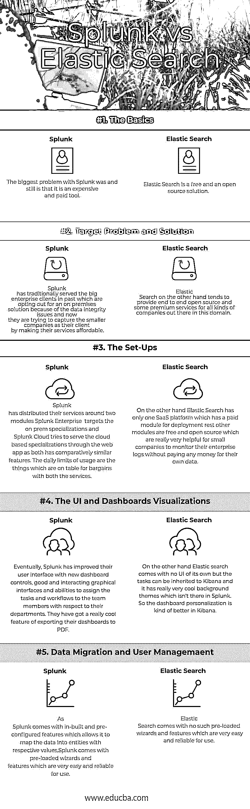

# Splunk 与弹性搜索

> 原文：<https://www.educba.com/splunk-vs-elastic-search/>

## Splunk 与弹性搜索的区别

当我们谈论日志管理解决方案时，首先想到的问题是:Splunk 比弹性搜索更好，还是相反？

**日志管理解决方案——需求**

<small>Hadoop、数据科学、统计学&其他</small>

日志管理工具在企业的分层安全性中起着至关重要的作用，如果没有它们，公司很难了解其技术基础架构内部发生的操作和事件，这些操作和事件可能会导致数据泄露或表明正在发生安全危害。Splunk 和 Elastic Search 是这一领域的两个领先企业竞争对手。你使用哪种工具取决于你试图捕捉和提醒你的人什么，以及你是打算在 GitHub 上派生一些开源应用还是从供应商那里购买一些商业软件；让我们看看他们在这次比较中的表现如何。

### Splunk 和 Elastic Search 之间的直接比较(信息图表)

以下是 Splunk 和弹性搜索之间的 5 大区别:

### Splunk 和弹性搜索的主要区别

以下几点描述了 Splunk 和弹性搜索之间的主要区别:

*   [T0】 Splunk and Elastic Search-Basic Knowledge

Splunk 继承了大数据问题的长期解决方案，早在 2003 年大数据问题出现在市场上之前，当时 **Michael Baum、Rob Das 和 Erik Swan** 提出了捕获数据记录和机器数据记录的解决方案，以确认当时系统的完整性。另一方面，弹性搜索是由**谢伊·巴农**在 2010 年创立的，当时大数据问题存在，人们想要一些其他日志记录和监控工具来测试和比较 Splunk 的性能，然后围绕它成立了一家公司，名为 as Elastic。

Splunk 的最大问题过去是，现在仍然是，它是河对岸一个昂贵的付费工具弹性搜索是免费的，是一个开源解决方案

**结论:** Splunk 和 Elastic Search 都是最全面和可定制的解决方案，但一个价格昂贵，另一个是开源的。

*   [T0】 Splunk and Elastic Search-Target Problems and Solutions

Splunk 过去一直为大型企业客户提供服务，这些客户由于数据完整性问题而选择本地解决方案，现在他们正试图通过降低服务价格来吸引小型公司成为他们的客户。另一方面，弹性搜索倾向于为这个领域的各种公司提供端到端的开源和一些优质服务。凭借云上消费和数据保留组件，他们在新手和初创企业中非常有名。他们还倾向于为客户提供特定用例解决方案，这些解决方案在本质上是通用的。

如果您正在寻找动态 greps 和良好的可视化，那么 Elastic search + Kibana 是您的不二之选，如果您的用例在每次发布和部署时都频繁变化，那么您绝对应该尝试 Splunk。

**结论:**耐心分析你的用例，然后决定退出哪个。

*   [T0】 Splunk and elastic search-set

Splunk 围绕两个模块分发其服务，Splunk 企业目标是本地专业化，Splunk 云试图通过 web 应用程序为基于云的专业化提供服务，因为两者具有相对相似的功能。每日使用限制是两种服务都可以讨价还价的东西。

另一方面，Elastic Search 只有一个 SaaS 平台，它有一个用于部署的付费模块，其他模块都是免费和开源的，这对小公司监控他们的企业日志非常有帮助，无需为他们自己的数据支付任何费用。

**结论:**如果你已经决定进行弹性搜索，那么请准备好付出额外的努力，因为弹性搜索的成功取决于你自己的努力，但如果你想有一个简单可行的解决方案，那么请准备好损失一些钱。

*   [T0】 Splunk and elastic search-UI and dashboard visualization

如今，人们非常喜欢用户界面和其他可视化的东西，最终，人们对黑色的日志屏幕有很大的期望。

最终，Splunk 改进了其用户界面，提供了新的仪表板控件、良好的交互式图形界面以及根据团队成员的部门向其分配任务和工作流的能力。他们有一个非常酷的功能，可以将仪表板导出为 PDF 格式。

另一方面，弹性搜索没有自己的用户界面，但任务可以继承给 Kibana，它有 Splunk 没有的非常酷的背景主题。所以 Kibana 中的仪表板个性化更好一些。

**结论:**这完全取决于用户选择如何排列仪表板，因为它们都提供了一些非常酷的功能，但 Splunk 有更多功能，如将仪表板导出为 PDF 和其他面向客户端的图形。

*   [T0】 Splunk and elastic search-data migration and user management

这实际上取决于这两种工具支持的数据格式的类型。Splunk 和 Elastic Search 都附带了数据发货人对象，该对象实际上保留了文件和上传的路径。

对于这两者来说，对象相对于它的其他对应物的字段的映射是非常不同的。由于 Splunk 自带内置和预配置的功能，允许它将数据映射到具有各自值的实体中，但另一方面，我们需要在弹性搜索中定义每个字段类型到其值的映射。

数据迁移的另一个不同之处是当数据被解析时，因为两者对相同的数据有不同的处理方式。弹性搜索认为解析是理所当然的，而且很大程度上是手动的，但另一方面，Splunk 带有预加载的向导和功能，使用起来非常简单可靠。

Splunk 预装了用户管理的另一个非常有用的功能，因为它有助于管理人员管理使用特定项目日志及其分段的资源。另一方面，弹性搜索没有这样的特性，因为它们有预定义的分配日志。

**结论:**在部分数据迁移和用户管理方面，Splunk 是一种非常简单可靠的方法，但弹性搜索在这些功能方面的发展速度非常快。

### Splunk 和弹性搜索对照表

以下是 Splunk 和弹性搜索的区别:

| **比较基础** | **SPLUNK** | **弹性搜索** |
| **基础知识** | The biggest problem with Splunk was and still is that it is an expensive and paid tool. |  Elastic Search is a free and open-source solution. |
| **目标问题及解决方案** | Splunk 过去一直为大型企业客户提供服务，这些客户由于数据完整性问题而选择本地解决方案，现在他们正试图通过降低服务价格来吸引小型公司成为他们的客户。 | 另一方面，弹性搜索倾向于为这个领域的各种公司提供端到端的开源和一些优质服务。 |
| **Set-Ups** | Splunk 围绕两个模块分发其服务，Splunk 企业目标是本地专业化，Splunk 云试图通过 web 应用程序为基于云的专业化提供服务，因为两者具有相对相似的功能。每日使用限制是双方都可以讨价还价的东西。 | On the other hand, Elastic Search has only one SaaS platform which has a paid module for deployment rest other modules are a free and open source which are really very helpful for small companies to monitor their enterprise logs without paying any money for their own data. |
| **用户界面和仪表盘可视化** | Eventually, Splunk has improved their user interface with new dashboard controls, good and interacting graphical interfaces and abilities to assign the tasks and workflows to the team members with respect to their departments. They have got a really cool feature of exporting their dashboards to PDF. | On the other hand, Elastic search comes with no UI of its own but the tasks can be inherited to Kibana and it has really very cool background themes which aren’t there in Splunk. So the dashboard personalization is kind of better in Kibana. |
| **数据迁移和用户管理** | As Splunk come with inbuilt and pre-configured features which allows it to map the data into entities with respective values.Splunk 附带预加载的向导和功能，使用起来非常简单可靠。 | 弹性搜索没有这种预加载的向导和功能，非常容易和可靠的使用。 |

### 摘要:Splunk 与弹性搜索

简而言之，Splunk 和 Elastic Search 都是世界领先组织信赖的优秀企业级日志管理和分析平台。

### 推荐文章

这是 Splunk 与弹性搜索之间差异的指南。在这里，我们讨论面对面的比较，Splunk 与 Elastic Search 之间的主要差异，以及信息图表和比较表。您也可以阅读以下文章，了解更多信息——

1.  [Splunk 与 Tableau–12 强对比，了解](https://www.educba.com/splunk-vs-tableau/)
2.  [Hadoop 与 Splunk–找出最佳的 7 个差异](https://www.educba.com/hadoop-vs-splunk/)
3.  [Cassandra vs elastic search——哪个更好](https://www.educba.com/cassandra-vs-elasticsearch/)
4.  [Hadoop 与 elastic search——哪个更有用](https://www.educba.com/hadoop-vs-elasticsearch/)
5.  [Splunk 与 Nagios 的区别](https://www.educba.com/splunk-vs-nagios/)
6.  [Hadoop vs Spark 的惊人特性](https://www.educba.com/hadoop-vs-spark/)
7.  [gray log 与 Splunk 的主要差异](https://www.educba.com/graylog-vs-splunk/)
8.  [data dog 与 Splunk 的主要区别](https://www.educba.com/datadog-vs-splunk/)

