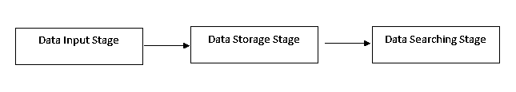
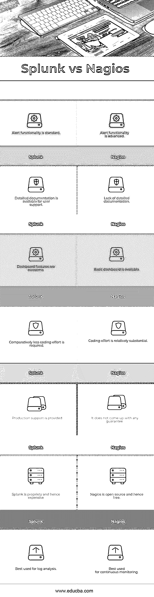

# Splunk vs Nagios

> 原文：<https://www.educba.com/splunk-vs-nagios/>

## Splunk 与 Nagios 的区别

### Splunk 是什么？

[Splunk 是一款用于分析、搜索和可视化机器数据的工具](https://www.educba.com/what-is-splunk-tool/)。如今，随着互联网、[物联网设备](https://www.educba.com/iot-devices/)、可穿戴设备的日益普及以及计算和处理能力的成倍增长，机器数据的生成量呈指数级增长。如此庞大的机器数据包含了强大的洞察力，可能具有巨大的价值。许多大数据技术和工具正在开发中，以从这些数据中获益，Splunk 就是这样一种工具。

Splunk 成立于 2003 年，提供三大类产品:Splunk Enterprise、Splunk Light 和 Splunk Cloud。

<small>Hadoop、数据科学、统计学&其他</small>

Splunk 的主要目的是收集和分析大量机器数据(大数据)并识别数据模式、提供指标、诊断问题以及为运营团队提供情报。还可以创建可视化仪表板。Splunk 提供 API 来直接连接各种类型的系统和应用程序。

Splunk 接受多种格式的输入数据，如 CSV、Jason 等。它可以配置为设置警报和通知，可以按比例增加以满足需求，还可以在此处创建知识对象以利用已保存的搜索、事件类型、报告、查找等。这增加了行动情报。Splunk 最大的卖点是实时工作。

#### Splunk 架构

**数据输入阶段:**在此阶段，Splunk 从源系统中消耗原始数据。数据流被分解成 64K 的块，每个块都用元数据键进行了注释。

**数据存储阶段:**这个阶段由两部分组成——解析和索引。解析用于通过将数据流分解成单个事件来从数据中提取重要信息。在索引阶段，解析的事件被写入磁盘索引。索引在搜索阶段很有帮助。

**数据存储阶段:**在此阶段，Splunk 根据上述用户创建的搜索标准提供搜索结果。

Splunk 有一个称为知识对象的重要功能。数据首先到达索引器，在那里它被索引，然后使用搜索器，人们可以搜索相关的关键字。在搜索阶段之后，可以设置知识对象，这使得操作更智能，并且它给系统带来智能。这些知识对象监视事件，并在某些情况发生时发出通知。这些结果可以通过创建报告和时间表来收集和可视化。

知识对象本质上是用户定义的，用于提取现有或运行时数据的知识，以丰富[数据分析过程](https://www.educba.com/data-analysis-process/)。Splunk 中有三种主要类型的知识对象:Splunk 时间图表、数据模型和警报。

Splunk 可以配置为使用物联网数据。例如，Splunk 可能使用[物联网技术](https://www.educba.com/iot-technologies/)从可穿戴设备获取数据，以监控患者的健康参数，并向医生和患者发送关于病情重大变化的通知。因此，它可以实时报告健康状况，更深入地研究患者的健康记录并进行分析，并向相关人员发出定期或基于需求的警报。

### 什么是 Nagios？

Nagios 是一个监控工具，它持续监控服务器等系统基础设施，以确保所有关键组件(即系统、应用程序、服务和业务流程)正常运行。

需要持续监控，以确保出现内存不足、无法访问服务器、连接错误等问题。在对绩效和生产力产生负面影响之前及时发现并处理。

#### Nagios 架构

Nagios 作为守护进程或服务在服务器上运行。它是作为服务器/代理架构构建的。它运行在一个主机上，并提供插件与被监控的本地或远程主机进行交互。插件将信息发送给调度程序，调度程序将信息显示在 GUI 上，供用户查看状态和采取行动。

Nagios 的一个重要组件是 NRPE (Nagios 远程插件执行器)。它被设计成允许 Nagios 在远程 Linux/Unix 机器上执行其插件。它的优点是允许监控本地资源，如 CPU 负载、内存使用等。也可以从远程机器上下载。由于这些资源不会暴露给外部机器，所以必须安装一个像 NRPE 这样的代理，以便于从远程系统进行监控。

还有其他类型的 Nagios 代理以及 NRDP，NSClient++和 NCPA 等。Nagios 的更高级版本是 Nagios XI。它在 Nagios 核心上提供了主要的功能增强，例如扩展的用户界面、配置编辑器、高级报告、监控向导、可扩展的前端和后端等。

### Splunk 和 Nagios 的面对面比较(信息图)

以下是 Splunk 和 Nagios 之间的 7 大对比:

### 我们为什么要比较？

比较 Splunk 和 Nagios 是有意义的，因为 Splunk 和 Nagios 在一定程度上执行相同/相似的任务。Splunk 用于日志分析，Nagios 用于持续监控。Splunk 和 Nagios 都是研究系统基础设施健康状况的工具。虽然每一种都有独特的工作方式和不同的体系结构，但它们在某些方面有所重叠。这种比较也是有意义的，因为 Nagios 是开源的，而 Splunk 是专有的。

### Splunk 和 Nagios 的主要区别

以下是要点列表，描述了 Splunk 和 Nagios 之间的主要区别:

1.  Nagios 比 Splunk 有更好的警报机制。
2.  使用 Nagios，可以处理警报确认，还可以将警报设置在所需的时间(即只在上午 9 点到下午 6 点之间发送警报消息)。Splunk 不提供此类功能。
3.  Splunk 是用户友好的，因为提供了详细的文档。
4.  就仪表板功能而言，Splunk 比 Nagios 好得多。
5.  纳吉奥斯是自由的。
6.  Splunk 和 Nagios 是互补而非竞争。但是，也有一些重叠的地方。
7.  中型和大型组织通常使用 Splunk，而 Nagios 则被自由职业者、小公司、初创企业等使用。
8.  Nagios 和 Splunk 都带有基于网络的用户交互界面。

### Splunk 和 Nagios 比较表

以下是 Splunk 和 Nagios 的对比表。

| **<u>Splunk</u>** | **<u>Nagios</u>** |
| 警报功能是标准配置 | 警报功能是高级的 |
| 详细的文档可用于用户支持 | 缺乏详细的文件 |
| 仪表板功能非常棒 | 基本仪表板可用 |
| 需要相对较少的编码工作 | 编码工作量相对较大 |
| 提供生产支持 | 它没有提出任何保证 |
| Splunk 是恰当的，因此也是昂贵的 | Nagios 是开源的，因此是免费的 |
| 最适合用于日志分析 | 最适合用于连续监控 |

### 结论

在这篇 Splunk 和 Nagios 的文章中，我们了解了 Splunk 和 Nagios 之间的区别。希望你喜欢这篇文章。

### 推荐文章

这是 Splunk 与 Nagios 之间差异的指南。在这里，我们讨论了 Splunk 与 Nagios 的直接比较、主要差异以及信息图表和比较表。您也可以阅读以下文章，了解更多信息——

1.  [Splunk 与 Tableau-12 大有用对比，值得学习](https://www.educba.com/splunk-vs-tableau/)
2.  [Splunk 与 Spark–需要了解的 8 大差异](https://www.educba.com/splunk-vs-spark/)
3.  [Splunk 与 Elastic Search–找出 5 个最佳差异](https://www.educba.com/splunk-vs-elastic-search/)
4.  [Hadoop 与 Splunk——了解最佳的 7 个差异](https://www.educba.com/hadoop-vs-splunk/)
5.  [了解 Hadoop 和 Spark 之间的有用差异](https://www.educba.com/hadoop-vs-spark/)
6.  [CPA vs CMA:有什么区别](https://www.educba.com/cpa-vs-cma/)
7.  [Graylog 与 Splunk |主要差异](https://www.educba.com/graylog-vs-splunk/)
8.  [Zabbix 与 Nagios 的区别](https://www.educba.com/zabbix-vs-nagios/)

