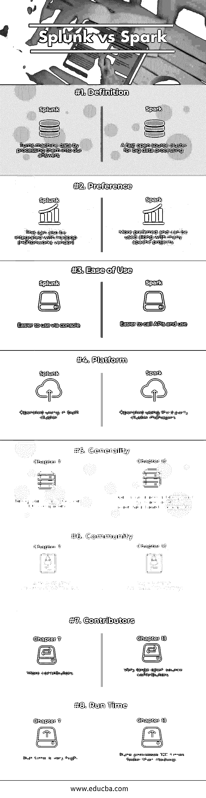

# Splunk vs Spark

> 原文：<https://www.educba.com/splunk-vs-spark/>

## Splunk 与 Spark 的区别

Splunk 用于搜索、监控和分析使用 web 界面的机器生成的大数据。它用于将机器数据转化为我们的答案。Splunk 提供满足客户或业务需求的实时答案，并且 Splunk 受到财富 100 强公司中 85 家公司的信任。Apache Spark 速度非常快，可以用于大规模数据处理，目前这种处理发展很快。在大数据技术的[领域，它已经成为许多现有大规模数据处理工具的替代品。在 Hadoop 环境中，Apache Spark 运行程序的速度比 Map Reduce 快 100 倍，因此更受欢迎。](https://www.educba.com/big-data-technologies/)

### Splunk 和 Spark 的面对面比较(信息图表)

以下是 Splunk 和 Spark 的八大对比:

<small>Hadoop、数据科学、统计学&其他</small>

### Splunk 和 Spark 的主要区别

Splunk 和 Spark 的主要区别如下:

Splunk 是由总部位于美国加利福尼亚州的美国跨国公司 Splunk 开发的大数据分析工具。Splunk 还与 Horton works 供应商合作，后者是 Hadoop 环境提供商。Spark 是由 Apache 软件基金会开发的开源集群计算框架，最初由加州大学伯克利分校开发，后来捐赠给 Apache 基金会使其开源。

以下是要点列表，描述 Splunk 与 Spark 之间的主要区别

1.Splunk 可用于使用 SP (Splunk 搜索处理语言)搜索大量数据。Spark 是一组应用程序编程接口(API ),来自现有的 30 多个 Hadoop 相关项目。Spark 可以通过创建 Amazon EC2(弹性云计算)实例或独立集群模式在 Hadoop 或 Amazon AWS 云上运行，也可以访问不同的数据库，如 Cassandra、Amazon DynamoDB 等。,

2.Splunk 概念包括事件、指标、字段、主机、源和源类型、索引时间、搜索时间和索引。Spark 提供 Java、Python、Scala、R 编程等不同编程语言的高级 API。

3.Splunk 的核心功能包括搜索、报告、仪表板和警报，而 Spark 具有 Spark Core、Spark SQL、M Lib(机器库)、Graph X(用于图形处理)和 Spark Streaming 等核心功能。

4.Splunk 用于部署和使用、搜索、扩展和分析从源中提取的大规模数据。Spark 集群模式可用于在不同的集群上流式传输和处理大规模数据，以实现快速和并行处理。

5.Splunk 维护模式可用于管理和维护索引和索引集群，而 Spark 集群模式将使应用程序作为集群中的独立进程运行。

6.Splunk 中的维护模式可以在群集启动后使用命令行界面选项来启用。Spark 集群的组件包括驱动程序管理器、驱动程序和工作节点。

7.Splunk 中的集群管理可以通过使用单个主节点和多个存在的节点来搜索和索引用于搜索的数据来完成。Spark 提供不同类型的集群管理器，如 HADOOP Yarn 集群管理器、独立模式(前面已经讨论过)、Apache Mesos(通用集群管理器)和 Kubernetes(用于自动化部署的实验性开源系统)。

8.Splunk 的集群功能可以通过称为搜索因子、复制因子和存储桶的不同概念来研究。Spark 集群组件函数在一个 worker 节点中有任务、缓存和执行器，其中一个集群管理器可以有多个 worker 节点。

9.Splunk 提供 API、视图和搜索管理器来与数据交互。Spark 集群计算框架提供了一个以交互方式高效分析数据的外壳。

10.Splunk 产品有不同的类型，如 Splunk Enterprise、Splunk Cloud、Splunk light 和 Splunk Universal Forwarder Enterprise Security、Service Intelligence 等。Spark 提供配置、监控、调优指南、安全性、作业调度和构建 Spark 等。,

11.Splunk Web 框架提供搜索管理器、Splunk 视图、简单的 XML 包装器和 Splunk JS 堆栈视图。Spark 提供 Spark SQL、数据集和数据框。Spark 中的 Spark 会话可用于从现有的弹性分布式数据集(RDD)创建数据框，该数据集是 Spark 的基本数据结构。

12.Splunk 还有一项基于云的服务，可根据业务需求处理作业或流程。Spark 在作业触发方面是延迟加载的，除非作业被触发，否则它不会触发动作。

13.Splunk Cloud 具有多种功能，可从各种来源发送数据并部署到云。Spark streaming 具有容错机制，可以恢复丢失的工作和状态，无需任何额外的配置或设置。

14.Splunk 云具有接收、存储、数据收集、搜索和与 Splunk 云连接的能力。Spark Streaming 可以通过 maven central repository 获得，并且可以将依赖项添加到项目中来运行 [Spark Streaming 程序](https://www.educba.com/spark-streaming/)。

### Splunk 和 Spark 对照表

下面是 Splunk 和 Spark 的对比表。

| **BASIS FOR****比较** | **Splunk** | **火花** |
| **定义** | 将机器数据处理成我们的答案 | 用于大数据处理的快速开源集群 |
| **偏好** | 这也可以与 Hadoop (Horton works 供应商)集成 | 更受欢迎，可以与许多 Apache 项目一起使用 |
| **易用性** | 通过控制台更易于使用 | 更容易调用和使用 API |
| **平台** | 使用内置集群运行 | 使用第三方集群管理器运行 |
| **通用性** | 被许多财富 100 强公司使用 | 开放源码，被许多大型数据公司使用 |
| **社区** | 互动的大型用户群社区 | 略多的用户群 |
| **贡献者** | 更多贡献者 | 非常大的开源贡献者 |
| **运行时间** | 运行时间非常长 | 运行进程的速度比 Hadoop 快 100 倍 |

### 结论

Splunk 可用于集成拥有大量客户基础数据的公司，如交通、银行和金融机构，而 Spark 拥有不同类型的核心框架和一组应用编程接口(API ),可用于集成许多基于 Hadoop 的技术或项目。

Spark 可能是闪电般快速的集群操作的首选，而 Splunk 的 API 基础有限，集成设施较少，但也可以与 Horton works 供应商提供的 Hadoop 框架集成[。Spark 可能是更好的选择，因为它拥有庞大的社区用户群，并且有更多与许多数据库、平台或软件应用程序集成的选项。](https://www.educba.com/hadoop-framework/)

### 推荐文章

这是 Splunk 与 Spark 的对比指南。在这里，我们讨论了 Splunk 与 Spark 的直接比较、主要差异以及信息图表和比较表。您也可以阅读以下文章，了解更多信息——

1.  [Hadoop 与 Splunk–找出最佳的 7 个差异](https://www.educba.com/hadoop-vs-splunk/)
2.  [Spark SQL vs Presto–找出 7 个有用的对比](https://www.educba.com/spark-sql-vs-presto/)
3.  [Apache Hive vs Apache Spark SQL–13 个惊人的差异](https://www.educba.com/apache-hive-vs-apache-spark-sql/)
4.  [Splunk vs Nagios](https://www.educba.com/splunk-vs-nagios/)
5.  [5 大数据分析的重要性和优势](https://www.educba.com/challenges-of-big-data-analytics/)
6.  [gray log 与 Splunk 的主要差异](https://www.educba.com/graylog-vs-splunk/)
7.  [Zabbix vs Nagios |最大差异](https://www.educba.com/zabbix-vs-nagios/)
8.  [data dog 与 Splunk 的区别](https://www.educba.com/datadog-vs-splunk/)

