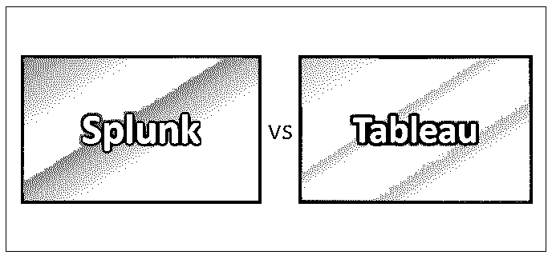
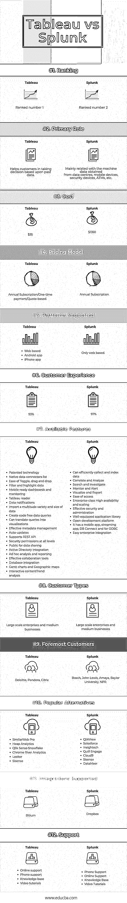

# Splunk vs Tableau

> 原文：<https://www.educba.com/splunk-vs-tableau/>

## Splunk 与 Tableau 的区别

随着市场中不断增长的数据流，使用正确的商业智能软件对当今大多数公司来说变得至关重要。“正确”的定义不是选择一个具有大量特性的产品，而是一个能够解决你所有重要优先事项的产品。商业智能软件是一种应用软件，旨在根据需要提取、分析和转换数据，并为商业智能目的进行报告。数据通常是预先存储的，尽管像 Apache Spark 这样的应用程序正在提供实时数据流功能，特别是在数据仓库中使用元关键字。

让我们借助一个例子来理解商业智能的作用。

<small>Hadoop、数据科学、统计学&其他</small>

假设您需要预测今年赢得 ICC 板球世界杯的球队，那么您需要过去 10 年所有球员的表现统计数据以及其他利益相关者的详细信息。这些数据可以存储在 NoSQL 数据库或 RDBMS 中。然后，可以使用 Hadoop 软件提取、转换这些数据，并提供给商业智能工具。现在，通过查看获胜趋势和一组正确的参数(如最有可能获胜的球队的教练)等，这些工具可用于预测获胜的球队。

Splunk 和 Tableau 就是两个这样的工具，它们可以让您的企业获得超越竞争对手的额外优势。让我们通过对比，在这个 Tableau vs Splunk 帖子中找出适合您需求的合适工具。

### Splunk 和 Tableau 的直接对比(信息图表)

以下是 Splunk 和 Tableau 的 12 大对比:

### Splunk 和 Tableau 的主要区别

Splunk 和 Tableau 之间的差异在以下几点进行了解释:

1.  Splunk 用于监控所有机器活动，包括每个用户在这些机器上的登录和操作，而 Tableau 在大量数据下实时提供基于模式的可视化。
2.  Splunk 主要与 IBM 的 QRadar、Micro Focus ArcSight、LogRhythm 进行比较，而 Tableau 可以与 Microsoft BI、Oracle OBIEE、SAS Visual Analytics 进行比较。
3.  Splunk 通过减少 MTTR 来帮助组织，因为所有开发人员和利益相关者都可以轻松访问日志事件。它通过消除多个团队的开发人员参与多个平台相关问题的需求，降低了成本。它还提供了改进的安全机制，因为许多人无法访问服务器。另一方面，Tableau 直观、简单地创建见解，其拖放功能使其使用起来非常方便。它还能够通过提供各种快捷方式来处理快速计算。它提供了与不同数据库的各种数据连接器集成。
4.  就初始设置和实施而言，Splunk 提供了相对简单的设置。为此目的，可以考虑一个有经验的执行伙伴。实现 Tableau 要简单得多，只需几个小时。
5.  当我们谈到定价、成本和许可时，Splunk enterprise 在每月 20GB 的许可后变得极其昂贵。因此，如果您管理和监视您的日志记录(通过不记录过多的事件触发)，这个数字是一个很长的路要走。Tableau 对小规模组织非常有用，因为它相对便宜，但随着服务器集成的增加，它变得昂贵。
6.  Splunk 和 Tableau 肯定都有改进的空间。Splunk 认证(如 CBT)相对昂贵，因此没有多少人能够认证自己，因此他们无法最佳地利用该工具。管理和过滤日志成为一项主要任务，因为轻松的数据接收可能会导致超出带宽。一种更简单的方法是提供标记非关键文件的功能，这样工具就可以自己丢弃它们。当谈到 Tableau 时，它缺乏机器学习和其他认知数据科学技术，因为这些技术实现了新的分析语言，如 R，SAS，Python 等。是不可能的。此外，像决策树、CHAID 分析、K-means 这样的技术由于缺乏认知技术而无法实现。Tableau 有一个到 R 的连接器，因此可以使用最少的功能。
7.  我们对使用 Splunk 的建议是，让经验丰富的 Splunk 架构师通过与高级技术团队充分合作来设计基础架构配置，以了解产品的可行性。Splunk 配置应在 GIT 中管理，团队成员应尽快接受培训，以便高效地使用该工具。对于 tableau，在一个瞬间应该可视化不超过 2M 数据点，并且提取的数据应该用于高性能。在报告中只使用 3-4 个部分，并在 ETL 阶段进行计算，将从这个工具中获得最大的好处。

### Splunk 和 Tableau 之间的比较表

以下是分数列表，描述了 Splunk 和 tableau 之间的比较。

| **比较的基础** | 表 | **Splunk** |
| **排名** | 排名第一 | 排名第二 |
| **主要角色** | 帮助客户根据过去的数据做出决策 | 主要与从数据中心、移动设备、安全设备、ATM 等获取的机器数据相关。 |
| **成本** | $35 | $1350 |
| **定价模式** | 年度订阅/一次性付款/基于报价 | 年度订阅 |
| **支持的平台** | 

*   online version
*   Android app
*   iPhone 应用程序

 | 仅基于网络 |
| **客户体验** | 93% | 97% |
| **可用功能** | 

*   Patent technology
*   List of native data connectors
*   Easy switching, drag and drop
*   Filter and highlight data.
*   Mobile ready dashboard and monitoring
*   Tableau 阅读器
*   Data notification
*   Import a large number of kinds and sizes of data.
*   Create a codeless data query.
*   You can convert queries into visual effects.
*   Effective metadata management based on
*   autoupdate
*   支持 REST API
*   Ad hoc analysis and report of all levels of security authority
*   Effective collaboration tool based on
*   Database integration
*   Gantt chart and geographic map
*   Interactive content
*   trend analysis

 | 

*   Data can be efficiently collected and indexed.
*   And correlation analysis
*   And search and survey
*   And monitoring and alerting
*   And visual reports.
*   Easy access
*   Enterprise-class high availability and scalability
*   Effective security and management of
*   Complete application library
*   Open development platform
*   It has mobile applications, streaming media applications, database connection and ODBC.

 |
| **客户类型** | 大型企业和中型企业 | 大型企业和中型企业 |
| **最重要的客户** | 德勤、潘多拉、思杰 | Bosch，John Lewis，Amaya，NPR 贝勒大学 |
| **流行的替代品** | 

*   SimilarWeb Pro
*   堆分析
*   Qlik Sense
*   雪花
*   铬河分析
*   检查员
*   西森斯

 | 

*   QlikView
*   销售力量
*   Insightech
*   套筒啮合
*   云 9
*   西森斯
*   数据梅尔

 |
| **支持的集成** | 生物界 | Dropbox |
| **支持** | 

*   Online ruler
*   Telephone support
*   knowledge base
*   Video tutorial

 | 

*   Telephone support
*   Online ruler
*   knowledge base
*   Video tutorial

 |

### 结论

在这篇 Splunk vs Tableau 的文章中，我们对 Splunk 和 Tableau 进行了详细的比较。市场上还有其他工具可以更好地满足您的需求。请将这些工具应用到您的业务中，并给我们回信，讲述您使用这些工具的激动人心的经历。

### 推荐文章

这是 Splunk 和 Tableau 之间差异的指南。在这里，我们讨论了 Splunk 与 Tableau 的直接比较、主要差异以及信息图表和比较表。您也可以阅读以下文章，了解更多信息——

1.  Power BI 与 QlikView-它们有何不同？
2.  [了解 Splunk 与 Spark 之间的 8 个有用区别](https://www.educba.com/splunk-vs-spark/)
3.  [Tableau 与 QlikView–哪个更有用](https://www.educba.com/tableau-vs-qlikview/)
4.  [Hadoop 与 Splunk–找出最佳的 7 个差异](https://www.educba.com/hadoop-vs-splunk/)
5.  [Power BI vs Tableau–要学习的 7 个有用的比较](https://www.educba.com/power-bi-vs-tableau/)
6.  [Splunk 与 Nagios 对比](https://www.educba.com/splunk-vs-nagios/)
7.  [Power BI vs Tableau vs Qlik:惊人的差异](https://www.educba.com/power-bi-vs-tableau-vs-qlik/)
8.  【Tableau vs Power BI vs QlikView 的差异
9.  [Graylog 与 Splunk |主要区别](https://www.educba.com/graylog-vs-splunk/)

