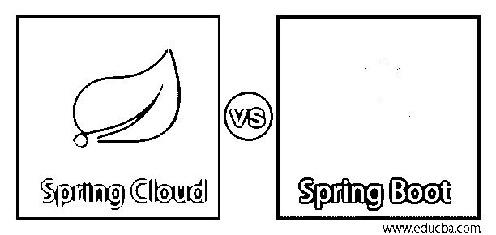
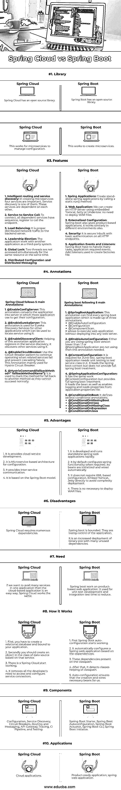

# 春云 vs Spring Boot

> 原文：<https://www.educba.com/spring-cloud-vs-spring-boot/>

## 春云和 Spring Boot 的区别

spring cloud 用于集中配置管理，并涉及 spring boot 应用程序的高度安全性和完整性，而 Spring boot 被定义为基于 Java 的开源框架，可用于创建微服务，基于依赖性 spring cloud 具有多种依赖性，Spring boot 是一种轻量级框架，具有较少的依赖性，除了这些差异之外，Spring cloud 和 Spring boot 在微服务、功能、注释、优点、需求、工作方式、组件和应用程序方面各不相同。

### 春云与 Spring Boot 的正面对比(信息图)

以下是春云 vs Spring Boot 的 10 大对比:

<small>Hadoop、数据科学、统计学&其他</small>

### 春云和 Spring Boot 的主要区别

以下是云与 spring boot 的主要区别:

*   Spring Boot 和 Spring Cloud 是 Spring 框架的一部分。两者对微服务的工作要求不同。
*   微服务需要这两种技术来简化应用程序的开发和维护。用于云应用的春天云。用于产品就绪应用的弹簧靴。
*   Spring Cloud 就是收集部署配置，自我管理。而弹簧靴制造微服务来提高生产率。
*   春云必须使用许多依赖项。相比之下，Spring Boot 申请较少依赖。Spring Boot 是一个轻量级框架。
*   Spring Cloud 是配置服务器技术并与许多服务通信并收集在一个应用程序中。Spring boot 是一个基于 java 的框架，用于在 Web 应用程序中进行自动配置。
*   Spring cloud 是 Spring boot 的一部分，Spring boot 是独立的、以 App 为中心的应用框架。
*   春云的主要目的是维护网络的流量。Spring Boot 的另一个主要目的是减少时间和提高生产率。

### 春云 vs Spring Boot 对比表

下表总结了 Spring Cloud 与 Spring Boot 的对比:

| **比较基础** | **春云** | **Spring Boot** |
| **图书馆** | 春云有一个开源库。 | Spring Boot 有一个开源图书馆。 |
| **微服务** | 这是微服务管理配置的工作。 | 这是创造微服务的工作。 |
| **特性** | **1。智能路由和服务发现:**在创建微服务的过程中，有四个服务非常重要。服务发现就是其中之一。这些服务相互依赖。
2**。**服务对服务的调用:连接所有有序列的依赖服务，注册对端点的调用。
**3。负载均衡:**将网络流量适当的分配给后端服务器。
**4。领导层选举:**该应用程序作为第三方系统与另一个应用程序一起工作。
**5。全局锁:**两个线程不能同时访问同一个资源。
**6。分布式配置和分布式消息传递** | **1。Spring 应用程序:**通过调用静态 run()方法创建独立的 Spring 应用程序。
2**。Web 应用:**我们可以使用嵌入式 Tomcat、Jetty 或 Undertow 创建一个 HTTP 服务器。不需要部署 WAR 文件。
**3。外化配置:** Spring-boot 也给出了基于产品的应用。它在不同的环境中也同样适用。
**4。安全性:**它是安全的，内置了所有 HTTP 端点上的基本认证。
**5。应用程序事件和监听器:** Spring Boot 必须处理许多任务，应用程序需要事件。添加用于创建工厂文件的侦听器。 |
| **注解** | 春云主要有以下 5 个主要注解:
**1** 。 **@EnableConfigServer:** 该注释将应用程序转换为服务器，更多的应用程序使用该服务器来获取它们的配置。
**2。** **@EnableEurekaServer:** 这个用于 Eureka 发现服务的注释对于其他应用程序来说可以用来定位使用它的服务。
**3。@EnableDiscoveryClient:** 帮助此注释应用程序在服务发现中注册，它发现使用它的其他服务。
4**4。@EnableCircuitBreaker:** 使用断路器模式在相关服务失败时继续运行，防止级联故障。
此标注主要用于 Hystrix 断路器。
**5。@ HystrixCommand(fallback method = " fallback method name "):**用于标记不能正常成功的方法回退到另一个方法。 | Spring boot following 5 main Annotations:
**1.** **@SpringBootApplication:** This annotation can find every spring boot application. It is made up of three annotations:

*   @启用自动配置
*   @配置
*   @ComponentScan。

它允许在不部署到任何 web 服务器的情况下执行 web 应用程序。
**2。@EnableAutoConfiguration:** 要么您使用的是低于 1.1 的 spring boot 版本，要么@SpringBootApplication 没有使用，则需要此注释。
**3。****@ context configuration:**JUnit 测试需要。spring-boot 应用程序需要单元测试来测试其中的服务类。它加载弹簧引导上下文，但不提供完整的弹簧引导处理。
**4。****@ SpringApplicationConfiguration:**它有相同的 work @ContextConfiguration 但是提供了完整的弹簧引导处理。
从 application.properties 文件
**5 中加载 bean 并启用日志记录和加载属性。****@ conditional boot:**它定义了几个条件注释:

*   **@ conditionalomissingboot**
*   **@ conditional class**
*   **@ conditionalomissingclass**
*   **@ conditional expression**
*   **@ConditionalOnJava**

 |
| **优势** | 1.它提供云服务开发。
2。它是基于微服务架构来配置的。
3。它提供服务间的通信。
它是以 Spring Boot 模式为基础的。 | 1.它可以快速开发和运行独立的 spring web 应用程序。
2。默认情况下，它会在需要时配置 Spring 功能。它的 beans 被自动初始化和连接。
3。它不需要基于 XML 的配置。直接嵌入 Tomcat，Jetty，避免复杂部署。
4。没有必要部署 WAR 文件。 |
| **缺点** | Spring Cloud 需要大量的依赖项。 | 弹簧靴是有界的。应用程序正在失去控制。这是一个增加了二进制大小的部署，有许多未使用的依赖项。 |
| **需要** | 如果我们想在一个应用程序中提供多种服务，那么基于云的应用程序是一个简单的方法。春云也是一样。 | Spring boot 在基于产品的 web 应用程序上工作。它用于单元测试开发和集成测试以减少时间。 |
| **工作原理** | 1.首先，您必须创建一个关系数据库并绑定到您的应用程序。
2。其次，应该在基于该服务的数据源类中创建一个对象。
3。有春云开始工作。
4。它消除了开发人员访问和配置服务连接器的所有需求。 | 1.第一个 Spring Boot 自动配置开始工作。
2。它会根据依赖关系自动配置为 Spring web 应用程序。
2。这些依赖关系存在于类路径中。
4。之后，它检测类路径的类帮助。
5 .自动配置确保创建和连接我们需要的 beans。 |
| **组件** | 配置、服务发现、断路器、路由和消息传递、API 网关、跟踪、CI 管道和测试。 | Spring Boot 启动器，Spring Boot 自动配置，Spring Boot 执行器，Spring Boot 命令行界面，Spring Boot 初始化。 |
| **应用程序** | 云应用。 | 产品就绪应用程序，spring web 应用程序。 |

### 结论

微服务日益流行创建一个应用。对于复杂而冗长的应用程序，我们需要制作小的服务并组合起来维护应用程序。弹簧靴创造了一个小的微服务。Spring clouds 统一管理它们的配置。它用于在云环境中部署他们的应用程序。

### 推荐文章

这是春云 vs Spring Boot 的攻略。在这里，我们还将讨论信息图和比较表的主要区别。您也可以看看以下文章，了解更多信息–

1.  [数据湖与数据仓库——主要差异](https://www.educba.com/data-lake-vs-data-warehouse/)
2.  [抽象与封装|前 6 名比较](https://www.educba.com/abstraction-vs-encapsulation/)
3.  [h base 面试问题介绍](https://www.educba.com/hbase-interview-questions/)
4.  [具有优势的 HBase 架构](https://www.educba.com/hbase-architecture/)
5.  [JavaScript 封装](https://www.educba.com/encapsulation-in-javascript/)
6.  [弹簧云组件指南](https://www.educba.com/spring-cloud-components/)
7.  [Spring Boot vs 春天 MVC |最大差异](https://www.educba.com/spring-boot-vs-spring-mvc/)

