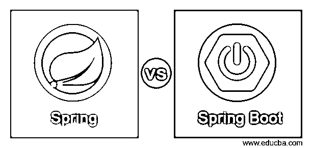
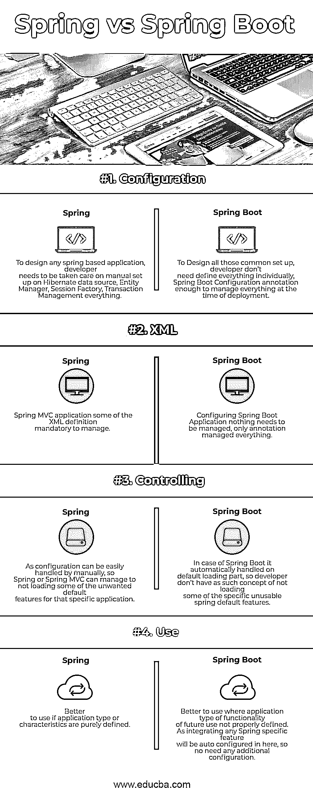

# 春天 vs Spring Boot

> 原文：<https://www.educba.com/spring-vs-spring-boot/>

## 春天和 Spring Boot 的区别

Spring 框架是帮助 Java 应用程序开发的最流行的框架之一。它维护各种方式的对象或 beans 关系。这对依赖注入(DI)或控制反转(IOC)是有益的，这极大地帮助了我们开发松散耦合的应用程序，这自动地帮助了任何 Java 应用程序的正确单元测试。

还有许多其他功能，包括 Spring 框架，它在任何常量中也非常流行。这些特性可以分成近 20 个模块，帮助解决许多问题，这在任何 java 应用程序中都非常常见。一些流行的模块解释如下:

<small>Hadoop、数据科学、统计学&其他</small>

1.  春天的 JDBC
2.  Spring MVC
3.  [春季 AOP](https://www.educba.com/spring-aop/)
4.  弹簧 ORM
5.  春天 [JMS](https://www.educba.com/what-is-jms/)
6.  弹簧试验
7.  Spring 表达式语言

Spring JDBC 是 Spring 应用程序的普遍特征之一。每当我们想从任何 RDBMS 数据库获取数据时，我们都可以使用 spring 默认的 JDBC 框架。

Spring MVC 表示模型、视图和控制器设计模式，主要用于[使用 Spring 开发 web 应用](https://www.educba.com/how-to-build-web-applications-using-mongodb/)。

面向方面的编程(AOP)主要用于任何方面，如安全性或与任何 Java 应用程序的日志集成，这是它的独特特性，在应用程序中出现方法返回或异常后，可以在方法调用之前或之后调用该特性。Spring 可以很容易地与任何 ORM 工具集成。用于测试目的的 Spring 测试和表达式语言用于视图呈现。

Spring boot 基于 Spring 的所有默认特性。Core Spring 和 MVC 可以处理任何 Java 应用程序所需的元素。根据复杂性和配置，spring boot 可以帮助我们显著降低与 spring 配置相关的复杂性。

### 斯普林和 Spring Boot 的直接对比

下面是春天和 Spring Boot 的四大区别

### 春天和 Spring Boot 的关键区别

春天 Spring vs 都是市场热门选择；让我们来讨论一下春天和 Spring Boot 的一些显著区别。

1.  Spring 主要专注于它的核心和 MVC 特性，开发者需要手动配置和定义应用程序需要根据需求使用哪个特性。同时，Spring Boot 自动加载了 spring core 和 MVC 的所有特性。开发人员不需要手动定义任何特定的配置。
2.  Spring core 有多个模块，可以用于不同的目的，并根据 java 应用程序的需求解析一些标准的实用程序。像 [Spring JDBC](https://www.educba.com/jdbc-vs-odbc/) ，MVC，AOP，ORM 等模块。，对每个项目需求的任何方面都有帮助。所有这些实用程序都可以根据系统或项目需求进行适当的配置和利用。尽管 Spring Boot 可以通过将应用程序定义为@SpringBootConfiguration 来轻松地使用所有这些需求，但是该注释足以管理加载整个 Spring 配置或所有基于 jar 文件的模块特性或为特定 spring boot 项目提到的依赖项。
3.  事务管理是任何 Spring 应用中最关键的工作之一；然后，开发人员必须为每个 hibernate 会话或 DB 连接(在 Spring JDBC 的情况下)定义一个适当的事务管理[键，Spring 需要在特定于应用程序的配置文件中定义一个特定的事务类，以便在整个应用程序中使用那些可以正确管理事务的类。尽管 Spring Boot 自动包含基本的事务数据，而不需要手动提及任何特定的配置，但是整个事情可以自动处理。营销可以在每次会话或连接打开和关闭时定义。基于特定会话完成状态的整个任务，可以提交或回滚事务。](https://www.educba.com/hibernate-interview-questions/)
4.  与任何 ORM 工具的集成对于任何 spring 应用程序都是至关重要的。它需要由开发人员在配置文件中手动正确定义其数据源，并且需要对任何 ORM 工具交换进行更改。在 spring 的情况下，boot 可以自动配置，不需要人工干预；对于整个设置，仅定义一个数据库属性文件就足够了。
5.  Spring core 或 Spring MVC 结构的开发者可以很容易地维护基于项目需求的特性。然而在 spring boot 的情况下，依赖项或 jar 文件中定义的所有属性都将被自动加载，开发人员不能基于项目需求部署任何特定的特性。

### 春季与 Spring Boot 对比表

Spring 与 Spring Boot 之间的主要比较讨论如下:

| **斯普林与 Spring Boot 的对比基础** | **春天** | **Spring Boot** |
| **配置** | 要设计任何基于 spring 的应用程序，开发人员必须注意手工设置 Hibernate 数据源、实体管理器、会话工厂和事务管理。 | 为了设计所有这些标准设置，开发人员不需要单独定义所有的东西；SpringBootConfiguration 注释足以在部署时管理一切。 |
| **XML** | 在 Spring MVC 应用程序中，一些 XML 定义是必须管理的。 | 配置 [Spring Boot 应用](https://www.educba.com/spring-boot-application/)，什么都不需要管理；唯一的注释包含了一切。 |
| **控制** | 由于配置可以很容易地手动处理，Spring 或 Spring MVC 可以设法不加载特定应用程序的一些不需要的默认特性。 | 在 Spring Boot 的情况下，它是在默认加载部分自动处理的，所以开发者没有不加载某些特定不可用的 Spring 默认特性的概念。 |
| **使用** | 如果应用程序类型或特征是纯粹定义的，那么使用起来会更好。 | 最好在未来使用的功能的应用程序类型没有正确定义的情况下使用。集成任何特定于 Spring 的特性都会在这里自动配置，所以不需要额外的配置。 |

### 结论-春季对 Spring Boot

Spring vs. Spring Boot 在任何时候都是 Java/J2EE 应用的通用框架。通常，开发人员会根据应用程序的需求或功能选择更好的框架。假设应用程序在未来集成的任何情况下都有可能使用 verities Spring 模块；在这种情况下，Spring boot 总是一个更好的选择，因为只需添加所需的依赖项或 jar 文件，就足以将特定的模块集成到您现有的应用程序中。但是如果一个应用程序没有这样的前景，或者计划只做一个纯粹的 web 应用程序，那么 Spring MVC 将是一个很好的方法，因为开发人员对启用或禁用的功能有很大的控制权。

### 推荐文章

这导致了春天和 Spring Boot 之间的巨大差异。在这里，我们还通过信息图和比较表讨论了 Spring 与 Spring Boot 的关键差异。您也可以看看以下春天与 Spring Boot 的文章，了解更多信息——

1.  [Spring Boot 面试问题](https://www.educba.com/spring-boot-interview-questions/)
2.  [Java 与 Java EE](https://www.educba.com/java-vs-java-ee/)
3.  [春季框架面试试题](https://www.educba.com/spring-framework-interview-questions/)
4.  [Java vs. Node JS](https://www.educba.com/java-vs-node-js/)

