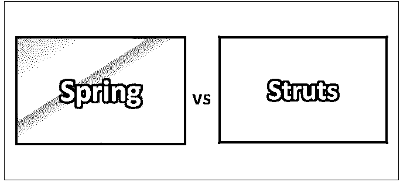
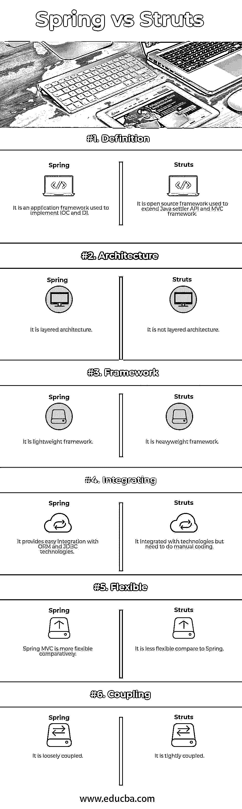

# 弹簧与支柱

> 原文：<https://www.educba.com/spring-vs-struts/>

## 弹簧和支柱的区别

Spring 简称 Spring framework，用于 Java 平台或用于 Java 语言。它也被称为应用程序框架，Java 应用程序使用它来处理基础设施并实现控制反转(IOC)和依赖注入(DI)。Spring 框架特性用于开发 web 应用程序。

Spring 框架由 Pivotal 软件开发。它最初发布于 2002 年。它是用 Java 写的。它只支持 Java 虚拟机(JVM)平台。它支持跨平台操作系统。Spring 平台为开发人员开发应用程序提供了一些优势，如在数据库事务和远程过程中执行 java 方法而无需处理事务 API，以及本地 java 方法管理操作或消息处理程序而无需使用 API。

<small>Hadoop、数据科学、统计学&其他</small>

Struts 被称为开发基于 Java 的 web 应用程序的开源框架。它扩展了 Java Servlet API 并采用了 MVC 架构。它使您能够在 JSP 页面、JavaBeans 和 XML 等标准技术上创建可扩展、可维护和灵活的基于 web 的应用程序。

Struts 具有重要的特性，如可配置的 MVC 组件、基于 POJO 的动作、AJAX 支持、集成支持、各种结果类型、各种标签支持、主题和模板支持。它有核心组件，如拦截器、值堆栈、动作上下文、动作调用、OGNL。struts 的体系结构由控制器、动作代理、动作映射器、配置管理器、动作调用、拦截器、动作、结果等组成。

struts 和 spring 的功能或功能方式也是不同的。在 spring MVC 中，需要 spring core 来运行 Spring MVC，它是模型视图架构，其中整个过程由 dispatcher servlet 控制。但是在 struts 中，获取和处理对象是通过 action 对象来完成的。strut 是最强大的 Java 应用程序框架之一，可以在各种 Java 应用程序中使用。Spring 利用依赖注入来实现简单和增强可测试性。

### Spring 和 Struts 之间的直接比较(信息图)

下面是 Spring 和 Struts 之间的 6 大区别

### Spring 和 Struts 的主要区别

Spring vs Struts 都是市场上的热门选择；让我们讨论一些主要的区别:

*   据说 Spring framework 是非侵入性的，这意味着它不会强迫开发人员扩展或实现 spring API 提供的类或接口。Struts 被认为是入侵性的，它迫使开发人员从 struts API 提供的基类扩展该类。
*   Spring MVC 提供了基本 HTML 表单标签的标签，但是 [struts 提供了](https://www.educba.com/what-is-struts/)许多其他 JSF 风格的复杂和复合标签。
*   使用 Spring 框架是因为它具有事务管理、支持消息传递、支持与其他框架集成等优点。Strut 框架之所以被使用，是因为它对标签库的出色支持，标签库被业界广泛接受，并且易于与其他客户端技术集成。
*   Spring 允许 JSP、Velocity、free maker、excel 和 pdf 查看组件。Struts 只允许 JSP 查看组件。
*   Spring MVC 提供了更多的处理程序映射。Struts 没有特定的处理程序映射，但是使用动作映射。
*   Spring 清除了模型、视图和控制器之间的模块划分，但是 struts 混合了控制器和模型。
*   Spring 提供了内置的中间件服务，如事务、日志、连接池等。Struts 不提供内置的中间件服务。
*   Spring 通过激活类来提供容器，但是 struts 显式配置类。
*   Spring MVC 代码相对来说更容易测试。与 Spring 相比，Strut 代码更难测试。
*   Spring 有独立的层，可以很容易地与其他框架集成，但在 struts 中，很难轻松实现这一点。

### Spring 与 Struts 对照表

下面是 Spring 和 Struts 之间最重要的比较:

| **比较的基础** | **春天** | **支柱** |
| **定义** | 它是一个用于实现 IOC 和 DI 的应用框架。 | 它是用于扩展 Java servlet API 和 MVC 框架的开源框架。 |
| **架构** | 它是分层的架构 | 它不是分层架构。 |
| **框架** | 这是一个轻量级的框架。 | 这是一个重量级的框架。 |
| **积分** | 它提供了与 ORM 和 JDBC 技术的简单集成。 | 它与技术相结合，但需要手工编码。 |
| **灵活** | Spring MVC 相对来说更加灵活。 | 与弹簧相比，它不太灵活。 |
| **联轴器** | 它是松散耦合的。 | 它是紧密耦合的。 |

### 性能比较

Spring 与 strut 的特性是不同的，两者都广泛用于开发 web 应用程序。Spring framework 比 struts 更有效，但有时 spring framework 会带来复杂性，但在 struts 中，由于其易于维护的设计，一切都很简单。Spring framework 比 struts 拥有更多的功能。使用 Spring MVC 主要是因为它更安全，性能更好。Spring 框架主要是升级了，而 struts 现在还没有升级。由于 spring 框架非常灵活并且提供了更好的性能，它正在各种平台上被使用。与 struts 相比，Spring framework 在 web 应用程序中表现更好，因为它具有独立的层架构，并且在模型、视图和控制器之间有明显的区别，但在 struts 中却不是这样。Spring security 是保护应用程序的最佳方式之一。Spring MVC 用于开发 REST API、客户机-服务器模型、面向服务的架构(SOA)以及数据库处理。Spring MVC 框架比 struts 更能有效地处理请求。

### 结论

Spring vs Struts 都是大而广的 java 框架。Spring 框架只有一个 spring MVC 模块，但是 strut 是用来做企业 web 应用的。Spring 没有提供实现业务领域和逻辑的框架，但是开发人员为应用程序创建了一个控制器和视图。Spring MVC 主要用于创建健壮的应用程序。

Strut 框架给出了简化的设计，在 strut 中，与 spring 相比，插件可以很容易地使用。Strut 还简化了动作形式和注释。它比标签有更好的功能。它提供了对 AJAX 和多视图选项特性的支持，使得 strut 更易于使用。在 struts 中，每次发出请求时都会创建或启动动作，而在 spring MVC 中，控制器只创建一次，存储在内存中并在所有请求之间共享。可以根据客户需求或可用资源来选择框架。

### 推荐文章

这是 Spring 和 Struts 之间最大区别的指南。在这里，我们还将讨论信息图和比较表的主要区别。您也可以看看下面的 Spring vs Struts 文章来了解更多信息

1.  [Java EE vs Spring](https://www.educba.com/java-ee-vs-spring/)
2.  [Java 春季面试试题](https://www.educba.com/java-spring-interview-questions/)
3.  [春天 vs Spring Boot](https://www.educba.com/spring-vs-spring-boot/)
4.  [春天 vs 冬眠](https://www.educba.com/spring-vs-hibernate/)
5.  [冬眠面试问题指南](https://www.educba.com/hibernate-interview-questions/)

