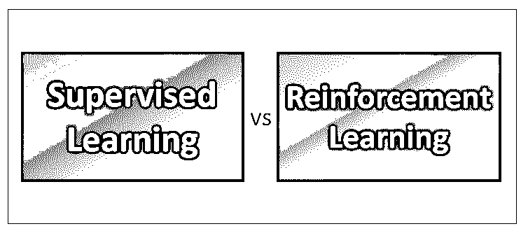
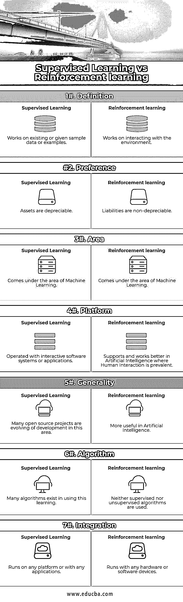

# 监督学习与强化学习

> 原文：<https://www.educba.com/supervised-learning-vs-reinforcement-learning/>

## 监督学习和强化学习的区别

监督学习是机器学习的概念，它意味着通过从许多类似的例子中学习来学习开发一个功能的实践的过程。这是一个从几个相似的例子中学习概括概念的过程。

[强化学习](https://www.educba.com/what-is-reinforcement-learning/)也是机器学习的一个领域，它基于行为心理学的概念，致力于直接与人工智能领域中起关键作用的环境进行交互。

<small>Hadoop、数据科学、统计学&其他</small>

监督学习和强化学习属于机器学习领域，它是由美国计算机专业人士阿瑟·萨米·李在 1959 年创造的，他是计算机游戏和人工智能的专家。

机器学习是计算机科学的[部分，其中软件系统或应用程序的能力将通过仅使用数据而不是由程序员或编码员编程来提高。](http://Computer Science)

在机器学习中，系统的性能能力或效率通过使用数据重复执行任务来提高自身。机器学习还涉及计算、统计、预测分析等。

让我们在本帖中详细了解监督学习和强化学习的区别。

### 监督学习和强化学习的直接比较(信息图)

下面是监督学习和强化学习之间的 7 大比较:

### 

监督学习和强化学习的主要区别

下面是监督学习和强化学习的区别:

1.  监督学习有两个主要任务，称为回归和分类，而强化学习有不同的任务，如开发或探索、马尔可夫决策过程、策略学习、深度学习和价值学习。
2.  监督学习分析训练数据并产生通用公式，在强化学习中，基本强化是在马尔可夫决策过程模型中定义的。
3.  在监督学习中，每个示例都有一对输入对象和一个具有期望值的输出，而在强化学习中，马尔可夫决策过程意味着代理以离散的步骤与环境进行交互，即代理在每个时间段“t”进行一次观察，并为每次观察获得奖励，最后，目标是收集尽可能多的奖励以进行更多的观察。
4.  在监督学习中，存在不同数量的算法，这些算法具有适合系统要求的优点和缺点。在强化学习中，马尔可夫决策过程为建模和决策情况提供了一个数学框架。
5.  监督学习和强化学习最常用的学习算法是线性回归、逻辑回归、决策树、贝叶斯算法、支持向量机和决策树等。，那些可以应用于不同场景的。
6.  在监督学习中，目标是通过分析函数的给定输入和输出，从给定示例中学习通用公式。在强化学习中，目标是控制机制，如控制理论、博弈论等。例如驾驶车辆或与另一个玩家玩游戏等。,
7.  在监督学习中，输入和输出都可以用于决策，学习者将在许多例子或给定的样本数据上接受训练，而在强化学习中，顺序决策发生，下一个输入取决于学习者或系统的决策，例如与对手下棋、环境中的机器人运动、博弈论。
8.  在监督学习中，只需要一个通用模型来对数据进行分类，而在强化学习中，学习者与环境进行交互以提取输出或做出决策，其中单个输出在初始状态下可用，并且输出将有许多可能的解决方案。
9.  监督学习意味着其名称本身表明它是高度监督的，而强化学习是较少监督的，并且依赖于学习代理通过达到不同的可能方式来确定输出解决方案，以便实现最佳可能解决方案。
10.  监督学习根据类别类型进行预测，而强化学习被训练为一个学习代理，它作为一个奖励和行动系统工作。
11.  在监督学习中，需要大量的数据来训练系统以得出通用公式，而在强化学习中，系统或学习代理本身通过与环境交互来创建数据。
12.  监督学习和强化学习都用于创造和带来一些创新，如反映人类行为和像人类一样工作的机器人，与环境的更多交互导致系统性能的更多增长和发展，导致更多的技术进步和增长。

### 监督学习和强化学习对照表

下面是监督学习和强化学习的对比表。

| **BASIS FOR****比较** | **监督学习** | **强化学习** |
| **定义** | 处理现有的或给定的样本数据或示例 | 致力于与环境互动 |
| **偏好** | 在需要完成常规任务的通用工作机制中优先考虑 | 人工智能领域优先 |
| **区域** | 属于机器学习领域 | 属于机器学习领域 |
| **平台** | 用交互式软件系统或应用程序操作 | 在人工智能中支持和更好地工作，在人工智能中，人类交互是普遍的 |
| **通用性** | 许多开源项目正在这一领域发展 | 在人工智能中更有用 |
| **算法** | 在使用这种学习中存在许多算法 | 既不使用监督算法，也不使用非监督算法 |
| **整合** | 可在任何平台或任何应用程序上运行 | 可在任何硬件或软件设备上运行 |

### 结论

监督学习是机器学习的一个[领域，其中软件系统的通用公式分析可以通过使用给系统的训练数据或示例来实现，这只能通过用于训练系统的样本数据来实现。](https://www.educba.com/what-is-machine-learning/)

强化学习有一个学习代理，它与环境交互，观察人类系统的基本行为，以实现行为现象。应用领域包括控制理论、运筹学、博弈论、信息论等。,

监督学习和强化学习的应用在软件系统的目的或目标上有所不同。监督学习和强化学习在计算机科学的应用领域都有巨大的优势。

不同新算法的发展导致机器学习性能的更多发展和改进以及增长，这将导致监督学习以及强化学习中的复杂学习方法。

### 推荐文章

这是监督学习和强化学习的指南。在这里，我们讨论了监督学习与强化面对面的比较，主要差异，以及信息图和比较表。您也可以阅读以下文章，了解更多信息——

1.  [数据科学与软件工程| 8 大有用对比](https://www.educba.com/data-science-vs-software-engineering/)
2.  [大数据与数据科学——它们有什么不同？](https://www.educba.com/big-data-vs-data-science/)
3.  [数据科学家 vs 数据工程师 vs 统计学家的 3 个最佳数据职业](https://www.educba.com/data-scientist-vs-data-engineer-vs-statistician/)
4.  [数据科学与机器学习的 5 个最有用的区别](https://www.educba.com/data-science-vs-machine-learning/)

