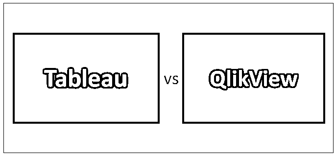
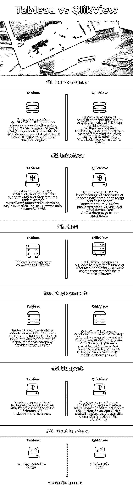

# 表 vs QlikView

> 原文：<https://www.educba.com/tableau-vs-qlikview/>

## Tableau 与 QlikView 的区别

Tableau 能够让用户即时开发仪表板。它有一个直观的界面，并提供更大的视觉自由度，这使它有别于市场上的其他玩家。另一方面，QlikView 能够处理各种数据集，并提供更好的性能。它能有效地处理大数据和传统数据，并能有效地在各种数据集之间建立联系。在 Tableau 和 QlikView 的引领下，市场上有大量工具可供最终用户使用。

### Tableau 和 QlikView 对照表之间的直接比较

以下是 Tableau 和 QlikView 之间的 6 大对比:

<small>Hadoop、数据科学、统计学&其他</small>

### Tableau 和 QlikView 的主要区别

以下是要点列表，描述了 Tableau 和 QlikView 之间的主要区别:

*   QlikView 是一个仪表板应用程序，提供整体和各种功能，而 Tableau 更侧重于视觉分析。
*   与初学者友好的 Tableau 相比，功能丰富的 QlikView 通常被认为很难上手。
*   Tableau 提供了一个更干净的界面，相对于 QlikView 的界面更杂乱，用户体验略好。为了与 Tableau 竞争，QlikView 发布了“QlikSense ”,这是一种更简洁的数据可视化工具。
*   Tableau 被认为更加用户友好，因为它具有简单的拖放功能。
*   QlikView 提供了更好的性能，因为其专利“关联技术”允许在内存中处理表格，同时规避了 OLAP 立方体的使用。
*   Tableau 已经掌握了使用各种图形界面的艺术，因此与 QlikView 相比，如果您的可视化中有地理地图、树状图和重叠，Tableau 更受欢迎。
*   尽管 Tableau 在更加用户友好和具有更好的可视化功能方面具有优势，但在根据特定的业务标准对报告进行细分时，它仍有不足之处。虽然 Tableau 缺乏提供业务视图的功能，但 QlikView 具有出色的功能来生成成熟的企业级报告。
*   Tableau 的另一个有趣的特性是通过 Tableau Online 或 Tableau Server 无缝共享报告。虽然 QlikView 没有同样规模的这些功能，但它提供了与社交媒体平台和移动技术的紧密集成。

### Tableau 和 QlikView 对照表

以下是要点列表，描述 Tableau 和 QlikView 之间的差异。

| **比较依据** | **板** | **QlikView** |
| **性能** | 在内存处理方面，Tableau 比 QlikView 慢。它使用立方体。立方体可以很快给出结果，它们比 RDBMS 更快，但是，当涉及到 QlikView 的专利分析引擎时，它们就不够了。 | QlikView 的关联模型带来了更好的性能。QlikView 可以轻松组合所有大小的数据集。此外，它还对内存处理进行了微调，其速度之快是其他数据可视化工具望尘莫及的。 |
| **界面** | Tableau 的界面更加用户友好和直观，并支持拖放功能。Tableau 具有多样化的图形视觉效果，这使它成为以不同形式展示数据的完美工具。 | QlikView 的界面过于霸道，菜单中有太多不必要的项目，并且缺乏逻辑结构。QlikView 提供了大量企业几乎从未使用过的 3D 图表或仪表。 |
| **成本** | Tableau 比 QlikView 便宜。 | 对于 QlikView，公司将不得不投入更多的财务资源。此外，QlikView 对其移动平台单独收费。 |
| **部署** | Tableau 桌面可供个人使用。对于基于云的部署，可以使用 Tableau Online，对于内部部署，该公司提供 Tableau Server。 | Qlik 以桌面版和企业版的形式提供 QlikView 和 QlikSense，前者供个人使用，后者供企业使用。此外，QlikSense 可作为基础版或商业版机型在云上使用。QlikSense 也可以安装在移动平台上。 |
| **支持** | 不为 Tableau 开发者提供电话支持。许可费用中包含在线知识库和在线社区。 | 开发人员可以在正常工作时间利用电话支持。电话支持包含在企业计划中。此外，还有免费的在线资源和活跃的在线社区 |
| **最佳特性** | 直观设计 | 高效的向下钻取 |

### 结论

综上所述，Tableau vs QlikView 赋予用户自己独特的风格。虽然 Tableau 和 QlikView 都被广泛用于数据可视化，但它们的具体差异使它们彼此不同。

这篇阅读文章以一种全面而有趣的方式给你提供了两种最流行的数据可视化工具之间的比较。Tableau 和 [QlikView tools](https://www.educba.com/qlikview-tools/) 都提供了出色的 BI 功能，可以发布令人惊叹但又极具洞察力的报告，包括交互式可视化分析。此外，Tableau 和 QlikView 都提供了与从 MS-SQL 到 Hadoop 的各种数据源的无缝集成。然而，Tableau 和 QlikView 之间确实存在一些基本差异，使它们更适合特定类型的用例。

无论您是作为 UI/UX 开发人员开始您的职业生涯，还是作为一名经验丰富的 IT 专业人员转向数据分析或商业智能，拥有这些技术的知识都是非常棒的。幸运的是，EduCBA 平台上有一些优秀的课程，可以加速你的学习目标。请务必查看以下链接，了解更多信息。

对于 Tableau:[https://www . educba . com/data-science/courses/Tableau-training/](https://www.educba.com/data-science/courses/tableau-training/)

### 推荐文章

这是 Tableau 与 QlikView 之间差异的指南。在这里，我们讨论了它们的直接比较、主要差异，以及信息图和比较表。您也可以阅读以下文章，了解更多信息——

1.  [视觉分析 vs Tableau–了解重要差异(信息图表)](https://www.educba.com/visual-analytics-vs-tableau/)
2.  【Excel 与 Tableau 的十大对比
3.  [Power BI 仪表盘与报告–8 项精彩对比](https://www.educba.com/power-bi-dashboard-vs-report/)

