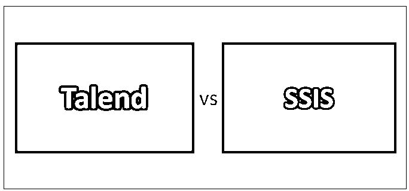
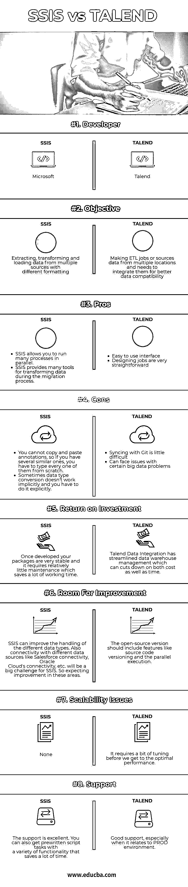

# Talend vs SSIS

> 原文：<https://www.educba.com/talend-vs-ssis/>

## 塔伦德 vs SSIS 简介

Talend 是一个 ETL 工具，可以帮助一个组织获得可访问的数据。这使您可以连接到许多数据库。Talend 可以灵活地处理不同的数据源和平台。它有助于[数据集成](https://www.educba.com/modern-data-integration/)、业务流程管理、主数据管理和数据质量。可以说是数据集成的未来。SSIS 代表“SQL Server 集成服务”。它有助于数据迁移、转换、ETL 和其他功能。这是另一个 ETL 工具，有助于执行复杂的解决方案，如从不同来源读取数据，它还包括分析和清理数据，运行 [ETL 过程](https://www.educba.com/etl-process/)来更新数据仓库。它包括一组名为 SQL Server 数据工具的工具，用于开发和测试集成程序。

**让我们更详细地研究一下塔伦德和 SSIS:**

<small>Hadoop、数据科学、统计学&其他</small>

在本文中，我们将比较市场上两个最好的 ETL 工具——Talend 和 SSIS。在开始这场对决之前，让我们试着找出塔伦德和 SSIS 是什么？他们能做什么？

### Talend 是什么？

Talend 是一个 ETL 工具，就像 Informatica 一样，通过使数据更容易访问来帮助公司。它让你连接到许多数据库。Talend 的构建方式非常灵活，可以与市场上的所有数据源和平台配合使用。它包括数据集成、数据质量、主数据管理和业务流程管理。它为您提供一切，让您的数据为您所用。我们认为这是数据集成的未来。

Talend 的特点:

*   Talend 运行在 Java 平台上。
*   Talend 利用 JDBC 连接到其他数据库系统。
*   Talend 将连接字符串存储在定义连接字符串的元数据中。
*   Talend 利用 Palette 根据 ETL 工作的类型来指定任务的类型。
*   Processing Palette 有各种任务，用于过滤和聚合数据，并使用主。

### 什么是 SSIS？

SSIS 代表“SQL Server 集成服务”。为了在数据迁移、ETL 和转换领域竞争，微软引入了 SSIS。微软为 it 提供了帮助数据迁移、转换、ETL 和其他功能的所有弹药。这个 ETL 工具可以执行复杂解决方案，例如从不同的源读取数据、分析和清理数据、运行 ETL 过程以更新数据仓库、将数据写入不同的源以及通过电子邮件发送给特定的人或组。它包括一组用于开发和测试集成程序的工具，称为 SQL Server 数据工具

SSIS 的特色:

*   SSIS 可以处理来自不同数据源的数据。
*   SSIS 更容易维护。
*   SSIS 与 SQL Server 和 Microsoft Visual Studio 紧密集成。
*   SSIS 通过使用 SQL Server 目标更快地将数据加载到 SQL 中。
*   SSIS 消除了将数据插入 SQL 时的网络瓶颈问题。
*   SSIS 更适合复杂的转换、多步骤操作、从不同数据源或类型聚合数据以及结构化异常处理。

### 塔伦德与 SSIS 的对决(资料图)

以下是塔伦德和 SSIS 的八大对比:

### 塔伦德和 SSIS 的速度比较

**用例**

为了测试这两个 ETL 工具的能力，我们将一个带分隔符的平面文件加载到同一服务器上的另一个带分隔符的平面文件中。该文件由 20M 记录组成，大小约为 1.5GB

**集群配置**

*   服务器:[IBM](https://www.educba.com/)–M3 x 3650 系统
*   处理器:英特尔至强 X5680 @ 3.33GHz (2 个处理器)
*   内存:76GB
*   操作系统:Windows Server 2008 R2 版–64 位
*   v5.3.1 公开演播室
*   JDK 1.7.0
*   JRE 7
*   SQL Server 2008–SP1

### 比较塔伦德与 SSIS

为了获得足够大的样本，我运行了 3 次测试。

| **审判** | **记录** | **塔伦德的时间** | **SSIS 时间** |
| One | Twenty million | Ninety-two point two eight | Forty-nine point seven one |
| Two | Twenty million | Ninety-two point nine nine | Fifty point two |
| Three | Twenty million | Eighty-six point six nine | Fifty-one point eight three |

塔伦德完成这项工作平均需要 67.69 秒，而 SSIS 完成同样的工作平均需要 39.8 秒。

### 塔伦德和 SSIS **对照表**

下面是塔伦德和 SSIS 的对比表。

| **比较依据** | **SSIS** | **演讲** |
| **开发商** | 微软公司(全球知名的 PC 软件主要厂商) | 说得好 |
| **目标** | 从不同格式的多个来源提取、转换和加载数据 | 制作 ETL 作业或从多个位置获取数据，并需要集成它们以获得更好的数据兼容性 |
| **优点** | 

*   Ssis allows you to run multiple processes in parallel.

 | 

*   Easy to use interface

 |
| 

*   SSIS provides many tools for data conversion during migration.

 | 

*   The design is very simple.

 |
| **缺点** | 您不能复制和粘贴注释，因此如果您有几个相似的注释，您必须从头开始键入每个注释。T3】 | 

*   It's a bit difficult to synchronize with Git.

 |
| 有时数据类型转换不能隐式地进行，你必须显式地进行。T3】 | 

*   Can face some big data problems.

 |
| **投资回报** | 一旦开发出来，你的包就非常稳定，相对来说需要很少的维护，这就节省了大量的工作时间 | [Talend Data Integration](https://www.educba.com/talend-data-integration/) 简化了数据仓库管理，从而降低了成本和时间 |
| **改进空间** | SSIS 可以改进不同数据类型的处理。还有与不同数据源的连接，如 Salesforce 连接、Oracle Cloud 连接等。对 SSIS 来说将是一个巨大的挑战。所以期待这些方面的改善。 | 开源版本应该包括像源代码版本控制和并行执行这样的特性。 |
| **可扩展性问题** | 没有人 | 在达到最佳性能之前，需要进行一些调整。 |
| **支持** | 支撑非常好。您还可以获得具有各种功能的预先编写的脚本任务，从而节省大量时间。 | 良好的支持，尤其是在涉及生产环境时。 |

### 结论

经过这次测试，可以清楚地看到，在一些简单的转换上，SSIS 比塔伦德表现得更好。但这并不意味着 SSIS 会在所有领域胜过塔伦德。这个测试规模很小，我们知道 Talend 可以比 SSIS 更有效地做很多事情，而且它是开源的。现在，最后，我们可以说这两种工具各有利弊，取决于您的需求，您可以在这两者之间做出选择。

### 推荐文章

这是一个塔伦德 vs SSIS 的指南。在这里，我们讨论了塔伦德与 SSIS 的直接比较，主要差异以及信息图表和比较表。您也可以阅读以下文章，了解更多信息——

1.  [Talend 与 Informatica PowerCenter 的区别](https://www.educba.com/talend-vs-informatica-powercenter/)
2.  [数据挖掘与数据可视化——哪个更好](https://www.educba.com/data-mining-vs-data-visualization/)
3.  [数据挖掘与数据分析的 7 大区别](https://www.educba.com/data-mining-vs-data-analysis/)
4.  [商业智能 vs 大数据——6 个惊人的对比](https://www.educba.com/business-intelligence-vs-big-data/)

