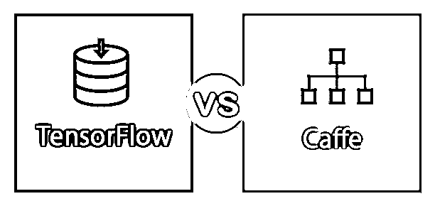
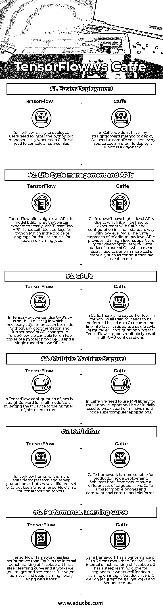

# tensorflow vs 咖啡

> 原文：<https://www.educba.com/tensorflow-vs-caffe/>

## TensorFlow 和 Caffe 的区别

TensorFlow 是一个开源的 python 友好软件库，用于数值计算，使用数据流图使机器学习更快更容易。TensorFlow 简化了获取数据、预测特征、基于用户数据训练不同模型以及提炼未来结果的过程。TensorFlow 由谷歌机器智能研究部门的大脑团队开发，用于机器学习和深度学习研究。Caffe 是一个用于训练和运行神经网络模型的深度学习框架，由伯克利视觉和学习中心开发。Caffe 的开发考虑到了表达、速度和模块化。在 Caffe 中，模型和优化被定义为纯文本模式，而不是具有公共代码、参考模型和可再现性的科学和应用进展的代码。

### What is TensorFlow?

TensorFlow 是跨平台的，因为我们可以使用它在 CPU 和 GPU、移动和嵌入式平台、张量流单元等上运行。TensorFlow 是用 python 和 C++编程语言开发的，非常适合于数值计算和大规模机器学习以及具有不同算法的深度学习(神经网络)模型，并通过公共层提供。TensorFlow 能够训练和运行不同的深度神经网络模型，如手写数字识别、图像识别、自然语言处理、基于偏导数方程的模型、与预测相关的模型以及[递归神经网络](https://www.educba.com/recurrent-neural-networks-rnn/)。

<small>Hadoop、数据科学、统计学&其他</small>

### 什么是咖啡？

Caffe 是和 Python、Matlab 一起用 C++编程语言开发的。Caffe 的建筑鼓励新的应用和创新。它允许在 CPU 和 GPU 上执行这些模型，我们可以使用单个标志在它们之间切换。Caffe speed 适用于研究实验和行业开发，因为它可以在一天内处理超过 6000 万张图像。Caffe 提供图像处理、视觉、语音和多媒体领域的学术研究项目和大规模工业应用。使用 Caffe 我们可以训练不同类型的神经网络。

### TensorFlow 和 Caffe 的面对面比较(信息图)

下面是 TensorFlow 和 Caffe 的 6 大区别

### TensorFlow 和 Caffe 的主要区别

两者都是市场上的热门选择；让我们讨论一些主要的区别:

*   TensorFlow 框架更适合研究和服务器产品，因为两者都有不同的目标用户，TensorFlow 的目标是研究人员和服务器，而 Caffe 框架更适合生产边缘部署。而 TensorFlow 和 Caffe 框架都有不同的目标用户。Caffe 的目标是移动电话和计算受限平台。
*   TensorFlow vs Caffe 对于想要学习深度学习和神经网络模型的初学者来说，学习曲线都很陡峭。
*   根据脸书的内部基准测试，Caffe 的性能比 TensorFlow 高 1.2 至 5 倍。
*   TensorFlow 在图像和序列上工作良好，并被评为最常用的深度学习库，而 Caffe 在图像上工作良好，但在序列和递归神经网络上工作不佳。
*   TensorFlow 通过使用 python pip 包管理更容易部署，而 Caffe 部署并不简单，我们需要编译源代码。
*   Caffe 的目标是希望体验动手深度学习的开发人员，并提供培训和学习资源，而 TensorFlow 高级 API 则负责开发人员无需担心的地方。

### TensorFlow 与 Caffe 对比表

下面是 TensorFlow 和 Caffe 之间的 6 个最上面的比较

| **比较的基础** | **TensorFlow** | **咖啡** |
| **更轻松的部署** | TensorFlow 易于部署，因为用户需要轻松安装 python pip 管理器，而在 Caffe 中，我们需要编译所有源文件。 | 在 Caffe 中，我们没有任何简单的部署方法。我们需要编译每一个源代码来部署它，这是一个缺点。 |
| **生命周期管理和 API** | TensorFlow 提供了用于模型构建的高级 API，因此我们可以轻松地使用 TensorFlow API 进行实验。它有一个适合 python(这是数据科学家的语言选择)的接口，用于机器学习工作。 | Caffe 没有更高级别的 API，因此很难用 Caffe 进行实验，这是一种使用低级 API 的非标准配置。中低层 API 的 Caffe 方法提供了很少的高层支持和有限的深层可配置性。Caffe 界面更像 C++，这意味着用户需要手动执行更多的任务，例如创建配置文件等。 |
| **GPU 的** | 在 TensorFlow 中，我们可以通过使用 tf.device()来使用 GPU，在 TF . device()中可以进行所有必要的调整，而无需任何文档，也不需要进一步更改 API。在 TensorFlow 中，我们可以在两个 GPU 上运行一个模型的两个副本，在两个 GPU 上运行一个模型。 | 在 Caffe 中，不支持 python 中的工具。所以所有的训练都需要基于 C++命令行界面来执行。它支持单一风格的多 GPU 配置，而 TensorFlow 支持多种类型的多 GPU 配置。 |
| **多机支持** | 在 TensorFlow 中，通过设置 tf，多节点任务的作业配置非常简单。设备需要运行的作业数量。 | 在 Caffe 中，我们需要使用 MPI 库来支持多节点，它最初是用来拆分大规模多节点超级计算机应用程序的。 |
| **定义** | tensorflow 框架更适合研究和服务器产品，因为两者都有不同的目标用户，TensorFlow 的目标用户是研究人员和服务器。 | Caffe 框架更适合生产边缘部署。而两种框架都有不同的目标用户。Caffe 的目标是移动电话和计算受限平台。 |
| **表现，学习曲线** | 在脸书的内部基准测试中，tensorflow 框架的表现不如 Caffe。它有一个陡峭的学习曲线，它在图像和序列上工作得很好。它和 Keras 一起被评为最常用的深度学习库。 | 在脸书的内部基准测试中，Caffe framework 的性能是 TensorFlow 的 1.2 到 5 倍。对于初学者来说，它的学习曲线很陡。它对图像的深度学习很有效，但对递归神经网络和序列模型不太有效。 |

### 结论

最后，概述了两种深度学习框架之间的比较。希望你看完这篇 TensorFlow vs Caffe 的文章，对这些框架有很好的理解。TensorFlow 框架是一个快速发展的框架，被评为最常用的深度学习框架，最近谷歌在该框架上进行了大量投资。TensorFlow 提供移动硬件支持，低级 API 核心提供一个端到端编程控制和高级 API，这使其快速高效，而 Caffe 在这些领域与 TensorFlow 相比落后。所以 TensorFlow 有潜力成为深度学习框架中的霸主。

### 推荐文章

这是 TensorFlow 与 Caffe 之间最大差异的指南。在这里，我们还将讨论信息图和比较表的主要区别。你也可以看看下面的文章来了解更多。

1.  [Ubuntu 与 Windows 10 的顶级对比](https://www.educba.com/ubuntu-vs-windows-10/)
2.  [Winforms vs WPF——有用的区别](https://www.educba.com/winforms-vs-wpf/)
3.  [区分 SOAP 和 JSON](https://www.educba.com/json-vs-soap/)
4.  [TensorFlow vs Keras | Top Differences](https://www.educba.com/tensorflow-vs-keras/)

