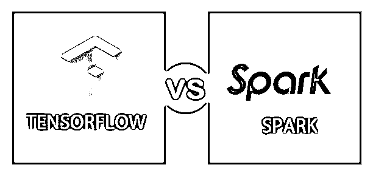
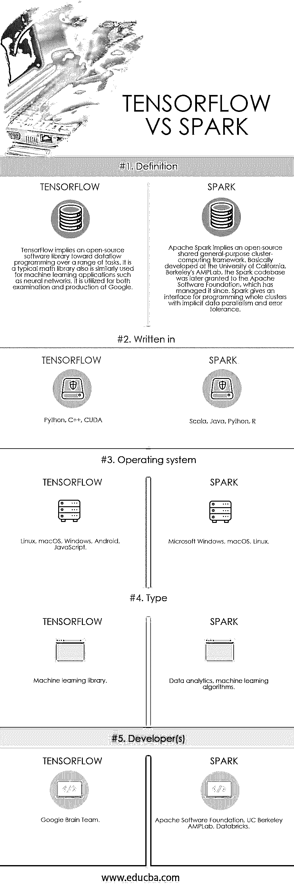

# TensorFlow vs Spark

> 原文：<https://www.educba.com/tensorflow-vs-spark/>

## 张量流和火花的区别

TensorFlow 暗示了一个用于数值计算的 Python 友好的开源库，它可以更快、更直接地执行机器学习。TensorFlow 允许开发人员设计数据流图——定义数据如何在图表上移动的结构，或者是一系列处理节点。特定图形中的单个节点表示某种数学运算。同样，所有点或节点之间的关联暗示了一些多维张量优先收集的数据。TensorFlow 通过一种流行的语言 Python 为开发者提供了充分的信息。Apache Spark 是一个高速的通用集群计算系统。它提供了 Scala、Python、Java 和 R 中的高级 API，以及一个促进通用执行图的优化引擎。它还可以帮助丰富的高级工具，包括用于机器学习的 MLlib，用于图形处理的 GraphX，以及用于 SQL 和结构化数据处理的 Spark SQL，Spark Streaming。Apache Spark 以弹性分布式数据集(RDD)作为其结构基础，这是一个分散在一个机器集群中的只读多数据项集，它以容错方式进行维护。

**什么是张量流？**

<small>Hadoop、数据科学、统计学&其他</small>

这种语言易于使用和学习，并提供了可接受的表示方法，从而可以将高级抽象链接到 Tensors，并且在 TensorFlow 中节点统称为 Python 对象。另外，TensorFlow 的应用程序本身仍然是 Python 应用程序。然而，在 Python 中，并没有实现正确的数学运算。可通过 TensorFlow 访问的库中的修改类似于具有更高性能的 C++二进制文件。Python 提供了高级编程抽象，直接在各个部分之间引导流量，并将它们保护在一起。TensorFlow 的应用程序可以在几乎所有可访问的目标上运行:本地机器、iOS、云中的集群、CPU 或 GPU 以及 Android 设备。如果你熟悉谷歌的私有云，为了获得额外的加速，你可以运行谷歌定制的 TensorFlow 处理器(TPU)芯片。然后，TensorFlow 开发的最终模型可以部署在几乎任何设备上，在那里它们将被处理以服务于预测。

**什么是火花？**

在 Spark 1.x 中，RDD 完成了最初的应用程序编程接口(API ),但是，从 Spark 2.x 的数据集实用程序开始，即使这个 RDD API 没有被弃用，也支持 API。RDD 技术仍然拥有数据集 API。Spark 及其 rdd 也是在 2012 年形成的，以响应 MapReduce 集群计算标准中的限制，该标准在共享程序上强制实施适当的线性数据流结构:MapReduce 程序扫描来自磁盘的输入数据，在数据上映射函数，减少映射的结果，此外还将减少结果存储到磁盘。

Spark 的 RDDs 功能是一个工作集，本质上是为分布式程序提供(有目的地)有限形式的分配共享内存。Spark 促进了迭代算法和交互式/探索性数据分析的实现，迭代算法在一个循环中多次访问数据集，交互式/探索性数据分析即复制数据库风格的数据查询。与 MapReduce 实现相关联的这种应用的延迟可以减少许多数量级(在 Apache Hadoop 堆栈中很流行)。迭代算法类是机器学习系统的基础算法，它是开发 Apache Spark 的主要动力。

### TensorFlow 和 Spark 的直接对比(信息图)

下面是 TensorFlow 与 Spark 之间的 5 大差异

### TensorFlow 和 Spark 的主要区别

两者都是市场上的热门选择；让我们来讨论一些主要的区别

*   Apache Spark 优先使用 Spark，因为它通常被认为是一个开源的集群计算框架，为整个编程集群提供了一个具有隐式数据并行性和容错能力的接口。另一方面，TensorFlow 是由谷歌开发的一个紧凑的库，它有助于提高数值计算甚至神经网络的性能，并以图形的形式生成数据流——由指示操作的节点和表示数据阵列的边组成。
*   Spark 本质上是一个大数据框架，它使得大量产生大量用户数据的公司能够有效地处理这些数据，并提供大规模的推荐。而 Tensorflow 本质上是一个机器学习框架，它支持人们创建广泛的学习模型，而不需要机器学习专家的严格技能。
*   在 Spark 中，用于大规模数据处理的快速而全面的引擎允许各种功能，如流和复杂的分析、高速、易用性，它可以与 SQL 连接，可以在任何地方运行，如 Mesos、Hadoop 和云。另一方面，在 Tensorflow 中，一个允许对大学习和机器学习进行计算的 Google API，TensorFlow 给出了计算流的图形表示。API 鼓励用户编写复杂的神经网络设计，并根据激活值对其进行调整。
*   用 Python，C++，CUDA 写的 Tensorflow。相比之下，Spark 是用 Scala、Java、Python、R
*   Spark 上的 TensorFlow 解决了以分布式方式在重要数据集群上部署高级学习的困难，这不是完全现代的健壮知识范例，但是优选地是对当前框架的升级，当前框架需要开发各种程序来扩展重要数据组上的智能。连接两个张量流也产生火花，它为不希望的系统复杂性以及端到端学习延迟提供了空间。

### 张量流与火花对照表

下面是最上面的 5 个对比

| **比较的基础** | **TENSORFLOW** | **火花** |
| **定义** | TensorFlow 意味着一个面向一系列任务的数据流编程的开源软件库。它是一个典型的数学库，也同样用于机器学习应用，如神经网络。它被用于谷歌的审查和生产。‍ | Apache Spark 暗示了一个开源共享的通用集群计算框架。基本上是在加州大学伯克利分校的 AMPLab 开发的，Spark 代码库后来被授予 Apache 软件基金会，由其管理。Spark 提供了一个接口，用于使用隐式数据并行和容错对整个集群进行编程。 |
| **写于** | Python，C++，CUDA | Scala，Java，Python，R |
| **操作系统** | Linux，macOS，Windows，Android，JavaScript | 微软视窗系统，苹果操作系统，Linux 操作系统 |
| **类型** | 机器学习库 | 数据分析，机器学习算法 |
| **开发商** | 谷歌大脑团队 | Apache 软件基金会、加州大学伯克利分校 AMPLab、Databricks |

### 结论

总之，Apache Spark 意味着一个数据处理框架，而 TensorFlow 用于大规模定制学习和神经网络设计。因此，如果用户需要实现深度学习算法，TensorFlow 是解决方案，而对于数据处理，它是 Spark。

### 推荐文章

这是 TensorFlow 与 Spark 之间最大差异的指南。在这里，我们还讨论了 TensorFlow 与 Spark 在信息图和对照表方面的主要差异。你也可以看看下面的文章来了解更多。

1.  [Tensorflow vs Pytorch](https://www.educba.com/tensorflow-vs-pytorch/)
2.  [Splunk vs Spark](https://www.educba.com/splunk-vs-spark/)
3.  [肥皂大战 WSDL](https://www.educba.com/soap-vs-wsdl/)
4.  [Hadoop vs Spark](https://www.educba.com/hadoop-vs-spark/)
5.  [深度学习的 7 大架构方法](https://www.educba.com/deep-learning-algorithms/)
6.  [机器学习系统完全指南](https://www.educba.com/machine-learning-system/)
7.  [TensorFlow 与 Keras |主要差异](https://www.educba.com/tensorflow-vs-keras/)

