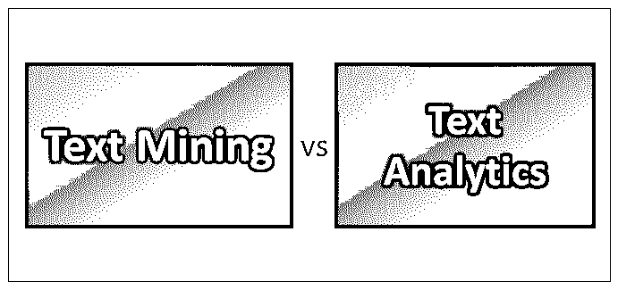
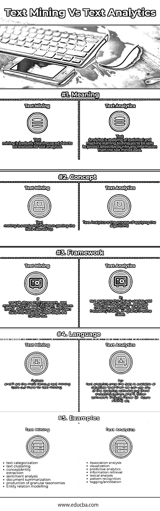
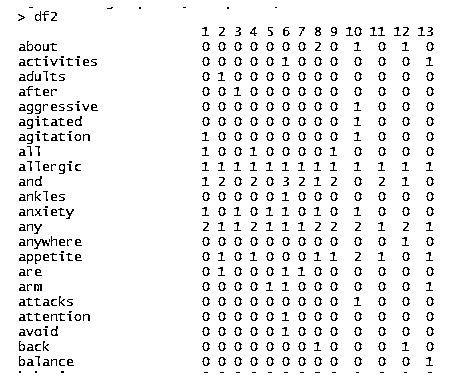
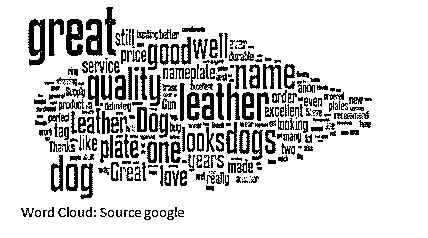
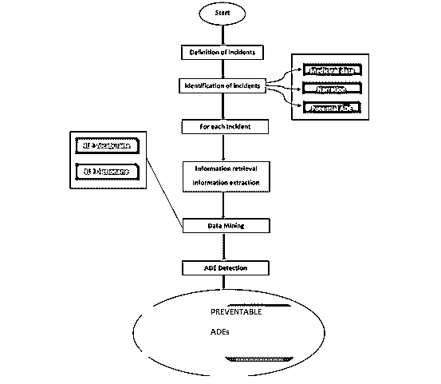
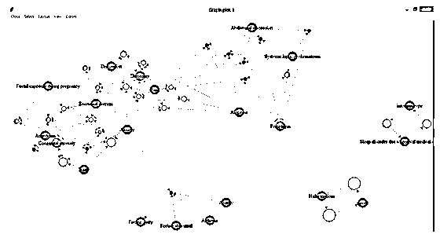
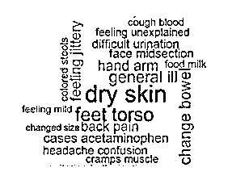

# 文本挖掘与文本分析

> 原文：<https://www.educba.com/text-mining-vs-text-analytics/>

## 文本挖掘和文本分析的区别

下面的文章提供了文本挖掘和文本分析的概要。自 20 世纪初以来，结构化数据就已经存在，但使[文本挖掘](https://www.educba.com/text-mining/)和文本分析如此特殊的是利用来自非结构化数据(自然语言处理)的信息。一旦我们能够将这种非结构化文本转换成半结构化或结构化数据，就可以应用所有的[数据挖掘](https://www.educba.com/data-mining-vs-statistics/)算法。《出埃及记》统计和[机器学习](https://www.educba.com/machine-learning-vs-predictive-analytics/)算法。

即使是唐纳德·特朗普也能够利用数据并将其转化为信息，帮助他赢得美国总统选举，基本上他没有这样做，而是他的下属做了。有一篇非常好的文章[https://fivethirtyeight . com/features/the-real-story-of-2016/](https://fivethirtyeight.com/features/the-real-story-of-2016/)你可以浏览一下。

<small>Hadoop、数据科学、统计学&其他</small>

许多企业已经开始使用文本挖掘，从现有文本中获取有价值的信息，例如，一家基于产品的公司可以使用 twitter 数据/脸书数据，通过情感分析了解他们的产品在世界上的表现如何。在早期，处理过程需要花费大量时间，事实上，需要几天来处理甚至实现机器学习算法，但是随着 Hadoop、Azure、KNIME 和其他大数据处理软件的引入，文本挖掘在市场上获得了巨大的人气。使用关联挖掘进行文本分析的最好例子之一是亚马逊的推荐引擎，它会自动向客户推荐其他人在购买任何特定产品时还购买了什么。

将文本挖掘工具应用到非数字格式/非计算机驱动的东西上的最大挑战之一是制作过程。旧的档案和许多重要文件只能在纸上获得，有时通过 OCR(光学字符识别)读取，这有许多错误，有时手动输入数据，这容易出现人为错误。我们想要这些的原因是，我们也许能够从传统的阅读中获得其他的洞见。

文本挖掘的一些步骤如下:

*   信息检索
*   数据准备和清理
*   分割
*   [标记化](https://www.educba.com/tokenization-in-python/)
*   停用字词编号和标点符号删除
*   堵塞物
*   转换成小写
*   词性标注
*   创建文本语料库
*   术语-文档矩阵

下面是在术语文档矩阵准备好之后应用的文本分析的步骤。

*   建模(这可能包括推理模型、预测模型或规定模型)
*   模型的训练和评估
*   这些模型的应用
*   可视化模型

唯一必须记住的是，文本挖掘总是先于文本分析。

### 文本挖掘与文本分析的直接比较(信息图表)

以下是文本挖掘与文本分析之间的五大对比:

### 文本挖掘和文本分析的主要区别

让我们根据应用文本挖掘和文本分析的几个应用中涉及的步骤来区分文本挖掘和文本分析:

**文档分类:**在此，文本挖掘包括的步骤是标记化、词干化和词条化，去除停用词和标点符号，最后计算术语频率矩阵或文档频率矩阵。

*   **标记化:**将整个数据(语料库)拆分成更小的组块或更小的词通常是单个词的过程称为标记化(N-Gram 模型或词袋模型)。
*   **词干化和词条化:**例如单词 big bigger 和 maximum 都表示相同的意思，这将形成重复数据，为了保持数据的冗余，我们进行词条化，将单词与词根链接起来。
*   **删除停用词:**停用词不用于分析，包括 is、the 等词。

**术语频率:**这是一个矩阵，行标题作为文档名称，列作为术语(单词)，数据是单词在这些特定文档中出现的频率。

下面是一个样本截图。

在上图中，我们将行中的属性(单词)和文档编号作为列，将词频作为数据。

现在来看文本分析，我们需要考虑以下步骤:

*   **聚类:**使用 K-means 聚类/ [神经网络](https://www.educba.com/neural-networks-vs-deep-learning/) / CART(分类和回归树)或任何其他聚类算法，我们现在可以基于生成的特征(这里的特征是单词)对文档进行聚类。
*   **评估和可视化:**我们可以将群集绘制成二维图，并查看这些群集之间的差异，如果该模型在测试数据上表现良好，我们可以将其部署到生产中，它将是一个很好的文档分类器，可以对作为输入给出的任何新文档进行分类，并可以命名它将属于的群集。

### 情感分析

市场上最强大的工具之一是情感分析，它可以帮助处理 twitter 数据/脸书数据或任何其他可用于从中得出情感的数据，无论情感对任何特定过程/产品或个人是好是坏还是中性。

通过使用 twitter API /脸书 API 获取推文/评论/喜欢等，可以很容易地获得数据源。在一家公司的推特或帖子上。主要的问题是，这些数据很难组织。数据也会包含各种广告，为该公司工作的[数据科学家](https://www.educba.com/data-scientist-vs-data-engineer/)必须确保数据的选择是以正确的方式进行的，以便只有选定的推文/帖子才能通过预处理阶段。
其他工具包括网络抓取，这是文本挖掘的一部分，你使用爬虫从网站上抓取数据。

文本挖掘的过程仍然与标记化、词干化和词条化相同，去除停用词和标点符号，最后计算术语频率矩阵或文档频率矩阵，但是唯一的区别在于应用情感分析。

通常，我们会给任何帖子/推文打分。通常，当你购买一件商品并评论时，你也可以选择给评论打分并发表评论。谷歌、亚马逊和其他网站使用星星来对评论进行评级，不仅如此，他们还将推文/帖子交给人类，以对其进行好/坏/中性评级，并将这两个分数结合起来，为任何特定的推文/帖子生成新的分数。

情感分析的可视化可以使用词云、频率术语矩阵的条形图来完成。

### 采矿分析协会

一些人正在研究的一个应用是“药物不良事件概率模型”，在这个模型中，人们可以检查如果他服用任何特定的药物，哪些不良事件可能会导致其他不良事件。文本挖掘包括以下工作流程。

从上图中，我们可以看到，直到数据挖掘的所有步骤都属于文本挖掘，即识别数据的来源，提取它们，然后准备好进行分析。

然后应用关联挖掘，我们有下面的模型。我们可以看到，一些箭头指向橙色圆圈，然后一个箭头指向任何一个特定的 ADE(药物不良事件)。如果我们以图像左下方的例子为例，我们可以发现冷漠、虚弱和感觉异常会导致负罪感，人们可以说这是显而易见的，这是显而易见的，因为作为一个人，你可以解释和联系，但在这里，机器正在解释它，并给我们下一个不良药物事件。

单词 cloud 的例子如下:

### 文本挖掘与文本分析对照表

以下是要点列表，描述了文本挖掘与文本分析之间的比较:

| **比较依据** | **文本挖掘** | **文本分析** |
|  **意为** | [文本挖掘是](https://www.educba.com/what-is-text-mining/)基本上清理 od 数据以用于文本分析。 | 文本分析是统计和机器学习技术的应用，能够从文本挖掘的数据中预测/规定或推断任何信息。 |
|  **概念** | 文本挖掘是一种帮助清理数据的工具。 | 文本分析是应用算法的过程。 |
|  **框架** | 如果我们谈论框架，文本挖掘类似于 ETL(提取转换加载)，这意味着能够插入数据到数据库这些步骤被执行。 | 文本分析这些数据用于增加业务价值，例如创建单词云、双字母频率表，在某些情况下是 N 字母。 |
|  **语言** | Python 和 R 是最著名的文本挖掘工具。 | 对于文本分析，一旦数据在数据库级别可用，我们就可以使用任何分析软件，包括 python 和 r。其他软件包括 Power BI、Azure、KNIME 等。 |
|  **例题** | 

*   text classification
*   Text clustering
*   Concept/Entity Extraction
*   Sentiment Analysis
*   Document abstract
*   Generate granularity classification
*   Entity relationship modeling

 | 

*   association analysis
*   visualization
*   [Forecast analysis](https://www.educba.com/what-is-predictive-analytics/)
*   IR
*   Lexical analysis
*   pattern recognition
*   Annotation/annotation

 |

### 结论

文本挖掘与文本分析的未来不仅适用于英语，而且也有持续的进步，使用语言工具不仅英语，其他语言也在考虑进行分析。由于分析其他语言的资源有限，文本挖掘的范围和未来将会增长。

文本分析的应用范围非常广泛，可以应用的行业示例如下:

*   社交媒体监控
*   制药/生物技术应用
*   商业和营销应用

### 推荐文章

这是文本挖掘与文本分析的指南。在这里，我们讨论了文本挖掘与文本分析的直接比较、关键差异以及信息图表。您也可以阅读以下文章，了解更多信息——

1.  [Azure Paas 与 Iaas-找出差异](https://www.educba.com/azure-paas-vs-iaas/)
2.  [关于数据挖掘和文本挖掘，最值得学习的 3 件事](https://www.educba.com/data-mining-vs-text-mining/)
3.  [了解数据挖掘和数据分析的 7 大区别](https://www.educba.com/data-mining-vs-data-analysis/)
4.  [商业智能与机器学习——哪个更好](https://www.educba.com/business-intelligence-vs-machine-learning/)

