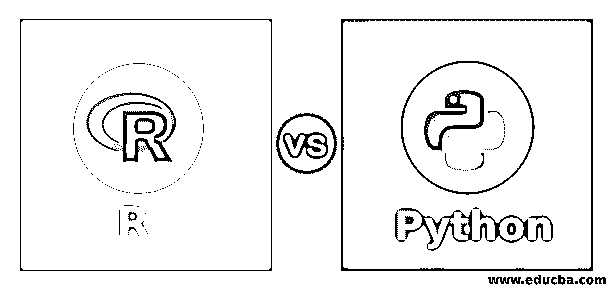
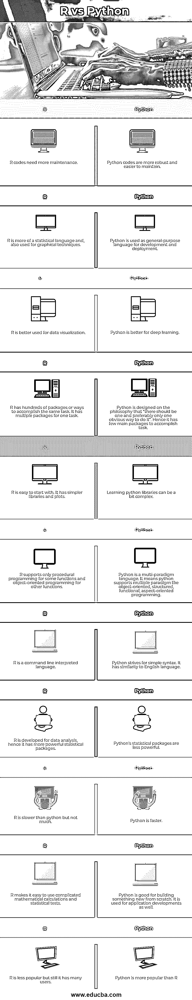

# R vs Python

> 原文：<https://www.educba.com/r-vs-python/>

## R 和 Python 的区别

统计程序设计包 R 和程序设计语言 Python 之间的比较，以便了解两种程序设计语言中的一种语言在特定参数上的优势，从而使用户能够针对给定的情况做出正确的选择，并且比较的参数可以是各种各样的，从设计语言的目标、用户基础、使用的灵活性、语言为学习者提供良好工作机会的作用、技术方面， 随着陷阱的一些缺点，因此通过提供关于选择工具的完整想法来帮助用户，被称为 R vs Python。 **T2】**

### R 是什么？

r 是一种统计语言。它用于开发统计软件和数据分析。自从数据挖掘和数据研究变得流行起来，R 也变得流行起来。除了统计技术，R 还为图形技术提供了各种各样的库。它可以生成静态图形，用于出版物质量的图形。动态和交互式图形也是可用的。R 有一个包存档网络(CRAN-Comprehensive R Archive Network)用于它支持的所有包。它包含超过 10，000 个包。r 是一种命令行语言，但是有几个界面提供了交互式 GUI 来减轻开发人员的任务。

<small>Hadoop、数据科学、统计学&其他</small>

### Python 是什么？

Python 是一种多范式语言，由吉多·范·罗苏姆于 1991 年创建。可以[用于 web 开发](https://www.educba.com/career-in-web-development/)，软件开发，系统脚本等。它可以在不同的平台上运行。Python 是为了更好的可读性而设计的；因此，它与英语有一些相似之处。Python 关注简单的、不那么混乱的语法和文法。例如，在 python 中，空格标记缩进以限制块。它使用动态类型和后期绑定，在运行时绑定方法和变量。有了大量的库，Python 可以有很多用途。它被列为十大最受欢迎的编程语言。

**真实场景**——多年来，机器学习给了我们无人驾驶汽车、有效的网络搜索，以及对人类基因组的极大了解。但问题是，这是如何运作的？

你可能还记得一些情况，你感谢你使用的技术，但是不能准确地描述为什么会发生这些事情。我们现在几乎所有人都把大部分时间花在电子商务网站或浏览谷歌上。

这经常发生在你打错字的时候，例如，在谷歌搜索的时候，它给我们的信息是“你是这个意思吗……”这只不过是谷歌机器学习算法，一个在进行特定搜索后检测你几次搜索的系统。

让我们再举一个场景，让它更清晰；亚马逊是全球知名的电子商务平台。人们寻找他们需要的产品。假设 Paul 先生正在寻找一部摩托罗拉手机，他进行了搜索并找到了(摩托罗拉的)手机，但该网站还推荐了一些与该手机相关的产品细节，如屏幕保护、与该手机最兼容的耳机。这也是亚马逊使用的机器学习算法。其目的是明确这些公司正在研究这项技术，以通过降低复杂性来简化应用程序的使用，让客户满意。

### R 和 Python 的面对面比较(信息图)

以下是 R 与 Python 之间的 11 大区别。

### R 和 Python 之间的主要区别

尽管 R vs Python 在类似的目的上很受欢迎，例如数据分析和机器学习，但这两种语言有不同的特性。此外，每种语言都有不同的优点和缺点。尽管如此，R 编程和 Python 都是市场上流行的选择；让我们讨论一下 R 编程和 Python 之间的主要区别，看看哪一个是最好的:

r 是由 Ross Ihaka 和 Robert Gentleman 在 1995 年创建的，而 Guido Van Rossum 在 1991 年创建了 Python。此外，r 专注于专门为统计和数据分析构建的编码语言，而 Python 可以灵活地使用包来定制数据。

当涉及到复杂的视觉效果和简单的定制时，r 是很棒的，而 Python 对于印刷就绪的可视化就不那么好了。此外，r 很难与生产工作流程集成。主要是一个统计分析和图形工具，而 Python 很容易集成到生产工作流程中，可以成为产品的一个实际部分。

r 在 2018 年 4 月 23 日有 3.5.0 的稳定发布(当前)，而 Python 在 2018 年 3 月 28 日有 3.6.5(当前)。r 有。r，。r，。r 数据，。rds 和。rda 文件扩展名，而 Python 有。py，。pyc，。pyd，。pyo。pwy，。pyz 文件扩展名。

让我们来看看更多的关键区别。

1.  **速度和性能:**虽然两种语言都用于大数据分析。但是就性能而言，Python 是构建关键而快速的应用程序的更好选择。r 比 Python 慢一点，但仍然足够快来处理大数据操作。
2.  **图形与可视化:**数据如果能够可视化，就很容易理解。r 为数据的图形化解释提供了各种包。Ggplot2 给出定制的图形。Python 也有用于可视化的库，但是比 R 要复杂一点。R 有一个印刷精美的库，可以帮助构建出版物质量的图形。
3.  **深度学习:**随着数据科学和机器学习的日益流行，r 和 python 语言都变得流行起来。虽然 python 提供了很多微调过的库，但 R 得到了 Python 深度学习包的接口 KerasR。因此，这两种语言现在都有非常好的深度学习包集合。但 python 在深度学习和 AI 的案例中脱颖而出。
4.  **统计正确性:**由于 R 是为数据统计而开发的，所以提供了更好的支持和库库。Python 最适合用于应用程序开发和部署。但是 R 和它的库为数据分析实现了各种各样的统计和图形技术。
5.  **非结构化数据:**全球 80%的数据是非结构化的。社交媒体产生的数据大多是非结构化的。Python 提供了 NLTK、scikit-image、PyPI 等包来分析非结构化数据。r 也提供了用于分析非结构化数据的库，但是支持不如 Python。然而，这两种语言都可以用于非结构化数据分析。
6.  **社区支持:**R vs Python 都有很好的社区支持。这两种语言都有用户邮件列表、StackOverflow 组、用户贡献的文档和代码。所以这是两种语言之间的联系。但是这两种语言都没有客户服务支持。这意味着用户只有在线社区和开发者文档来寻求帮助。

### r 与 Python 对照表

让我们讨论一下 R 和 Python 之间最重要的区别。

| 英语字母表中第十八个字母 | 大蟒 |
| r 代码需要更多的维护。 | Python 代码更加健壮，也更容易维护。 |
| r 更多的是一种统计语言，也用于图形技术。 | Python 被用作开发和部署的通用语言。 |
| r 更适合用于数据可视化。 | Python 更适合深度学习。 |
| r 有数百个包或方法来完成相同的任务。一个任务有多个包。 | Python 的设计理念是“应该有一种，最好只有一种显而易见的方法”。因此它只有几个主要的包来完成这个任务。 |
| r 很容易上手。它有更简单的图书馆和情节。 | 学习 python 库可能有点复杂。 |
| 对于某些函数，r 只支持过程化编程，而对于其他函数，r 只支持面向对象编程。 | Python 是一种多范式语言。这意味着 python 支持多种范例，如面向对象、结构化、函数式、面向方面的编程。 |
| r 是一种命令行解释语言。 | Python 力求简单的语法。它和英语有相似之处。 |
| r 是为数据分析而开发的；因此，它有更强大的统计软件包。 | Python 的统计包没那么强大。 |
| r 比 python 慢，但慢不了多少。 | Python 更快。 |
| r 使得使用复杂的数学计算和统计测试变得容易。 | Python 适合从头开始构建新的东西。它也用于应用程序开发。 |
| r 不太受欢迎，但仍然有很多用户。 | Python 比 R 更流行 |

### 结论:

r 和 python 语言各有利弊；这是两者之间的一场硬仗。Python 似乎在数据科学家中更受欢迎一点，但 R 也不是完全失败。r 是为统计分析而开发的，并且非常擅长于此。而 Python 是一种用于应用程序开发的通用语言。这两种语言都提供了广泛的库和包；在某些情况下，跨库支持也是可用的。因此，选择哪一个完全取决于用户的要求。

### 推荐文章

这是 R vs Python 的指南。在这里，我们还将讨论信息图和比较表的主要区别。您也可以浏览我们推荐的其他文章，了解更多信息——

1.  [Python 简介](https://www.educba.com/introduction-to-python/)
2.  [PowerShell vs Python](https://www.educba.com/powershell-vs-python/)
3.  [SQL Server vs PostgreSQL](https://www.educba.com/sql-server-vs-postgresql/)
4.  [Python 替代品](https://www.educba.com/python-alternatives/)

