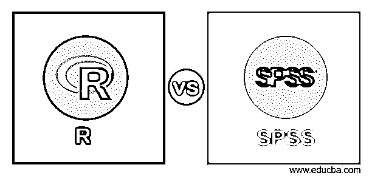
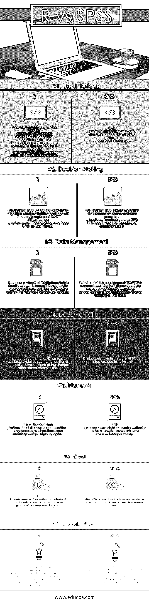

# r 与 SPSS

> 原文：<https://www.educba.com/r-vs-spss/>

## R 和 SPSS 的区别

r 和 SPSS 是两种业界领先的统计数据分析技术。r 是一种开源编程语言，被广泛用作分析的首选。而 SPSS 被认为是 IBM 拥有的社会科学统计软件包。r 是一种脚本语言，与 IBM SPSS 相比，它支持有限的图形用户界面特性，后者具有用于数据质量处理和分析的内置特性。r 有几个来自社区用户的软件包支持。而 SPSS 完全由 IBM 管理，用于支持和特性增强。r 以其定制可视化支持而闻名，而 SPSS 则受限于可视化特性。

### R 和 SPSS 之间的直接比较(信息图表)

下面是 R 与 SPSS 之间的 7 大比较

<small>Hadoop、数据科学、统计学&其他</small>

### R 和 SPSS 的主要区别

下面是 R 与 SPSS 之间最重要的关键区别

*   R 是开源免费软件，其中 R 社区的软件更新非常快，定期添加新的库。稳定的 R 的新版本是 3.5。IBM SPSS 不是免费的，如果有人想使用 SPSS 软件，那么它必须先下载试用版。由于 SPSS 的成本效益，大多数初创企业选择 R 软件。
*   r 是用 C 和 Fortran 写的。r 比 SPSS 具有更强的面向对象编程能力，而 SPSS 图形用户界面是用 Java 语言编写的。它主要用于交互式和统计分析。
*   在统计分析决策树中，R 没有提供太多的算法，并且 R 的大多数包只能实现分类和回归树，它们的界面不够友好。另一方面，IBM SPSS 中的决策树比 R 要好，因为 R 没有提供很多树算法。对于决策树来说，SPSS 的界面非常人性化，易懂易用。
*   与 SPSS 相比，R 的交互式分析工具较少，但其编辑器可为 R 编程提供 GUI 支持。对于学习和实践动手分析，R 是我们的最佳工具，因为它确实有助于分析师掌握各种分析步骤和命令。而且，SPSS 界面或多或少类似于 excel 电子表格。
*   r 提供了更多的机会来修改和优化图形，因为它提供了广泛的软件包。R 中应用最广泛的包是 ggplot2 和 R shiny。R 中的图形也很容易交互，允许用户处理数据。在 SPSS 中，图形不像在 R 中那样具有交互性，在 R 中，您只能创建基本和简单的图形或图表。R 和 SPSS 中的数据管理几乎相同。R 的一个主要缺点是它的大部分函数在执行前必须将所有数据加载到内存中，而 SPSS 提供了数据管理功能，如排序、聚合、转置和表格合并。

### r 与 SPSS 对照表

下面是对比表

| **比较依据** | **R** | **SPSS** |
| **用户界面** | R 具有较少交互的分析工具，但编辑器可用于为 R 中的编程提供 GUI 支持。对于学习和实践动手分析，R us 是最佳工具，因为它确实有助于分析师掌握各种分析步骤和命令。
***T4】*** | SPSS 具有更强的交互性和更友好的用户界面。SPSS 以类似电子表格的方式显示数据 |
| **决策制定** | 对于决策树，R 没有提供很多算法，并且 R 的大部分包只能实现 CART(分类和回归树),它们的界面也不是很友好。 | 对于决策树，IBM SPSS 比 R 好，因为 R 没有提供很多树算法。对于决策树来说，SPSS 界面非常人性化，易懂。 |
| **数据管理** | R 的一个主要缺点是，它的大多数函数在执行之前必须将所有数据加载到内存中，这就限制了可以处理的数据量。 | 在数据管理方面，IBM SPSS 或多或少类似于 r。它提供数据管理功能，如排序、聚合、转置和对表进行合并。 |
| **文档** | 在文档方面，R 有很容易获得的解释文档文件。然而，r 社区是最强大的开源社区之一。 | 而 SPSS 在这一功能上相对落后。SPSS 缺乏这一功能，因为它的使用有限。 |
| **平台** | r 是用 C 和 Fortran 写的。与大多数统计计算语言相比，r 具有更强的面向对象编程能力。 | SPSS 图形用户界面(GUI)是用 Java 编写的。它主要用于交互和统计分析。 |
| **成本** | R 是开源自由软件，R 社区在软件更新和增加新库方面非常快。 | IBM SPSS 不是免费的，如果有人想学习 SPSS，那么必须先使用试用版。 |
| **可视化** | r 提供了更多的定制和优化图形的机会，因为有大量的模块可用。R 中使用最广泛的模块是 ggplot2。这些图表也很容易交互，允许用户处理数据。 | SPSS 的图形功能是纯功能性的，尽管可以对图形进行微小的修改，但在 SPSS 中完全定制图形和可视化会非常麻烦。 |

### 结论

r 和 SPSS 都是分析工具，有很大的职业潜力。因为 R 是开源的，所以很容易学习和实现。SPSS 是许可的，您需要购买它才能永久使用，但是您可以通过 IBM SPSS 试用版学习 SPSS。如果有人是数据分析的新手，那么 SPSS 是一个更好的选择，因为它的用户友好的界面可以轻松地执行统计分析。从 SPSS 中，您可以创建基本的可视化。这个问题可以通过 R 来解决，R 具有广泛的可视化。在 R 中，您可以使用 ggplot2 和 R shiny 来执行可视化。r 最适合(EDA)探索性数据分析。r 和 SPSS 在处理大量数据时都很慢。要解决这个问题，你必须使用另一种工具。

### 推荐文章

这是一个指南，介绍了 R 与 SPSS 之间的差异、它们的含义、直接比较、关键差异、比较表和结论。这篇文章包含了 R 和 SPSS 之间所有有用的区别。您也可以阅读以下文章，了解更多信息——

1.  [Hadoop vs Cassandra——找出 17 个惊人的差异](https://www.educba.com/hadoop-vs-cassandra/)
2.  [Java 与 Python——你必须了解的 9 大重要对比](https://www.educba.com/java-vs-python/)
3.  [预测分析与描述分析——哪个更好](https://www.educba.com/predictive-analytics-vs-descriptive-analytics/)
4.  [Spark SQL vs Presto–找出 7 个有用的对比](https://www.educba.com/spark-sql-vs-presto/)

