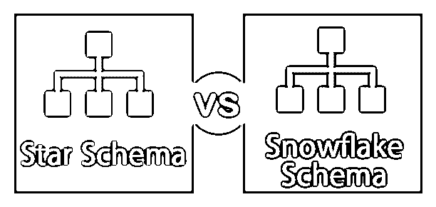
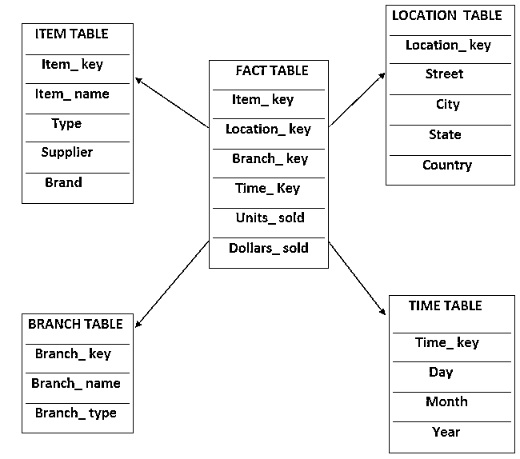
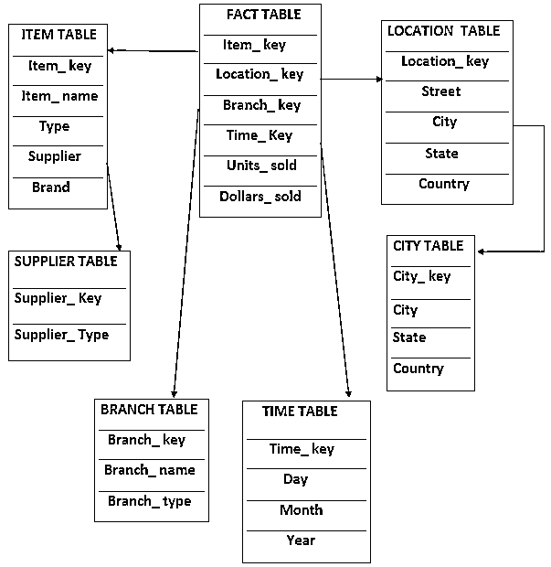
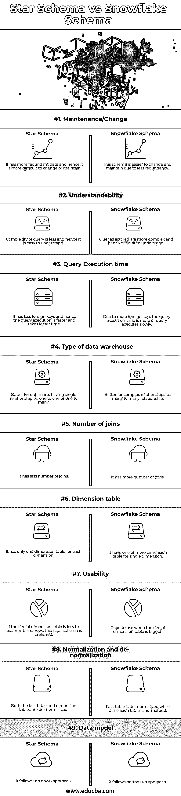

# 星型模式与雪花型模式

> 原文：<https://www.educba.com/star-schema-vs-snowflake-schema/>

## 星型模式 **a** 和雪花模式的区别

星型架构，顾名思义，它可以显示为星型，中间有一个事实表和一组与之连接的维度表。类似地，雪花模式，顾名思义，它看起来是雪花形状，中间有一个事实表，一组维度表连接到它以及系统中的其他维度表。由于星型模式中存在未格式化或非规范化的数据，因此可能存在重复数据，这将导致数据不一致。另一方面，雪花模式的数据是规范化的，因此它更加一致和冗余。

### 什么是星型模式？

它是最简单的数据仓库模式。顾名思义，它的结构就像一颗星星。在这个模式中，事实表位于中心，并且[维度表的数量通过外键](https://www.educba.com/dimension-table/)与之相关联，维度表包含属性集。在这个模式中，每个维度仅用一个维度表来表示，但是维度表并不相互连接。它的优点包括向下切片、易于理解数据、优化磁盘使用和提高性能。为了更好地理解，让我们看一个例子。

<small>Hadoop、数据科学、统计学&其他</small>

**举例:**

考虑一家冰箱制造公司，我们需要为这家冰箱制造公司的销售创建一个模式。销售将有以下几个方面:

*   项目
*   位置
*   树枝
*   时间

该模式在销售中心有一个事实表，其中包含与每个维度相关联的键，有两个度量，即销售量和销售额。

### 什么是雪花模式？

雪花模式是星型模式的[扩展。它增加了额外的维度。顾名思义，它看起来像一片雪花。在这种模式中，维度表是规范化的，即数据被拆分到附加的表中。拆分表可以减少冗余和内存浪费。它具有维度表的层次形式。维度和子维度表与事实表中的主键和外键相关联。它更容易实现，并且使用更少的磁盘空间。因为它有多个表，所以查询的性能会降低。因为有更多的查找表，所以需要更多的维护。为了更好地理解，让我们看一个例子。](https://www.educba.com/what-is-star-schema/)

**举例:**

考虑与上述冰箱制造公司相同的示例，在雪花模式中，事实表与星型模式中的相同，但主要区别在于维度表的定义或布局。

在这个模式中，项目的一维表已经被规范化和拆分，并且创建了一个新的供应商表，其中包括供应商类型的信息。类似地，location 维度表被规范化，数据被拆分到一个新的 city 表中，该表包含特定城市的详细信息。

### 星型模式和雪花型模式的直接比较(信息图表)

下面是星型模式和雪花型模式的 9 大区别。

### 星型模式和雪花型模式的主要区别

让我们看看星型模式和雪花型模式之间的一些主要区别。

#### 星形模式

*   星型架构中的维度层次结构存储在维度表中。
*   它包含一个由维度表包围的中央事实表。
*   在这种情况下，单个连接将事实表与维度表关联起来。
*   它的设计很简单。
*   数据结构被反规格化。
*   查询以更快的速度执行。
*   在这个立方体中，处理速度更快。
*   它有更多的冗余数据。
*   它使用简单的查询。
*   星型模式很容易理解。
*   在星型模式中，会消耗更多的空间。

#### 雪花模式

*   雪花模式中的层次结构存储在单独的表中。
*   它还包含一个被维度表包围的事实表，这些维度表又被维度表包围。
*   在这个模式中，许多连接对于获取数据是必要的。
*   它的设计很复杂。
*   数据结构在雪花模式中是规范化的。
*   该查询的执行速度比星型模式慢。
*   在雪花架构中，多维数据集处理速度较慢。
*   它包含较少的冗余数据。
*   它使用复杂的查询。
*   雪花模式相对难以理解星形模式。
*   在雪花模式中，占用的空间更少。

### 星型模式与雪花型模式对照表

让我们讨论星型模式和雪花型模式之间的比较。

| **特性** | **星形模式** | **雪花模式** |
| **维护/更换** | 它有更多的冗余数据，因此更难更改或维护 | 由于冗余较少，这种模式更容易更改和维护 |
| **可理解性** | 查询的复杂性更低，因此更容易理解 | 应用的查询更加复杂，因此难以理解 |
| **查询执行时间** | 它的外键更少，因此查询执行速度更快，花费的时间也更少。 | 由于外键较多，查询执行时间较多，或者查询执行较慢。 |
| **数据仓库的类型** | 更适合具有单一关系的数据集市，即一对一或一对多 | 更适合复杂的关系，即多对多关系 |
| **加入数量** | 它有更多的连接 | 它的连接数量较少 |
| **尺寸表** | 对于每个维度，它只有一个维度表 | 对于单个维度，它有一个或多个维度表 |
| **可用性** | 如果维度表的大小较小，即行数较少，则首选星型模式。 | 当维度表的大小较大时，非常适合使用 |
| **规范化和反规范化** | 事实数据表和维度表都是非规范化的。 | 事实表是非规范化的，而维度表是规范化的 |
| **数据模型** | 它遵循自上而下的方法 | 它遵循自下而上的方法 |

### 结论

在本文中，我们将详细讨论星型模式和雪花型模式。这些模式用于表示数据仓库。他们有些方面相似，有些方面不同。雪花是星型模式的延伸。当数据较多时，雪花模式是首选，因为它减少了冗余，但是星型模式比雪花模式更受欢迎。

### 推荐文章

这是星型模式和雪花型模式的对比指南。在这里，我们还讨论了星型模式和雪花型模式的主要区别，并提供了信息图表和比较表。您也可以浏览我们推荐的其他文章，了解更多信息——

1.  [编码与解码–最大差异](https://www.educba.com/encoding-vs-decoding/)
2.  [功能测试与非功能测试](https://www.educba.com/functional-testing-vs-non-functional-testing/)
3.  [冒烟测试与健全性测试](https://www.educba.com/smoke-testing-vs-sanity-testing/)
4.  [雪花模式](https://www.educba.com/snowflake-schema/)

