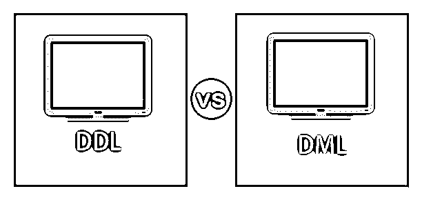
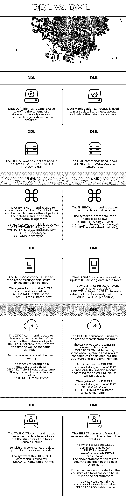

# DDL 与 DML

> 原文：<https://www.educba.com/ddl-vs-dml/>

## DDL 和 DML 的区别

在关系数据库管理系统(RDBMS)中，大量的数据存储在表中。这些表是相关数据的集合，数据存储在行和列之间。这种数据存储方式使得在出现需求时使用起来非常有效。从这些表中访问数据以用于业务需求，以及在需要修改数据库中包含的现有数据时，这一点非常重要。为了检索数据或操作数据，我们需要结构化查询语言(SQL)。SQL 带有与 RDBMS 交互的标准命令。数据定义语言(DDL)用于定义数据库模式，数据操作语言(DML)用于操作数据库中已经存在的数据。在本主题中，我们将了解 DDL 与 DM。在本主题中，我们将了解 DDL 和 DML。

### DDL 和 DML 之间的直接比较(信息图表)

以下是 DDL 和 DML 之间的主要区别

<small>Hadoop、数据科学、统计学&其他</small>

### DDL 和 DML 的主要区别

主要区别如下:

*   DDL 和 DML 之间的一个重要区别是，数据定义语言(DDL)定义数据库的模式，而数据操作语言(DML)用于修改数据库的模式。
*   DDL 命令包括创建、更改、删除、截断等。而 DML 命令是插入、更新、删除、选择等。
*   DDL 语句对整个表进行操作，而 DML 语句对行进行操作。
*   DDL 语句没有 WHERE 子句来过滤数据，而 DML 语句使用 WHERE 子句来过滤数据。
*   DDL 语句在它们的事务中被执行，因此被立即提交，因为每个语句所做的更改是永久的。但是由于 DML 语句是通过修改数据库对象的数据来操作的，所以这些语句是根据事务规则来执行的。
*   使用 DDL 语句时，它们所做的更改不能回滚。因此，我们不需要运行 COMMIT 或 ROLLBACK 命令，而在 DML 语句中，应该运行 COMMIT 和 ROLLBACK 命令来确认更改。

### DDL 与 DML 对照表

让我们来讨论 6 大区别:

| **DDL(数据定义语言)** | **DML(数据操作语言)** |
| 数据定义语言用于定义数据库的模式。它处理数据如何存储在数据库中。 | [数据操作语言用于](https://www.educba.com/data-manipulation-language/)操作，即检索、更新和删除数据库中的数据。 |
| SQL 中使用的 DDL 命令有 CREATE、DROP、ALTER、TRUNCATE 等。 | SQL 中使用的 DML 命令有插入、更新、删除、选择等。 |
| The CREATE command is used to create a table or view of a table. It can also be used to create other objects of the database like index, stored procedure, triggers, etc.创建表格的语法如下:创建表 table_name(COLUMN_1 数据类型主键，列 2 数据类型，列 3 数据类型，……); | The INSERT command is used to insert the data into the table.将数据插入表中的语法如下:向 table_name (column_1，column_2，…column_N)中插入值(value1，value 2…valueN)； |
| The ALTER command is used to modify the existing table structure or the database objects.使用 ALTER 命令的语法如下:将表 table_name 重命名为 table _ name _ new | The UPDATE command is used to update the existing data in the table.

使用 UPDATE 命令的语法如下:

UPDATE table _ name SET column 1 = value 1，column2 = value2，…column = valueN WHERE[condition]；

 |
| The DROP command is used to delete a table or the view of the table or other database objects. The DROP command will remove the data as well as the table definition. So this command should be used carefully.删除数据库的语法如下:删除数据库 database _ name删除表的语法如下:DROP TABLE table _ name | The DELETE command is used to delete the records from the table.使用 DELETE 命令的语法如下:从表名中删除；在上面的语法中，表的所有行都将被删除，但表的结构将保持不变。但是如果我们将 DELETE 命令与 WHERE 子句一起使用，那么只有符合 WHERE 子句的特定记录才会被删除。DELETE 命令和 WHERE 子句的语法如下:DELETE FROM table _ name WHERE[condition]； |
| The TRUNCATE command is used to remove the data from a table but the structure of the table remains intact. So with this command, the data gets deleted only, not the table.

TRUNCATE 命令的语法如下:

TRUNCATE TABLE table _ name

 | The SELECT command is used to retrieve data from the tables in the database.使用 SELECT 命令的语法如下:SELECT column1，column 2…column FROM table _ name；上述语句选择 select 语句中指定的列。但是当我们想要选择一个表的所有列时，我们需要在 select 语句中使用“*”。选择表中所有列的语法如下:SELECT * FROM table _ name |

### 结论

SQL 提供了定义模式的灵活性，然后通过使用数据定义语言和数据操作语言根据数据库中的要求修改模式。通过使用简单的 DDL 语句，开发人员可以更容易地为大量数据定义数据库模式和表结构。此外，通过使用 DML 语句，我们可以操作数据，例如检索数据、修改现有数据等。每当需要的时候。在使用各种 DDL 和 DML 命令时，有一些要点需要注意。软件开发人员或设计人员需要全面了解各种 DDL 和 DML 操作的工作原理，因为它们在构建业务所需的高效数据库中起着至关重要的作用。

### 推荐文章

这是 DDL 与 DML 的对比指南。在这里，我们详细讨论 DDL 和 DML 各自的主要区别、信息图和比较表。您也可以看看以下文章，了解更多信息–

1.  [Hive vs HUE:值得学习的 6 大有用对比](https://www.educba.com/hive-vs-hue/)
2.  [WebLogic vs JBoss](https://www.educba.com/weblogic-vs-jboss/)
3.  [SQL Server vs PostgreSQL](https://www.educba.com/sql-server-vs-postgresql/)
4.  [PL SQL vs SQL](https://www.educba.com/pl-sql-vs-sql/)

