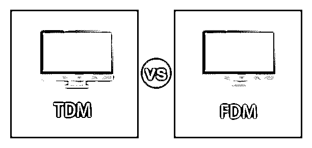
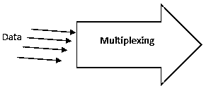
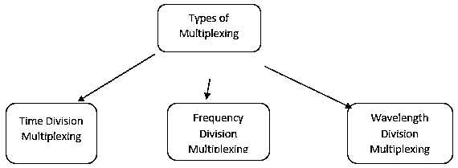
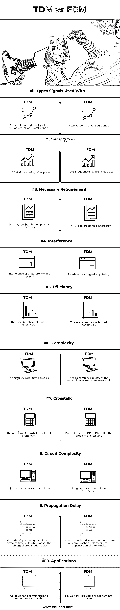
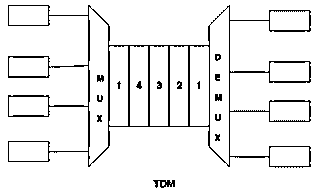
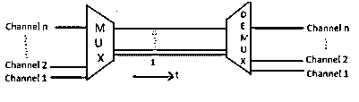
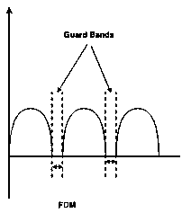

# TDM vs FDM

> 原文：<https://www.educba.com/tdm-vs-fdm/>

## TDM 和 FDM 的区别

TDM 和 FDM 是不同类型的复用方法。两者对输入信号的规格不同，应用领域也不同。在通信系统中，我们既不能有一个单独的信道来传输来自不同来源的信息，也不可能一个接一个地顺序传输信号。因此，我们必须有一个有效的技术来管理它。“多路复用”就是这样一种技术。

**复用≈混合**

<small>Hadoop、数据科学、统计学&其他</small>

多路复用是将来自不同来源的数据组合起来并通过单个数据通道传输的过程。

有各种[复用技术](https://www.educba.com/multiplexing-techniques/)可用，如下所述:

多路复用是网络中信号传输的一种方式。它[有助于在给定信道上以模拟或数字形式呈现的信息的有效通信](https://www.educba.com/effective-communication/)。这也有助于我们优化传输信息的传输成本。

### TDM 和 FDM 的直接比较(信息图)

以下是 TDM 与 FDM 的 10 大区别:

### TDM 和 FDM 的主要区别

让我们来看看主要的区别:

*   **定义:** TDM 是在单个信道上传输多个数据流的过程。其中每个信号被分成固定长度的时隙。而 FDM 是将总的可用带宽分成一系列不重叠的频带的过程，其中每个频带承载一个单独的信号。
*   **基本标准:**时间被分成各种不同的固定长度的时隙，每个信号在循环的基础上被分配一个时隙，而 FDM 为不同的信号产生不同的信道，并且每个信号占用不同的频带。
*   **频率利用:** TDM 总可用带宽以分时方式使用，而在 FDM，可用的整个频带被分成多个信道，每个信道被一个保护带隔开，这也导致了频带的无效利用。
*   **要求:**成帧位(同步脉冲)用于每个信号的开始，以实现同步，并在解复用过程中恢复信息。在 FDM，保护频带用于分隔两个不同的信号，也用于避免重叠。
*   **复杂性:**与 FDM 系统相比，TDM 系统对于各种数据流需要相同的系统，这使得电路简单，在后者中，对于来自不同数据流的数据需要不同的电路、带通滤波器等，这使得 FDM 系统的设计相当复杂
*   **信号类型:** TDM 既可用于传输模拟信号，也可用于传输数字信号。虽然 FDM 主要用于模拟信号
*   **优势:**与 FDM 系统相比，TDM 可防止串扰。

### TDM 与 FDM 对比表

TDM 与 FDM 的一些比较如下:

| **比较的基础** | **时分复用** | **频分复用(FDM)** |
| **与**一起使用的信号类型 | 这种技术适用于模拟和数字信号。 | 它能很好地处理模拟信号。 |
| **基本标准** | 在 TDM **、**中，发生分时。 | 在 FDM **，**发生频率共享。 |
| **必要要求** | 在 TDM **、**中，同步脉冲是必要的。 | 在 FDM **、**中，防护带是必需的。 |
| **干扰** | 信号的干扰很低，可以忽略不计。 | 信号的干扰很大。 |
| **效率** | 有效地使用了可用信道。 | 可用信道被无效地使用。 |
| **复杂度** | 电路并不复杂。 | 它在发送端和接收端都有一个复杂的电路。 |
| **串音** | 相声的问题就没那么突出了。 | 由于不完美的 BPF，FDM 遭受串扰的问题。 |
| **电路复杂度** | 这种技术并不昂贵。 | 这是一种昂贵的多路复用技术。 |
| **传播延迟** | 因为信号在不同的时隙中传输，这产生了传播延迟的问题。 | 另一方面，当信号传输时，FDM 不会引起任何传播延迟。 |
| **应用程序** | 例如电话公司和互联网服务提供商。 | 例如光纤电缆或铜纤维电缆。 |

### TDM 和 FDM 的例子

为了更好地理解 TDM 系统，让我们把每一个盒子都看作输入流。来自各种流的数据被分成一个单元，该单元被分配给一个给定的时隙用于基于循环的传输。如下图所示，第 1、第 2、第 3、第 4 第个输入流中的每一个分别具有第 1、第 2、第 3&第 4 个槽。一旦每个流的分配完成，那么再次将第五个时隙分配给来自第 1 个 st 输入流的数据。这个过程一直持续到整个数据流都被传输完。

在上图中，

*   **Mux** :执行多路复用- >的设备，信号在此准备传输。
*   **Demux** :它是一个执行解复用的设备- >它是复用的逆过程，信号被带回到原来的状态。并且在传输期间添加的所有不想要的信息都被移除。

**FDM:** 让我们考虑一个 FDM 的例子，这里所有的信号都在同一时间传输，但被分配了一个单独的频带。每个频带由合适的间隙隔开，以避免重叠。这个间隙频率被称为保护频带。

上图显示了 FDM

上图显示了具有分离保护频带的频率分布。

*** *波分复用(WDM):** 在 WDM，具有不同波长的不同数据流在光谱中传输。Prism 的输出用于 MUX，因为它具有将不同波长转换成单条线的特性，也用作 DEMUX 的输入。WDM 主要用于光纤通信。

### 结论

在通信系统中，多路复用和解复用在共享信道和发射机端有效传输信号以及在接收机端检索信息方面有着广泛的应用。根据信号类型(模拟或数字信号)和应用领域，我们采用特定类型的多路复用。

### 推荐文章

这是 TDM 与 FDM 的对比指南。这里我们讨论信息图表和比较表的主要区别。您也可以浏览我们推荐的其他文章，了解更多信息——

1.  [ROLAP vs MOLAP vs HOLAP](https://www.educba.com/rolap-vs-molap-vs-holap/)
2.  [CNN vs RNN——热门对比](https://www.educba.com/cnn-vs-rnn/)
3.  [波纹与恒星的区别](https://www.educba.com/ripple-vs-stellar/)
4.  [数据科学家 vs 软件工程师](https://www.educba.com/data-scientist-vs-software-engineer/)

