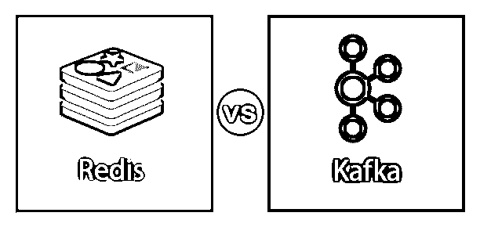
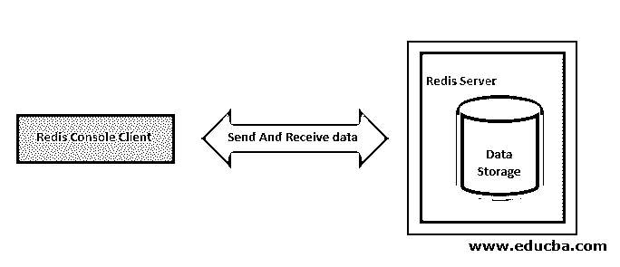
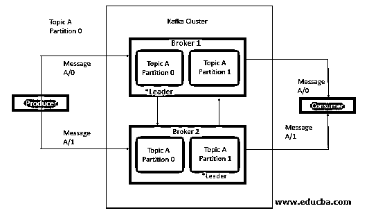
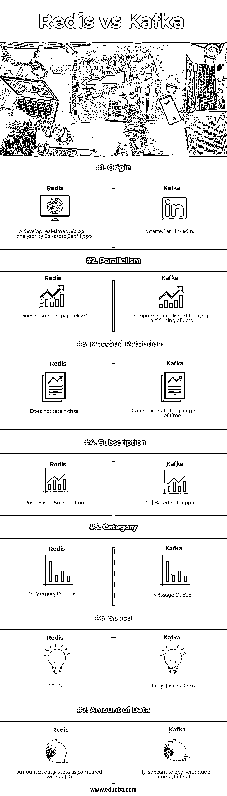

# 里兹诉卡夫卡

> 原文:# t0]https://www . educba . com/redis-vs-Kaka/

## 雷迪斯和卡夫卡的区别

在这篇文章中，我们将看看雷迪斯和卡夫卡之间的主要区别和表现。

Redis: Redis 是一个内存中的键值数据存储，也是开源的。它速度极快，可以用于缓存会话管理、高性能数据库和消息代理。在存储和多种功能方面，Redis 和 Kafka 有点不同。

<small>Hadoop、数据科学、统计学&其他</small>

Apache Kafka: Apache Kafka 是一个消息系统，允许您发布和订阅基于主题和分区的消息流。这样，就类似于 ActiveMQ、RabbitMQ 等产品。但即使有这些相似之处，Kafka 也有一系列与传统信息系统的根本区别，这使它完全不同。

### 什么是里兹？

Redis 是远程词典服务器的缩写。它是一个键值存储，这个键值存储可以用作读写数据的存储库。Redis 是一个非 SQL 数据库，这意味着与 MySQL 或 Oracle 数据库不同，它没有表/行/列/函数/过程等结构。它也不支持选择、插入、删除和更新等命令。字符串、散列、列表、集合和排序集合是 Redis 提供的不同数据结构。

Redis 体系结构中有两个主要进程:Redis 客户机和 Redis 服务器

Redis 客户端和服务器可以在同一台计算机上，也可以在两台不同的计算机上。使用客户机/服务器接口与 Redis 通信。

*   **Redis 服务器** : Redis 服务器负责在内存中存储数据。这管理所有的操作方式，并形成架构的主要部分。
*   **Redis 客户端** : Redis 客户端可以是 Redis 控制台接口，也可以是任何其他编程语言的 Redis API，它向 Redis 服务器发送数据。

### 卡夫卡是什么？

Kafka 是一个发布-订阅消息系统。借助 Kafka 等流技术，您可以在集群中生成新数据时对其进行处理，您可以[将其保存到 HDFS](https://www.educba.com/what-is-hdfs/) ，或者保存到 HBase 或其他数据库，这样您就可以在数据传入时对其进行实时处理，您可以通过流来完成所有这些工作。

*   **生产者**:生产者发布消息到一个主题。
*   **Broker** : Broker 是 Kafka 中由一个或多个服务器组成的集群。代理接收来自生产者的消息，将它们分配给 offset 并提交消息。
*   **主题**:消息分为主题。主题被分解成许多分区，在这些分区中，主题索引和存储接收名为 offset 的增量 Id 的消息。
*   **消费者**:消费者订阅各种话题，从经纪人那里读取数据。他们在消费者群体中读取数据。消费者总是通过跟踪消息的偏移量来跟踪它已经消费了哪些消息。

### 雷迪斯和卡夫卡的对决(资料图)

以下是雷迪斯和卡夫卡之间的 7 大区别

### 雷迪斯和卡夫卡的主要区别

让我们讨论一下雷迪斯和卡夫卡之间的一些主要区别

#### 1.起源

*   Redis :由 Salvatore Sanfilippo 开发，用于开发实时博客
*   **Apache Kafka:** Kafka 是 LinkedIn 开发的开源软件平台。

#### 2.签署

*   **Redis:** Redis 支持基于推送的消息传递，这意味着发布到 Redis 的消息将立即自动传递给订阅者。
*   **Apache Kafka:** Kafka 支持基于拉的消息传递，意味着在 Kafka 中发布的消息从不直接分发给消费者，消费者订阅主题，并在消费者准备好处理它们时请求消息。

#### 3.平行

*   **Redis:** Redis 不支持并行的概念。
*   **Apache Kafka:** Kafka 支持并行性，因为它对数据进行日志分区，多个消费者同时在消费者组中消费。

#### 4.消息保留

*   **Redis:** Redis 将消息一次性发送给消费者，稍后消息被删除。因此，没有人知道数据保存在哪里。
*   **阿帕奇卡夫卡:**因为卡夫卡是日志，所以总有消息；您可以通过为邮件设置保留策略来对此进行监控。例如保留 7 天

#### 5.速度

*   **Redis:** 如果速度是一个问题，那么就使用 Redis，因为 Redis 不保存消息，所以它可以更快地传递消息。
*   Apache Kafka :即使在它发送了消息之后，Kafka 仍然保存这些消息，所以与 Redis 相比，它相当慢。

#### 6.数据量

*   **Redis:** Redis 是一个内存存储。它确保使用主内存进行存储和处理，这使得它比基于磁盘的 Kafka 快得多。Redis 内存存储的唯一问题是，我们无法长时间存储大量数据。因为主内存比磁盘小
*   Apache Kafka: Kafka 旨在处理大量数据。它允许使用所需数量的服务器。它使用磁盘进行存储，因此加载速度可能会很慢。然而，由于磁盘存储能力，它可以在更长的保留期内保存大量数据(即以 TB 为单位)。

#### 7.用例

*   **Redis:** 它用于各种用例，如会话缓存、整页缓存(FPC)、排行榜/计数、发布/订阅、队列
*   **Apache Kafka:** Kafka 有各种用例，如消息传递、网站活动跟踪、日志聚合、流处理、指标、事件源、提交日志。

### 里兹诉卡夫卡比较表

我们来讨论一下雷迪斯和卡夫卡的顶级对比

| **对比点** | **再说一遍** | **卡夫卡** |
| 起源 | **Salvatore Sanfilippo 开发实时网络日志分析器** | 始于 LinkedIn |
| 排比 | 不支持并行 | 由于数据的日志分区，支持并行性 |
| 消息保留 | 它不保留数据。 | 可以保留更长时间的数据 |
| 订阅 | 基于推送的订阅 | 拉基础订阅 |
| 类别 | 内存数据库 | 消息队列 |
| 速度 | 更快 | 不如 Redis 快 |
| 数据量 | 与卡夫卡相比数据量较少 | 这意味着要处理海量的数据 |

### 结论

如果您希望将消息立即传递给消费者，并且您可以忍受数据丢失，并且要处理的数据量较少，那么可以使用 Redis。当你寻求可靠性、高吞吐量、容错以及数据量巨大时，可以使用 Kafka。

### 推荐文章

这是 Redis vs Kafka 的指南。这里我们讨论信息图和比较表的主要区别。您也可以看看以下文章，了解更多信息–

1.  [RabbitMQ vs Kafka |最大差异](https://www.educba.com/rabbitmq-vs-kafka/)
2.  [了解 RabbitMQ 与 MQTT 的差异](https://www.educba.com/rabbitmq-vs-mqtt/)
3.  [Redis 十大备选方案指南](https://www.educba.com/redis-alternatives/)
4.  [rabbitq vs redis | top 9 差异](https://www.educba.com/rabbitmq-vs-redis/)
5.  [rabbit MQ vs SQS 差异指南](https://www.educba.com/rabbitmq-vs-sqs/)
6.  [hazel cast 与 Redis 的主要差异](https://www.educba.com/hazelcast-vs-redis/)
7.  [Redis 与 Memcached |主要差异](https://www.educba.com/redis-vs-memcached/)
8.  [背对蒙戈布|前 7 项差异](https://www.educba.com/redis-vs-mongodb/)

