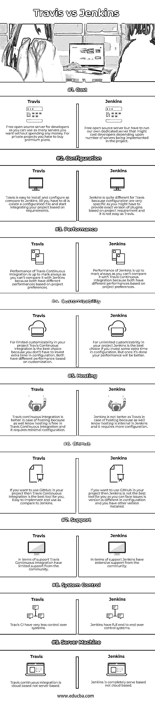

# 特拉维斯 vs 詹金斯

> 原文：<https://www.educba.com/travis-vs-jenkins/>

## 特拉维斯和詹金斯的区别

以下文章为特拉维斯 vs 詹金斯提供了一个大纲。对于需要同时在多个环境中测试的项目，使用 Travis 持续集成。虽然 Jenkins 也可以完成同样的任务，但它更适合于需要在更高层次上进行修改的大型项目。Jenkins 是一个完全基于 Java 编程语言的持续集成工具。这是一个开源软件，它有很多功能，可以使用可用的插件在项目中实现。Travis 也是开源软件，附带免费主机，因此编码人员不必像 Jenkins 那样为项目创建或提供自己的服务器。Travis 持续集成使测试变得简单快速，而且完全免费。因为您可以根据自己的需求购买计划。

### 特拉维斯和詹金斯的面对面比较(信息图)

以下是特拉维斯和詹金斯之间的 9 大区别

<small>Hadoop、数据科学、统计学&其他</small>

### Travis **持续集成**和 Jenkins 的主要区别

让我们来讨论一些主要差异:

*   Travis CI 提供了完全免费的基于云的托管，因为您不必提供自己的专用服务器，而 Jenkins 的 CI 不是基于云的，因为它是内部托管的，需要在更新的基础上进行维护和配置。詹金斯需要一名管理员[来处理一个项目。](https://www.educba.com/what-is-jenkins/)
*   通过 Travis CI，您可以同时在 Linux 和 Mac OSX 上运行测试，它还支持 C、C++、Clojure、Crystal、Java、JavaScript、Python、Ruby、Rust、Scala 等编程语言。而在 Jenkins 中，您可以在不同的操作系统(如 Windows、Linux 和 Mac OSX)上轻松运行、构建、测试和部署它。
*   Travis CI 易于设置和安装，因为它是轻量级的，并允许通过作业调度与其他[持续集成工具](https://www.educba.com/continuous-integration-tools/)集成，而在 Jenkins 中，由于安装很容易，因此很难配置。它有各种插件，可以与不同的项目模型持续集成。
*   在 Jenkins 中，如果在管道中的某个特定阶段出现错误，您将无法构建项目，因为这会导致构建失败，而在 Travis CI 中，您可以在各种条件下轻松启动构建。
*   Travis CI 与 Kubernetes、Docker 和其他几个程序兼容，而 Jenkins 也与 Kubernetes、Docker、Libvirt 和其他程序兼容。
*   Jenkins 习惯于通过各种插件定制 Jenkins 环境来监控分布式构建上的外部作业，而 Travis CI 则通过与 GitHub 自动集成并构建对存储库访问的拉请求来部署多个云服务。
*   Travis CI 通过插件的帮助在项目中提供排队消息、通知和数据库操作等服务，而 Jenkins 支持各种作业模型，如 pipeline、freestyle 等。在那里你可以毫无困难地安排未来的工作。
*   每次触发构建时，系统都会创建一个虚拟机。在 Travis 持续集成中，如果您想要商业项目的 CI，您需要购买一个高级计划，而在 Jenkins 中，每个集成都将通过 admin 在服务器上完成。
*   Jenkin 持续集成的最大优势之一是定制警报、身份验证、作业调度和凭证等功能，而 Travis 持续集成的最大优势是与具有完整功能的云集成，我们可以并行运行这些功能。

### Travis 持续集成与 Jenkins 对比表

让我们讨论一下 Travis 持续集成与 Jenkins 之间的顶级比较:

| **因素** | **特拉维斯 CI** | 詹金斯 |
| 费用 | 为开发者提供免费的开源服务器，因为你可以使用任意数量的服务器，而无需花费任何金钱。对于私人项目，你必须购买保费计划。 | 免费的开源服务器，但必须运行我们自己的专用服务器，这可能需要开发人员根据项目中实施的服务器数量来决定 |
| 配置 | 与 Jenkins 相比，Travis 易于安装和配置。您所要做的就是创建一个配置文件，并开始根据需求集成您的项目。 | Jenkins 对于 Travis 来说是非常不同的，因为配置非常具体，因为你可能需要根据项目要求提供插件的准确版本，这对于 Travis 来说并不容易。 |
| 表演 | Travis 持续集成的性能取决于 mark always，因为您无法将其与 Jenkins 进行比较，因为两者基于项目偏好具有不同的性能。 | Jenkins 的性能取决于 mark always，因为您无法将其与 Travis 持续集成进行比较，因为两者基于项目偏好具有不同的性能。 |
| 可定制性 | 对于项目中有限的可定制性，Travis 持续集成是最佳选择，因为您不必在配置上投入额外的时间。基于定制，两者具有不同的性能。 | 对于项目中的无限可定制性，如果您在配置上投入一些额外的时间，Jenkins 是最佳选择。但是一旦完成，你的表现会更好。 |
| 主办；主持 | Travis 持续集成在托管的情况下更好，因为众所周知，在 Travis 持续集成中托管是免费的，它需要最少的配置。 | 詹金斯不是更好的特拉维斯在主机的情况下，因为以及知道主机是在詹金斯内部，它需要更多的配置。 |
| Github | 如果你想在你的项目中使用 Github，那么 Travis 持续集成是最好的工具。与 Jenkins 相比，易于实现和使用。 | 如果你想在你的项目中使用 Github，那么 Jenkins 对你来说不是最好的工具，因为你可能会面临版本配置不同的问题，而且你已经安装了其他版本。 |
| 支持 | 在支持方面，Travis 持续集成从社区获得的支持有限。 | 在支持方面，Jenkins 得到了社区的广泛支持。 |
| 系统控制 | Travis CI 对系统的控制非常少。 | Jenkins 拥有完整的端到端控制系统。 |
| 服务器机器 | Travis 持续集成是基于云的，不是基于服务器的。 | Jenkins 完全基于服务器，而不是基于云。 |

### 结论

Travis continuous integration 和 Jenkins 都在较小和较大级别的项目集成中发挥了重要作用，但谁的表现更好与项目的要求和偏好成正比。对于小型开源项目，Travis CI 是最好的，对于大型企业项目，Jenkins 是最好的。

### 推荐文章

这是特拉维斯 vs 詹金斯的指南。在这里，我们还将讨论信息图和比较表的主要区别。您也可以看看以下文章，了解更多信息–

1.  [Jenkins vs Travis CI–热门对比](https://www.educba.com/jenkins-vs-travis-ci/)
2.  【Jenkins 与 TeamCity 的区别
3.  詹金斯 vs 切尔莱西——哪一个更好？
4.  [詹金斯 vs 竹子——惊人的差异](https://www.educba.com/jenkins-vs-bamboo/)
5.  [Gitlab CI vs Jenkins |主要差异](https://www.educba.com/gitlab-ci-vs-jenkins/)
6.  【Rundeck 与 Jenkins 的区别
7.  [Spinnaker 与 Jenkins 的主要差异](https://www.educba.com/spinnaker-vs-jenkins/)

