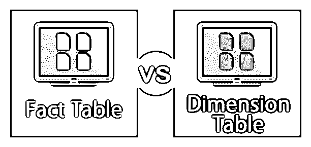
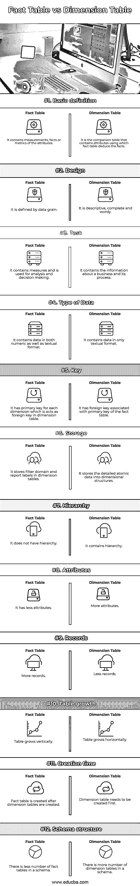

# 事实表与维度表

> 原文：<https://www.educba.com/fact-table-vs-dimension-table/>

## 事实表和维度表简介

事实表包括系统的事实作为其数据内容，而维度表包括事实表的所有属性或对象，这些属性或对象可以帮助将事实表连接到相应的维度表。两个表中的数据可以是普通的文本格式，而事实表可以在文本中包含数字。在创建数据库的过程中，由于维度表自身的属性，维度表会在事实表之前创建。

### 事实表

它是一个包含维度表属性值的表。它包含非规范化形式的定量信息。它基本上包含了需要分析的数据。事实表通常有两列，一列用于外键，这有助于将它们与维度表连接起来，另一列包含需要分析的值或数据。它主要包含数字数据。它垂直增长，包含更多的记录和更少的属性。

<small>Hadoop、数据科学、统计学&其他</small>

#### 事实表的特征

*   **键:**事实表由一个键组成，该键是与该事实表相关联的各种维度表的所有主键的组合或串联。这种键称为串联键，它唯一地标识事实表的行。
*   **事实表粒度:**表的粒度是指存储在事实表中的信息的详细程度或深度。为了设计一个高效的事实表，这个级别必须是最高的。
*   **可加性度量:**事实表中的属性可以是完全可加性、半可加性或非可加性。完全可加性或可加性度量是添加到所有维度的度量。在半累加性中，度量被添加到某些维度，而不是所有维度，非累加性度量是那些存储任何业务流程的基本度量单位的度量。
*   **稀疏数据:**事实表中存在的一些记录包含具有空值或度量的属性，即这些记录不给出或提供任何信息。
*   **退化维度:**事实表中存在的不能添加或不可添加的维度或属性称为退化维度。
*   **支腿尺寸:**参考任何其他尺寸表的尺寸称为支腿尺寸。
*   **缩减的累计维度:**作为基本维度的列和行的细分的维度称为缩减的累计维度。

### 维度表

维度表包含维度，事实表中的属性值沿着这些维度获取。维度表很小，仅包含几千行，但其大小有时会增加。这些表通过外键与一个事实表相关联。这些表是非规范化的。维度表包含层次关系，并且水平增长。

#### 维度表的特征

*   **Keys:** 每个维度表都需要有一个主键，帮助惟一地标识维度表的每条记录。
*   **属性:**维度表包含许多属性，因此维度表看起来是水平增长的。
*   **属性值:**维度表中的值多为文本格式，没有数值格式。
*   **属性之间的关系:**维度表中出现的属性一般不直接相关，但仍然是同一个维度表的一部分。
*   **规范化:**维度表未被规范化，因为规范化会拆分数据并创建额外的表，这会降低查询执行的效率，因为当它想要从事实表中恢复维度表中任何相应属性的度量时，必须通过这些额外的表。
*   **向下钻取，向上滚动:**维度表中的属性允许通过从较高级别到较低级别的遍历来获得详细信息，也允许从较低级别的属性向上滚动到较高级别的属性。
*   **记录:**维度表记录数少，属性数多。

### 事实表和维度表之间的直接比较(信息图表)

下面是事实表和维度表之间的 12 大区别

### 事实表和维度表的主要区别

让我们讨论事实表和维度表之间的一些主要区别。

*   事实表包含维度表属性的值或度量值。
*   事实表包含较少的属性和较多的记录，而维度表包含较少的记录和较多的属性。
*   事实表垂直增长，而维度表水平增长。
*   事实数据表包含一个连接键，而维度表包含一个主键。
*   必须在创建事实数据表之前创建维度表。
*   任何模式都包含更多的维度表和更少的事实表。

### 事实表与维度表比较表

让我们讨论事实表和维度表之间最大的区别。

| **特性** | **事实表** | **尺寸表** |
| **基本定义** | 它包含属性的测量、事实或度量。 | 它是包含属性的伙伴表，事实表使用这些属性来推断事实。 |
| **设计** | 它由数据粒度定义。 | 它是描述性的，完整的，罗嗦的。 |
| **任务** | 它包含度量，用于分析和决策。 | 它包含有关业务及其流程的信息。 |
| **数据类型** | 它包含数字和文本格式的数据。 | 它只包含文本格式的数据。 |
| **键** | 每个维度都有一个主键，作为维度表中的外键。 | 它有一个与事实表的主键相关联的外键。 |
| **存储** | 它将筛选域和报表标签存储在维度表中。 | 它将详细的原子数据存储到维度结构中。 |
| **层级** | 它没有层次结构。 | 它包含一个层次结构。 |
| **属性** | 它的属性较少 | 更多属性 |
| **记录** | 更多记录 | 记录更少。 |
| **表格增长** | 桌子是垂直增长的。 | 这张桌子是水平增长的。 |
| **创建时间** | 创建维度表后，会创建一个事实表。 | 需要首先创建维度表。 |
| **模式结构** | 架构中的事实数据表数量较少。 | 一个模式中有许多维度表。 |

### 结论

在本文中，我们详细了解了事实表和维度表以及它们之间的差异。这些表对于开发模式非常重要。维度表是事实表的伴侣，两者互为必需。

### 推荐文章

这是事实表和维度表的指南。在这里，我们还将讨论信息图和比较表的主要区别。您也可以浏览我们推荐的其他文章，了解更多信息——

1.  [数据仓库 vs 数据集市](https://www.educba.com/data-warehouse-vs-data-mart/)
2.  【AUTOCAD 与 CATIA 的区别
3.  [DOS 与 Windows–顶级对比](https://www.educba.com/dos-vs-windows/)
4.  [白盒测试 vs 黑盒测试](https://www.educba.com/white-box-testing-vs-black-box-testing/)
5.  [实现数据集市的类型、特征和步骤](https://www.educba.com/what-is-data-mart/)

