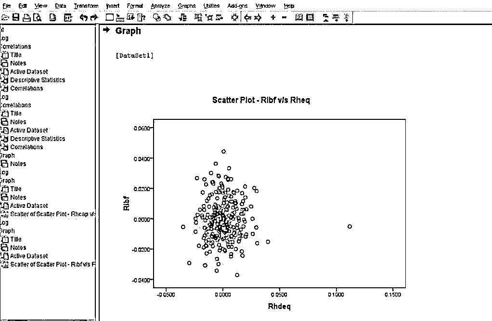
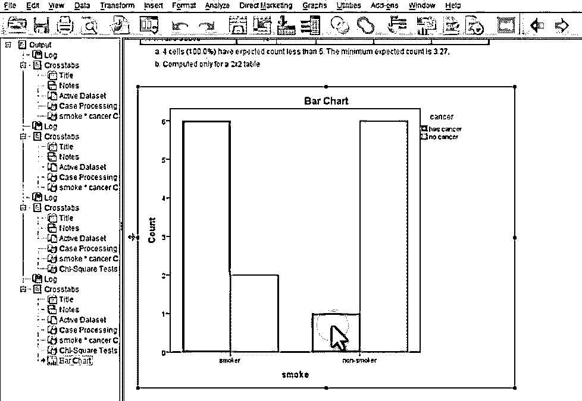

# 聚类分析与因子分析

> 原文：<https://www.educba.com/cluster-analysis-vs-factor-analysis/>

## 什么是聚类分析？

聚类分析根据数据所具有的特征对数据进行分组。聚类分析根据使对象相似的因素对对象进行分组。聚类分析也称为细分分析或分类分析。聚类分析不区分因变量和自变量。聚类分析广泛应用于心理学、生物学、统计学、数据挖掘、模式识别和其他社会科学领域。

### 目标

主要目标是解决每组数据的异质性。其他聚类分析目标是

<small>Hadoop、数据科学、统计学&其他</small>

*   **分类描述**–识别数据中的组
*   **数据简化**–分析相似观察结果组而不是所有单个观察结果的能力
*   **假设生成或测试**–根据数据的性质开发假设或测试之前陈述的假设
*   **关系识别**–描述关系的聚类分析的简化结构

它主要有两个目的——理解和实用。

在理解的情况下，它将具有一些共同特征的对象分组

出于实用的目的，它将每个数据对象的特征提供给它们所属的集群。

它与因子分析和判别分析齐头并进。

在开始之前，您应该问自己几个聚类分析问题

*   哪些变量是相关的？
*   样本量够吗？
*   离群值可以被检测出来吗？是否应该被删除？
*   应该如何测量对象的相似性？
*   数据是否应该标准化？

### 集群的类型

有三种主要聚类类型

*   **层次聚类**——包含凝聚和分裂方法
*   **部分聚类**–包含 K 均值、模糊 K 均值、Isodata
*   **基于密度的聚类**–下有 Denclust、CLUPOT、[、均值漂移](https://www.educba.com/mean-shift-algorithm/)、SVC、Parzen-Watershed

### 假设

这里面总有两个假设。

*   假设样本是总体的代表
*   假设变量不相关。即使变量是相关的，也要移除相关变量或使用距离度量来补偿相关性。

### 步伐

下面是给出的一些步骤。

### SPSS 中的聚类分析

在 [SPSS](https://www.educba.com/data-science/courses/spss-certification-course/) 中，你可以在分析/分类选项中找到聚类分析选项。在 SPSS 中，有三种聚类分析方法——K-Means 聚类、层次聚类和两步聚类。

K-Means 聚类方法通过固定数量的聚类对给定的数据集进行分类。这种方法很容易理解，当数据彼此分离时，可以得到最好的输出。

两步聚类分析是一种用于处理大型数据集的工具。它在分类变量和连续变量上创建聚类。

等级聚类是聚类分析中最常用的方法。它通过一系列连续的步骤将案例组合到一起，从而将案例组合成同质的集群。

层次聚类分析包含三个步骤

*   计算距离
*   链接集群
*   通过选择正确的集群数量来选择解决方案

下面给出了在 SPSS 中进行层次聚类分析的步骤。

*   第一步是选择要聚类的变量。下面的对话框会向您解释
*   通过单击上面对话框中的统计选项，您将看到一个对话框，您可以在其中指定输出
*   在绘图对话框中，添加树状图。树状图是层次聚类分析方法的图形表示。它展示了如何在每一步将集群组合在一起，直到形成一个集群。
*   对话框方法至关重要。这里可以提到距离和聚类方法。在 SPSS 中，有三种度量方法用于间隔、计数和二进制数据。
*   平方欧几里德距离是不求平方根的平方差之和。
*   在计数中，您可以选择卡方或 Phi 方测量
*   在二进制部分，你有很多选择。平方欧几里得距离是最好的选择。
*   下一步是选择聚类方法。总是建议使用单一连锁或最近邻，因为它很容易帮助识别异常值。在识别出异常值后，你可以使用沃德的方法。
*   最后一步是标准化

### 批评

最常见的批评列举如下

*   它是描述性的，理论性的，非推理性的。
*   不管任何结构的实际存在与否，它都会产生簇
*   它不能被广泛使用，因为它完全依赖于用作相似性度量基础的变量

### 什么是因子分析？

因子分析是一种探索性分析，有助于将相似的变量归入不同的维度。它可以通过减少观察值的维数来简化数据。因子分析有几种不同的旋转方法。

因子分析主要用于数据简化。

有两种类型的因素分析-探索性和验证性

*   当你对一组变量的结构或维度没有预先定义的概念时，可以使用探索性方法。
*   当你想检验一组变量中关于结构或维度的特定假设时，可以使用证实性方法。

### 目标

因子分析有两个主要目的，下面将会提到

*   **识别潜在因素**-这包括将变量聚类到同质集合中，创建新变量，并帮助获得关于类别的知识
*   **筛选变量**–这有助于回归和识别分组，允许您选择一个代表多个变量的变量。

### 假设

因子分析有四个主要的假设，下面会提到

*   模型通常基于线性关系
*   它假设收集的数据是区间标度的
*   数据中的多重共线性是可取的，因为目标是找出相关的变量集
*   数据应该是开放的，并对因素分析有反应。不应该是这样的，一个变量只与自身相关，而与任何其他变量不存在相关性。无法对此类数据进行因子分析。

### 保理的类型

以下是一些类型的保理业务。

*   **主成分因子分解**–最常用的方法，通过计算因子权重来提取最大可能的方差，并一直持续到不再有有意义的方差。
*   **典型因素分析**–找出与观察变量具有最高典型相关性的因素
*   **公共因子分析**–寻找能够解释一组变量的公共方差的最少数量的因子
*   **图像分解**–基于相关矩阵，其中每个变量通过多重回归从其他变量中预测出来
*   **阿尔法因子**–最大化因子的可靠性
*   **因子回归模型**–因子模型和因子部分已知的回归模型的组合

### 标准

以下是描述的一些标准。

1.  #### Eigenvalue Standard

*   表示与因子相关的原始变量的差异量
*   一个因子上每个变量的因子负荷的平方和代表特征值
*   保留特征值大于 1.0 的因子

2.  [T0】 Scree drawing standard

*   按照提取顺序，特征值与因子数量的关系图。
*   图的形状决定了因素的数量

3.  #### Variance percentage standard

*   找出提取的因子个数，使因子提取的方差增长百分比达到满意水平。

4.  #### Significance test standard

*   找出各个特征值的统计重要性，并且仅保留那些具有统计显著性的因素

因子分析被应用于心理学、社会学、政治学、教育和心理健康等多个领域。

### SPSS 中的因子分析

在 SPSS 中，因子分析选项可以在分析降维因子中找到

*   首先将变量添加到变量列表部分
*   单击描述性选项卡，添加几个统计数据，在这些统计数据下验证因子分析的假设。
*   单击提取选项，该选项将允许您选择提取方法并切断提取值
*   主成分(PCA)是默认的提取方法，甚至可以提取变量的不相关线性组合。当相关矩阵是奇异的时，可以使用 PCA。它非常类似于典型相关分析，其中第一个因素具有最大方差，随后的因素解释较小部分的方差。
*   第二个最常见的分析是主轴分解。它确定了观察结果背后的潜在结构。
*   下一步是选择旋转方法。最常用的方法是 Varimax。这种方法简化了因素的解释。
*   第二种方法是 Quartimax。此方法旋转因子，以最大限度地减少因子的数量。它简化了观察变量的解释。
*   下一个方法是 Equamax，它是上述两种方法的组合。
*   在对话框中通过点击“选项”可以管理缺失值
*   在将结果保存到数据集之前，首先运行因子分析并检查假设，确认结果有意义且有用。

### 聚类分析与因子分析

聚类分析和因子分析都是用于数据分割的无监督学习方法。许多刚接触这一领域的研究人员认为聚类分析和因子分析是相似的。这看起来很相似，但它们在许多方面有所不同。下面列出了两者之间的差异

*   #### Target

聚类和因子分析的目的是不同的。这样做的目的是将观测结果分成同类和不同的组。另一方面，因子分析解释了由相似值产生的变量的同质性。

*   #### Complexity

复杂性是聚类和因子分析不同的另一个因素。数据大小对分析有不同的影响。如果数据太大，那么它在聚类分析中变得难以计算。

*   #### Solution

在因子分析和聚类分析中，解决问题的方法或多或少是相似的。但是因子分析在更好的方面为研究者提供了更好的解决方案。它不能产生最好的结果，因为聚类分析中的所有算法在计算上都是低效的。

*   #### application

因子分析和聚类分析不同地应用于真实数据。因子分析适用于简化复杂的模型。它将大量的变量减少到一个更小的因素集。研究者可以开发一组假设并运行因子分析来确认或否定该假设。

它适用于根据特定标准对对象进行分类。研究人员可以测量一个群体的某些方面，并使用聚类分析将它们分成特定的类别。

还有很多其他的不同点，下面会提到

*   它试图对案例进行分组，而因子分析试图对特征进行分组。
*   它用于查找代表整体数据的较小案例组。它用于查找代表数据集原始特征的一小组特征。
*   其中最重要的部分是找到集群的数量。[聚类方法](https://www.educba.com/clustering-methods/)基本上分为两种——凝聚法和分割法。凝聚方法从每个案例所在的分类开始，当达到一个标准时停止。分区方法从一个集群中的所有案例开始。
*   它用于找出一组数据中的潜在结构。

### 结论

希望这篇文章能帮助你理解聚类分析和因子分析的基础知识以及两者之间的区别。

### 推荐文章

这是聚类分析和因子分析的指南。这里我们已经详细讨论了基本概念、目标、类型、假设。您也可以看看以下课程，了解更多信息——

1.  [卡夫卡集群](https://www.educba.com/kafka-cluster/)
2.  [数据挖掘聚类分析](https://www.educba.com/data-mining-cluster-analysis/)
3.  [聚类的类型](https://www.educba.com/types-of-clustering/)
4.  [Matlab 中的阶乘](https://www.educba.com/factorial-in-matlab/)

