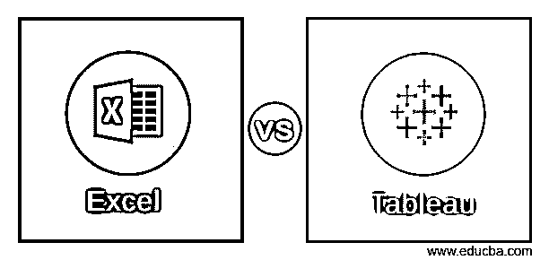

# Excel 与表格

> 原文：<https://www.educba.com/excel-vs-tableau/>

## Excel 和 Tableau 的区别

Excel 是一个电子表格应用程序，用于任何计算以及许多统计操作和数据分析。许多数据分析师的便利工具是 excel。它由微软发行。Tableau 是一个商业智能工具，用于查询和报告以及在线分析处理和分析。这是一个可视化工具，数据分析师使用它来获得业务视角和报告上的数据洞察力。

### Excel 和 Tableau 的直接比较(信息图表)

下面是 Excel 和 Tableau 的十大对比:

<small>Hadoop、数据科学、统计学&其他</small>

### Excel 和 Tableau 的主要区别

以下是要点列表，描述了 Excel 和 Tableau 之间的主要差异:

*   Excel 是处理数据转换的电子表格软件，例如使用公式进行计算和操作。首先是数据格式化，然后是表示。Tableau 是市场上广泛用于分析的丰富可视化工具之一。
*   在当今时代，组织更喜欢使用一些丰富的可视化工具来查看影响业务的数据。尽管 excel 有一些重要的特性，但它被认为是一个结构化的传统工具。Tableau 成立于 2003 年。而 Excel 相对于 tableau 来说有点过时了。
*   Excel 还需要一些 vb(Visual basic)脚本知识，以便充分利用其功能和组件。Tableau 非常用户友好，设计一个仪表板非常容易。拖放是用户发现使用这个工具很容易的关键特性。
*   Excel 可以使用插件连接到不同的外部源。Tableau 有许多要连接的源，并且它有云的能力。此外，为了使用 excel 进行访问或开发，还有一些系统要求。就速度和访问而言，Tableau 在与外部资源进行实时连接方面做得更好。
*   Tableau 进入市场是因为组织面临的大数据问题。就数据而言，Excel 一直是一种有限的资源。Excel 在使用时也有有限的行数和列数。
*   对于任何开关报告，与 tableau 相比，excel 是一个简单易用的工具，因为后者需要设置和配置或任何服务器部署。对于业务案例的任何短期和最小数据，excel 都是明智的选择。
*   就应用程序和用途而言，这完全取决于业务需求。对于目前的大数据问题以及对其进行分析以获得即使来自离群值的见解，tableau 是首选。然而，对于数据和静态报告的任何描述性分析和数学转换，excel 是首选。
*   Tableau 有桌面、prep、服务器和基于云的多个版本。由于安全性也在考虑之列，因此在选择版本时它是特定于组织的。Excel 是 Microsoft 许可的软件，与 office 工具一起提供。
*   excel 中的数据点存储在单元格中。数据以表格格式访问和表示，任何值或信息都显示在单元格中。随后会用图表来突出见解。
*   Tableau 主要以图形表示的方式格式化数据。它以图表和图形的形式描述了数据的趋势和密度。它通常连接到任何第三方工具来提取数据并将其可视化。用户访问非常友好，具有拖放功能，这使得数据分析师可以展示见解。
*   Excel 被用于各种领域，也用于许多部门。它不限于某些领域或数据相关的部门。甚至使用基本的计算和操作。使用范围从基本的计算到复杂的宏，例如开发 VB(Visual Basic)脚本。
*   Tableau 专门用于可视化从外部来源提取的数据或现场使用的数据。在许多情况下，数据分析师是使用 tableau 的主要资源。它不需要任何复杂的脚本。易于访问和用户友好。
*   Excel 是一个静态工具，首先加载数据，然后进行表示。可以使用插件插入外部来源的数据。为了实现这些功能，需要预先了解特性和功能。

### Excel 和 Tableau 比较表

下面是 Excel 和 Tableau 的对比表:

| 的依据 ****比较****  | **Excel** | 表 |
| **定义** | 组织、格式化和计算数据的软件 | 用于表示和可视化数据洞察的软件 |
| **用途** | 存储数据和操作 | 数据表示法 |
| **好处** | 操作和描述性统计。 | Quick interactive visualizations,方便用户的 |
| **实时使用量** | 必须实时设置外部应用程序或程序。 | 实时交互处理数据 |
| **业务目的** | 快速开关报告 | 自助服务功能将提取数据的洞察力 |
| **易用性** | 关于脚本(VB)和宏的知识来使用它成熟。 | 不需要编码技能。 |
| **应用程序** | Data analysts, Developers, ETL工商管理学博士(Doctor of Business Administration) | 数据分析师、数据科学家 |
| **字段** | 在许多处理数据转换的领域中 | 业务评估、关键绩效指标 |
| **脱颖而出** | 操作和描述性统计 | 可视化和 tableau 存储大量数据 |
| **解决方案** | 它最适用于小规模结构化数据 | 来自大数据问题的见解正在呈现。 |

### 结论

在这个现代技术中，有人说 excel 和 tableau 在需求和用法上几乎是一样的。但事实并非如此。同样的功能可以在 Excel 和 Tableau 中执行。但是如何更好地进行改进，以及在 excel 和 tableau 之间做出选择。任何开发人员或研究人员都更喜欢 excel 而不是 tableau，多年来一直如此。人们对使用新的工具和应用程序犹豫不决。而 Tableau 由于其商业智能功能和构建仪表板而在市场上得到普及。

随着大数据问题在这个时代越来越多，也有不同的可视化工具将被推向市场。一个行业将无法坚持使用一种特定的工具来进行任何数据分析。这是 Excel 和 Tableau 之间的切换。可能会有这样的情况，Excel 和 Tableau 都出现在说服最终产品的画面中。Excel 有自己强大的功能，tableau 也因为很多大数据用例而变得越来越成熟。

### 推荐文章

这是 Excel 和 Tableau 之间差异的指南。在这里，我们用信息图和比较表来讨论计算机网络和数据通信之间的主要区别。您也可以阅读以下文章，了解更多信息——

1.  [表格格式的创新方式——使用 Excel 表格格式](https://www.educba.com/excel-format-excel-table-format/)
2.  [Spark SQL vs Presto–找出 7 个有用的对比](https://www.educba.com/spark-sql-vs-presto/)
3.  [视觉分析 vs Tableau–了解重要差异(信息图表)](https://www.educba.com/visual-analytics-vs-tableau/)
4.  [Hadoop vs Cassandra——找出 17 个惊人的差异](https://www.educba.com/hadoop-vs-cassandra/)
5.  [Sqoop vs Flume–你应该知道的 7 个惊人对比](https://www.educba.com/sqoop-vs-flume/)

