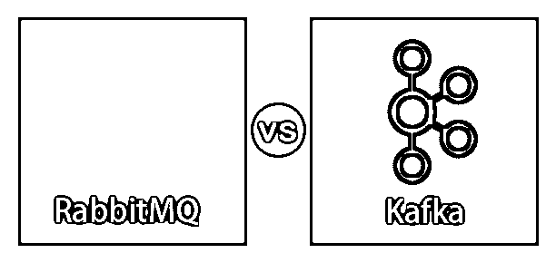
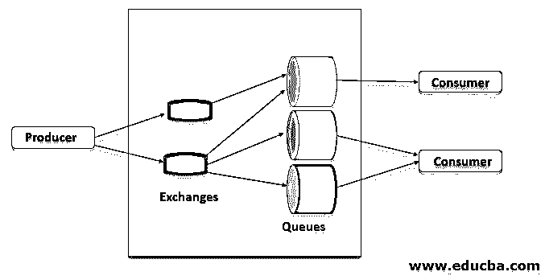
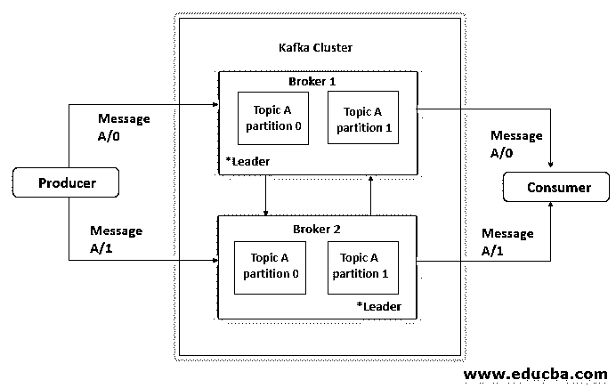
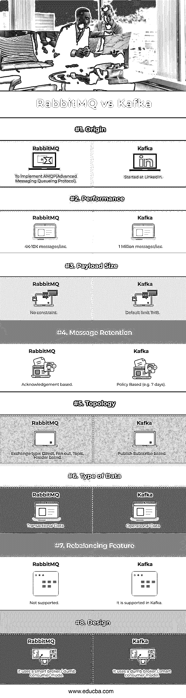

# RabbitMQ vs 卡夫卡

> 原文：<https://www.educba.com/rabbitmq-vs-kafka/>

## RabbitMQ 与卡夫卡的区别

RabbitMQ 是一个传统的消息代理，实现了多种消息协议。为了实现高级消息队列协议(AMQP)，最初开发了 RabbitMQ。AMQP 在生产商、经纪人和消费者的帮助下实现了信息的标准化。在这个话题中，我们将学习 RabbitMQ vs Kafka。

Apache Kafka 是一个消息传递系统，允许您发布和订阅基于主题和分区的消息流。这样，就类似于 ActiveMQ、RabbitMQ 等产品。但即使有这些相似之处，Kafka 也有一系列与传统信息系统的根本区别，这使它完全不同。

<small>Hadoop、数据科学、统计学&其他</small>

### 兔子 q

它是一个消息代理。它接受和发送消息。它就像邮局一样，接收、存储和发送邮件给收件人，就像 RabbitMQ 接收、存储和转发二进制数据块(消息)一样。

该图演示了基本的消息使用，包括以下组件，如下所述

*   **生产者:**生产者向队列发送消息，但从不直接使用队列，而是使用交换。发布消息意味着生产者将消息发送给交换，交换将消息转发给队列。
*   **交换:**交换负责将带有链接和路由关键字的消息路由到各个队列。绑定是交换和队列之间的关系。
*   **队列:**是存储消息的缓冲区。
*   **消费者:**消费消息意味着消费者从队列中挑选一条消息并消费它。

### 卡夫卡

Kafka 是一个发布-订阅消息系统。借助 Kafka 等流技术，您可以在集群中生成新数据时对其进行处理，您可以将其保存到 HDFS，或者保存到 HBase 或其他数据库，这样您就可以在数据传入时对其进行实时处理，您可以通过流来完成所有这些工作。

有几个关于卡夫卡的简单术语应该理解。

*   **生产者**:生产者将消息发布到一个主题。
*   **Broker** : Broker 是 Kafka 中由一个或多个服务器组成的集群。代理接收来自生产者的消息，将它们分配给 offset 并提交消息。
*   **主题**:消息分为主题。主题被分解成许多分区，在这些分区中，主题索引和存储接收名为 offset 的增量 Id 的消息。
*   **消费者**:消费者订阅各种话题，从经纪人那里读取数据。他们在消费者群体中读取数据。消费者总是通过跟踪消息的偏移量来跟踪它已经消费了哪些消息。

### RabbitMQ 与 Kafka 的正面比较(信息图)

以下是 RabbitMQ 和 Kafka 之间的 8 大区别

### RabbitMQ 和卡夫卡的主要区别

下面是提到的主要区别

#### 1.有效载荷

*   RabbitMQ:它可能有一个很大的有效负载，因为一个创建订单的实例可能有 45 个不同的属性。
*   Apache Kafka:Kafka 中的有效负载非常小，其键值对跨流发送。

#### 2.数据流

*   RabbitMQ:它有一个明确的有界数据流，换句话说，消息由消息消费者的接收者创建、发送和接收。
*   Apache Kafka:它有一个无界的连续数据流，换句话说，这些键-值对连续地流向主题。

#### 3.吞吐量

*   RabbitMQ: RabbitMQ 提供高达每秒 4K -10K 消息的吞吐量。
*   Apache Kafka:使用 Kafka，可以获得高达 100 万条消息/秒的吞吐量，因为 Kafka 利用顺序磁盘 I / O 能力，并且需要较少的硬件，这导致仅使用少量节点的高吞吐量。

#### 4.数据使用

*   RabbitMQ:这对交易数据有好处，我所说的交易数据是指用户请求、订单形成、订单下达，这些都是交易项目的形式。
*   Apache Kafka: Kafka 非常适合运营信息，即数据本质上是关于我们的流程运营，即不同流程的统计数据

各种审计和日志记录。这类数据说明了系统的安全性和正在进行的活动。

#### 5.消息保留

*   RabbitMQ: RabbitMQ 将消息发送给消费者，一旦消息被处理并且确认到达，就从队列中删除该消息。
*   Apache Kafka:因为 Kafka 是一个日志，所以总是有消息，您可以通过为消息设置保留策略来监控这一点。

例如保留 7 天

#### 6.设计

RabbitMQ:它使用一个智能代理/非智能消费者模型，该模型专注于一致地向消费者传递消息，消费者的消费速度与代理跟踪消费者状态的速度大致相同。

Apache Kafka: Kafka 使用一个愚蠢的经纪人/聪明的消费者。Kafka 并不试图监控每个用户已读的消息，只保留未读的消息；相反，Kafka 将所有消息保留一定时间，消费者负责监控他们在每个日志中的位置(消费者状态)。

#### 7.拓扑学

*   RabbitMQ:它具有交换队列拓扑，其中生产者向交换发送消息，然后该消息被路由到消费者可以消费的不同队列绑定。
*   Apache Kafka: Kafka 只支持发布-订阅类型的拓扑。这是生产者跨流向 Kafka 中的主题发送消息，然后由不同的消费者群体消费的地方。

### RabbitMQ 与 Kafka 对比表

让我们通过一个比较表来看看 RabbitMQ 和 Kafka 之间的更多差异，以便更清楚地理解:

| **比较点** | **RabbitMQ** | **卡夫卡** |
| **原点** | 实现 AMQP(高级消息队列协议) | 始于 LinkedIn |
| **性能** | 4K-10K 消息/秒 | 每秒一百万条消息 |
| **有效载荷大小** | 没有约束 | 默认限制 1MB |
| **消息保持** | 基于确认 | 基于策略(例如 7 天) |
| **拓扑** | 交换类型:直接、扇出、主题、基于标题 | 基于发布-订阅 |
| **数据类型** | 交易数据 | 操作数据 |
| **再平衡功能** | 不支持 | 它在卡夫卡中得到支持 |
| **设计** | 它使用智能代理/非智能消费者模型 | 它使用一个愚蠢的经纪人/聪明的消费者模型 |

### 结论

RabbitMQ 是简单用例的理想选择，它在低数据流量的情况下有一定的优势，比如优先级队列和灵活的路由选项。

此外，如果您需要提交日志或多个消费者，您可以使用 Kafka 获得海量数据和高吞吐量，因为 RabbitMQ 无法帮助您。

### 推荐文章

这是一本 RabbitMQ vs Kafka 的指南。在这里，我们讨论 RabbitMQ 与 Kafka 的关键区别，并提供信息图表和比较表。您也可以看看以下文章，了解更多信息–

1.  [卡夫卡 vs 克瑞斯](https://www.educba.com/kafka-vs-kinesis/)
2.  [ActiveMQ vs RabbitMQ](https://www.educba.com/activemq-vs-rabbitmq/)
3.  [卡夫卡 vs 火花](https://www.educba.com/kafka-vs-spark/)
4.  [ActiveMQ vs Kafka](https://www.educba.com/activemq-vs-kafka/)

