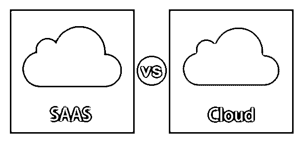

# SAAS 与云

> 原文：<https://www.educba.com/saas-vs-cloud/>

## SAAS 与云的区别

本文中的 SaaS vs 云计算。包括网络、存储和处理能力在内的技术进步导致了计算的缩影，这是当前称为云计算或通常称为云的趋势。所以云是一种标准化的模型，允许按需网络访问共享的计算资源，云模型强调使用互联网在线管理、存储和处理数据。云有 3 种主要的交付模式，SaaS 是其中之一，即所谓的软件即服务。这是一种按需服务，用户可以按使用付费；它安装在软件提供商的计算机上，可供用户在线使用。

### SAAS 与云的直接比较(信息图)

以下是 SAAS 与云的 7 大对比:

<small>Hadoop、数据科学、统计学&其他</small>

### SAAS 和云的主要区别

SAAS 和云有很多不同之处。但是让我们来看看它们之间的关键和主要区别:

*   [云计算](https://www.educba.com/what-is-cloud-computing/)可以被认为是 SaaS 的超集，这种云模型能够以最少的管理工作实现按需网络访问，而 SaaS 是云的子集，但值得注意的是，并非所有 SaaS 模型都是在云上创建的，它们也可以在本地终端上创建，并部署在基于云的服务器上。
*   谈到每个类别下的服务提供商，我们有谷歌、Adobe、Slack、Shopify、微软和 SaaS 类别下的许多其他提供商，而 AWS、MS Azure、谷歌云平台、IBM cloud、Adobe creative cloud、VMware 和 Rackspace 是云市场的一些大玩家。
*   云用户能够定制和管理由任何第三方远程托管的服务器上的应用程序，这意味着您可以访问服务器上的数据，而 SaaS 用户无权维护服务器上的数据，只能通过网络浏览器订阅完全开发的软件，这意味着无权管理和定制应用程序。
*   数据备份设施是两者之间的一个关键区别；SaaS 用户没有数据存储权限，而云用户可以自动执行此操作。
*   在 SaaS，用户对服务器没有控制权；它可以在没有用户许可的情况下随时被取消，而在云中，用户拥有完全的权限，因为他们拥有服务器，没有他们的许可不会受到干扰。
*   云本身就是一个海洋，所有主要的云提供商都提供了大量的解决方案，让我们看看 com 产品的例子，从人工智能，AR VR，区块链和应用集成，而 SaaS 没有这么大的应用选择和类别。完整的企业解决方案是云提供给用户的东西，但对 SaaS 来说却不是这样。

### SAAS 与云对比表

以下是 SAAS 与云的主要区别:

| **比较的基础** | **SaaS** | **云** |
| **历史** | 集中式托管早在 1960 年就建立了基础，但是随着 20 世纪 90 年代的革命性变化，一个新的集中式计算类别出现了，它被称为应用服务提供商(ASP)。SaaS 是 ASP 的扩展。 | 云计算一词最早出现在 1996 年初；康柏公司的一份内部文件首次提到了它。亚马逊在 2006 年用它的 EC2(弹性计算云)推广了它。 |
| **定义** | SaaS 是一个成熟的应用程序，而不是一种构建应用程序的方式。 | 云计算是在互联网上提供计算服务 |
| **可交付成果** | 作为输出/实用程序的应用程序。 | 使用实用程序进行计算。 |
| **类型** | **打包云:**在 SaaS 的商业模式下，最重要的可交付成果之一就是打包云；它有几个实用工具，如人力资源、客户关系管理等，这些工具在每个组织中都很常见。协作软件侧重于协作工作，如网络会议、文档集中、电子邮件、消息传递等。管理工具对开发过程非常有用，也是 SaaS 平台的重要集成，用于监控、测试等。 | **公共云:**服务提供给使用相同共享外部基础设施的多个客户端。私有云订阅专门针对一个用户，基于他们的特定需求。混合云是将公共云和私有云结合在一起的复杂解决方案。例如，组织的敏感信息存储在私有云中，而一般信息存储在公共云中。 |
| **由**开发 | 它的出现没有一个名字。 | 1960 年约瑟夫·卡尔·罗班尼特·利克里德。 |
| **应用程序** | 今天，SaaS 出现在该行业的所有领域，让我们看看一些常见的应用:
协作/通信/社交
CRM
客户服务/支持
人力资源/人才管理
电子商务
采购/支出/采购
管理
软件开发/QA 测试
商业智能
分析
预算/报告/规划
治理、风险&合规
ERP/制造/供应链
财务/会计 | 有一个在所有细分市场和业务类别中开发的应用程序列表，让我们看看一些常见的:
在线文件存储
照片编辑软件
数字视频软件
与 Twitter 相关的应用程序
创建相册
防病毒的网络应用程序
文字处理应用程序
电子表格
演示软件
在地图上找到路
电子商务软件
其他应用程序 |
| **利弊** | **优点:**

*   Reduce upfront costs
*   Quick setup and deployment
*   Easy upgrade
*   Accessibility
*   expandability

**缺点:**

*   Lack of control
*   Security & Data Protection Issues
*   Limited application range
*   Connection requirements

 | **优点:**

*   Cost savings
*   high-speed
*   reliability
*   coordinate
*   Fast & easy to develop
*   Automatic integration
*   Data backup and recovery facilities
*   Availability of API access
*   Multi-tenant
*   Fast and effective virtualization
*   Location and equipment independence

 |

### 结论

当我们看云和 SaaS 时，我们正在走向何方是一个更大的问题，SaaS 自 20 世纪 60 年代以来就在我们身边，并且存活了几十年，每天都在变得更大、更好。无论你称之为 SaaS 还是云计算，该行业都在呈指数级增长，几乎占据了所有细分市场，用户群甚至更大。

### 推荐文章

这是 SAAS vs 云计算的指南。在这里，我们讨论 SAAS 和云之间的区别，以及主要区别、信息图和比较表。

您也可以浏览我们的其他相关文章，了解更多信息——

1.  [PAAS vs SAAS](https://www.educba.com/paas-vs-saas/)
2.  [私有云 vs 公有云](https://www.educba.com/private-cloud-vs-public-cloud/)
3.  [Scala vs Java](https://www.educba.com/scala-vs-java/)
4.  [云计算公共 vs 私有](https://www.educba.com/cloud-computing-public-vs-private/)
5.  [本地与云|主要差异](https://www.educba.com/on-premise-vs-cloud/)
6.  [SaaS 与内部部署的比较](https://www.educba.com/saas-vs-on-premise/)
7.  [云与数据中心的主要区别](https://www.educba.com/cloud-vs-data-center/)

