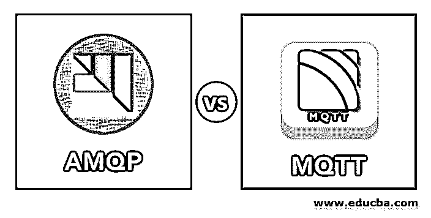
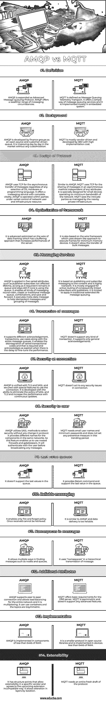

# AMQP vs MQTT

> 原文：<https://www.educba.com/amqp-vs-mqtt/>

## AMQP 与 MQTT 的区别

在过去的几十年中，广泛部署的用于消息异步排队的开源协议是 AMQP vs MQTT。最近，它已经适应了新的更新。AMQP 有意成为国际标准组织或国际电化学委员会的一员，并被 OASIS 选中，MQTT 已采用 Eclipse。AMQP 使用网络执行它的消息队列。因此，有线协议在网络上被转换为字节值的洪流。MQTT 是为带宽有限的设备开发的。这是一个轻量级的广播系统，用户可以像客户端一样传输和接收消息。

### AMQP 与 MQTT 的面对面比较

以下是 AMQP 与 MQTT 的 14 大区别:

<small>Hadoop、数据科学、统计学&其他</small>

### AMQP 与 MQTT 的主要区别

AMQP 和 MQTT 都受雇于物联网。然而，让我们讨论一下主要的区别:

*   MQTT 有客户机/代理架构，而 AMQP 有客户机/代理和客户机/服务器架构。
*   MQTT 遵循发布和订阅的抽象，而 AMQP 遵循响应或请求以及发布或订阅方法。
*   AMQP 的报头大小是 8 字节，MQTT 是 2 字节。MQTT 的消息大小很小且已定义，而 AMQP 的消息大小是可协商且未定义的。
*   MQTT 的方法是连接、发布、关闭、订阅和断开连接。AMQP 遵循消费、交付、发布、获取、选择、确认、删除、恢复、拒绝、打开和关闭。
*   MQTT 对缓存和代理提供部分支持，而 AMQP 提供完全支持。
*   AMQP 和 MQTT 都遵循 TCP 协议、二进制标准和开源排队系统。
*   AMQP 提供的安全性是 IPSec、SASL、TLS 或 SSL，MQTT 只提供 TLS 或 SSL 安全标准。AMQP 和 TCP 使用 SCTP 进行传输。OASIS 同时支持 AMQP 和 MQTT。
*   MQTT 交付的服务质量是 fire，忘记 QoS 是否为 0。如果 QoS 为 1，则至少有一个，如果 QoS 为 2，则正好有一个。AMQP 提供的服务质量是解决和解除类似于 MQTT 的格式。

### AMPQ 与 MQTT 对比表

下面是 AMQP 与 MQTT 的比较:

| **比较的基础** | **AMQP** | **MQTT** |
| **定义** | AMQP 被扩展为高级消息队列协议。AMQP 提供了更丰富的信息环境。 | MQTT 被定义为消息队列遥测传输。它提供了一种简单的消息队列服务方式，主要在嵌入式系统中实现。 |
| **Background** | AMQP 是由金融集团开发的，作为一个开源和客户驱动的队列。它在市场上日臻完善，无需任何定制。 | MQTT 主要由供应商驱动，由 IBM 开发，实现成本很高。 |
| **Design of Protocol** | 无论选择何种操作系统、硬件或编程语言，AMQP 都使用 TCP 进行消息的异步传输。它提供了一个充满活力的信息服务。AMQP 在网络用户和基础设施资源的不同控制下在各方内部运行。 | 与 AMQP 类似，MQTT 使用 TCP 以独立于任何属性的异步方式共享消息。它是专门为在最小网络带宽上运行的小型设备而设计的。MQTT 认为错综复杂的各方由附近的私有基础设施管理。 |
| **Optimization of framework** | 它在数据组帧方面进行了高级优化，具有一种提高服务器性能的缓冲方法。 | 它也基于 wire 框架，该框架使用类似流的方法来执行最小存储设备的帧。它不允许传输批量消息。 |
| **信息服务** | AMQP 应用于五个不同的属性中，例如发布者-订阅者不受影响的生存期，只要它需要，它就保持在队列中，如果没有人使用队列，它就保持不动。它支持各种消息传递循环、经典或传统消息队列、组合以及保存和转发。它执行元数据消息以帮助等幂消息和消息分组。 | 它基于内容的发布和订阅消息传递，并且非常短暂。它主要用于因此链接的订户和发布者的主动路由。它仅限于应用于传统的延长寿命消息队列。 |
| **消息交易** | 它支持不同的确认、事务、用例以及整个消息队列。它支持分解各种交易代码，这是必需的，并且在出现延迟以微调性能时会被确认为过期。 | MQTT 不支持任何类型的事务。它只支持一般确认。 |
| **连接处的安全性** | AMQP 与 TLS 和 SASL 是统一的，并使用特殊功能来保护连接。它能够消除 SASL 和 TLS 策略，并通过持续更新来提高性能。 | MQTT 不会对连接中的任何安全问题采取行动。 |
| **用户安全** | AMQP 使用 SASL 方法来选择安全性，而无需更改协议。它为同一网络中的组件提供了不同的名称。因此，这一特性使我们能够使用嵌套防火墙和网关守护设备。它将在广播任何消息之前对用户进行验证。 | MQTT 需要小的用户名和最小的密码，并且在这个趋势期不设置任何预防措施。 |
| **最后一个值队列** | 它不支持队列中的最后一个值。 | 它提供 Retain 命令并支持队列中的最后一个值。 |
| **可靠的消息传递** | 它只允许火灾和遗忘政策。一旦收到就无法收回。 | 它类似于 AMQP，数据传输过于可靠。 |
| **消息中的名称空间** | 它允许以多种方式查找消息，如节点和队列。 | 它在消息的分层传输中使用“名称空间”。 |
| **附加属性** | AMQP 支持对等连接，并允许整个网络的负载平衡，它是多路复用的。它可以使用容器，主题是双对称的。 | MQTT 提供了对 DNS 服务器的基本要求。MQTT 是非对称的，不支持任何高级特性。 |
| **实施** | AMQP 在小于 64kb RAM 的组件中实现。 | 它是开放源码库中的一个较小的协议，在 RAM 小于 64kb 的设备上实现 |
| **扩展性** | 它有结构点，允许在特定供应商的可扩展性，并同意即将到来的扩展不兼容的方式。它允许通过隔离来改变层。 | MQTT 需要一份全新的协议草案。 |

### 结论

尽管 AMQP 和 MQTT 在架构和协议上有很多不同，但它们正被广泛应用于各种应用，如物联网。作为开源协议，AMQP 和 MQTT 都可以基于客户机需求和可用带宽在所有应用程序中使用。

### 推荐文章

这是一个 AMQP vs MQTT 的指南。这里我们讨论信息图和比较表的主要区别。您也可以浏览我们推荐的其他文章，了解更多信息——

1.  [计算机网络 vs 数据通信](https://www.educba.com/computer-network-vs-data-communication/)
2.  [信息学与数据阶段](https://www.educba.com/informatica-vs-datastage/)
3.  [数据分析师 vs 数据科学家](https://www.educba.com/data-analyst-vs-data-scientist/)
4.  [数据科学 vs 数据可视化](https://www.educba.com/data-science-vs-data-visualization/)
5.  [AMQP vs JMS 的区别](https://www.educba.com/amqp-vs-jms/)

