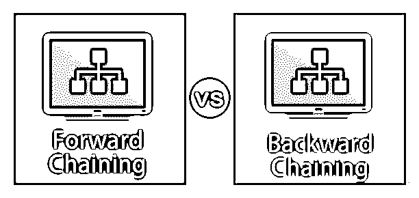
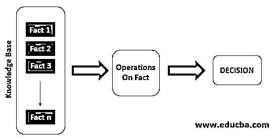
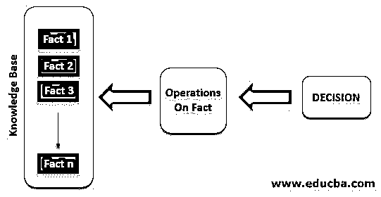
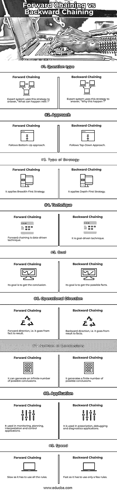
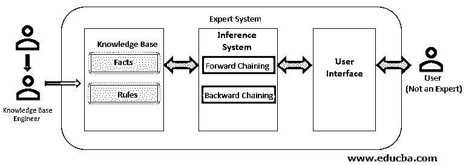

# 正向链接与反向链接

> 原文：<https://www.educba.com/forward-chaining-vs-backward-chaining/>

## 正向链接和反向链接的区别

正向链接和反向链接是人工智能领域的两个重要策略。它起源于人工智能的专家系统领域。专家系统是人工智能最重要的研究领域之一，它被用来模拟人类专家的决策能力。它有 3 个组成部分:

*   **知识库:**存储特定领域的高质量知识。
*   **推理机:**使用知识库中的知识做出决策。
*   **用户界面:**提供专家系统用户和专家系统之间的交互。

正向和反向链接是推理机在进行推理时使用的策略。

<small>Hadoop、数据科学、统计学&其他</small>

### 正向链接

**这种策略用于通过操作知识库中的知识来得出结论。**

这个策略用于回答“接下来会发生什么？”

**属性:**

*   因为它是自上而下的，所以被称为自上而下方法。
*   它通过从数据中进行推断并从初始状态移动到目标状态来做出结论。

### 反向链接

在这种情况下，推理系统知道最终的决定，它试图找出导致该决定的条件。它主要用于查找问题的原因。

这个策略被用来回答“为什么会这样？”

**属性:**

*   在这里，目标被分解成子目标来证明一个事实。
*   这是一种目标驱动的方法
*   它使用深度优先策略进行证明。

### 正向链接和反向链接的比较(信息图表)

下面是前向链接和反向链接的 9 大对比 **:**

### 正向链接和反向链接的主要区别

让我们讨论一些主要的关键差异:

*   正向链接用于通过获取事实来推断结论，并通过应用推理规则向前移动以获得更多数据，直到它到达目标的时间，而在反向链接中，它获取目标并通过使用推理规则向后移动以确定可能是目标的原因的事实。
*   正向链接使用广度优先策略来推断结论，而反向链接使用深度优先策略来获取事实。
*   由于采用事实和推导结果的原因，正向链接被称为自底向上的方法，而反向链接也被称为自顶向下的方法。
*   正向链接用于从数据中获取目标，因此被称为数据驱动推理技术，而反向链接用于从目标中获取数据，被称为目标驱动推理技术。
*   正向链接将搜索所有可能的方法来达到目标，而反向链接则避免不必要的路径。
*   因为正向链接检查所有规则，所以速度很慢，而反向链接只检查需要的规则，所以速度很快。
*   前向链接可用于股票市场，以使用可用数据检测股票价格，而后向链接可用于了解癌症等原因的原因。
*   前向链接用于诸如计划、监视、解释和控制应用的任务，而后向链接用于调试和诊断任务。
*   现在你可能对推理系统的这两种策略以及它们与专家系统的关系有了清晰的理解。查看下图，了解它们之间的关系:

*   专家和知识库工程师创建专家系统的知识库，然后在使用知识库中可用的事实和规则的正向链接的情况下，或者通过将来自用户的输入作为目标以及来自知识库的事实和规则来获得目标的原因的情况下，推理系统的策略使用该知识库来推导结果。

### 正向链接与反向链接对照表

下表总结了这些比较:

| **比较的基础** | **正向链接** | **反向链接** |
| **题型** | 专家系统使用这种策略来回答“接下来会发生什么？” | 专家系统使用这种策略来回答“为什么会发生这种情况？” |
| **接近** | 遵循自下而上的方法 | 遵循自上而下的方法 |
| **策略类型** | 它应用了广度优先策略 | 它应用深度优先策略 |
| **技术** | 正向链接是一种数据驱动的技术 | 这是一种目标驱动的技术。 |
| **目标** | 它的目标是得到一个结论。 | 它的目标是获得可能的事实 |
| **运行方向** | 正向，即从事实到结果 | 逆向，即从结果到事实。 |
| **结论数量** | 它可以产生无数可能的结论 | 它产生有限数量的可能结论 |
| **应用** | 它用于监测、规划、解释和控制应用。 | 它用于处方、调试和诊断应用。 |
| **速度** | 尽管它必须使用所有的规则 | 因为它只需要使用很少的规则。 |

### 结论

在本文中，我们已经看到了正向链接和反向链接之间的区别以及它们的关键区别。我希望这篇文章对你有所帮助。

### 推荐文章

这是正向链接和反向链接之间区别的指南。在这里，我们还讨论了正向链接和反向链接的关键区别，包括信息图表和比较表。您也可以看看以下文章，了解更多信息–

1.  [人工智能问题](https://www.educba.com/artificial-intelligence-problems/)
2.  [人工智能技术](https://www.educba.com/artificial-intelligence-technology/)
3.  [Tableau 中的帕累托图](https://www.educba.com/pareto-chart-in-tableau/)
4.  [中断 vs 继续](https://www.educba.com/break-vs-continue/)
5.  [反向链接指南](https://www.educba.com/backward-chaining/)

