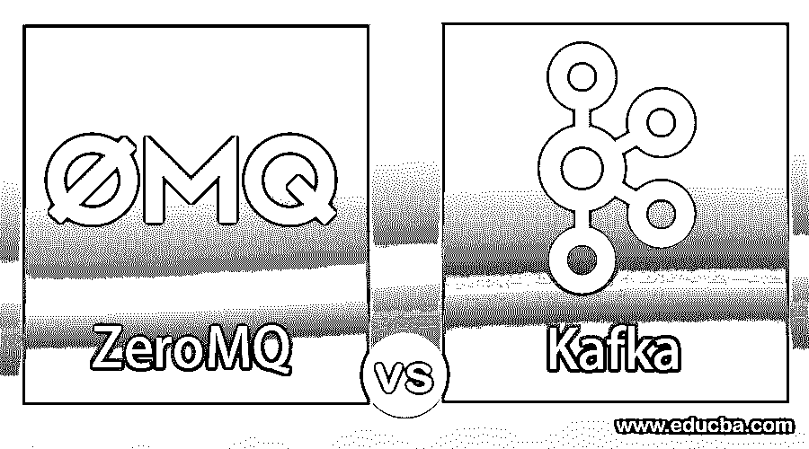
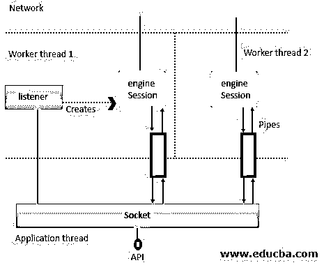
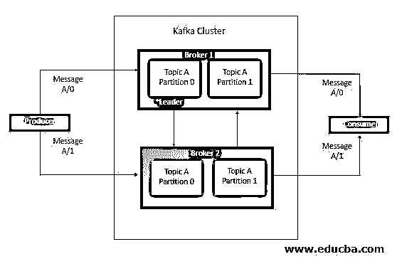
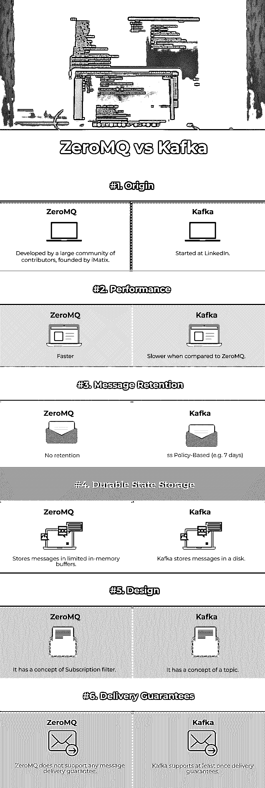

# zeromq 和卡夫卡

> 原文：<https://www.educba.com/zeromq-vs-kafka/>

## ZeroMQ 与 Kafka 的区别

ZeroMQ 是一个开源的高性能消息库。它是跨平台的，支持跨语言，轻量级和快速的。ZeroMQ 是一个消息服务提供商。使用这些提供者，需要一个消息传递 API 来发送和接收消息，并且需要将这些提供者与应用服务器集成。Apache Kafka 是一个消息传递系统，允许您发布和订阅基于主题和分区的消息流。这样，就类似于 ActiveMQ、RabbitMQ 等产品。但即使有这些相似之处，Kafka 也有一系列与传统信息系统的根本区别，这使它完全不同。

### 架构和组件

在这里，我们将看到下面给出的 ZeroMQ vs Kafka 的架构和组件:

<small>Hadoop、数据科学、统计学&其他</small>

#### 泽姆 q

它是一个异步消息库，用于消息系统的不同应用程序中。它提供了一个消息队列，但是与其他面向消息的设备不同，ZeroMQ 设备可以在没有专用消息代理的情况下运行。

*   **套接字:**使用套接字，用户与这些套接字的交互类似于 TCP 套接字，它们之间的区别在于每个套接字能够处理多个对等通信。
*   **工作线程:**各种对象驻留在工作线程中，这些对象中的每一个都恰好由一个父对象持有(所有权在图中用简单的实线表示)。许多对象直接由套接字持有；尽管如此，在一些情况下，实体是由套接字拥有的对象控制的。

*   **监听器:**TCP 监听器实体监听传入的 TCP 连接，并为每个新连接生成引擎/会话对象。
*   **Session:** 是与 ZeroMQ 套接字通信的会话对象。
*   **引擎:**引擎对象与网络通信。
*   **管道:**当会话与套接字交换消息时。有两个方向来传递消息，管道对象处理内部要传递的每个方向的消息。本质上，每个管道都是一个无锁队列，用于在线程之间快速传递消息。

#### 卡夫卡

Kafka 是一个发布-订阅消息系统。借助 Kafka 等流媒体技术，您可以在集群中生成新数据时对其进行处理，您可以[将其保存到 HDFS](https://www.educba.com/what-is-hdfs/) ，或者保存到 HBase 或其他数据库，这样您就可以在数据进入时对其进行实时处理，您可以通过流媒体完成所有这些工作。有几个关于卡夫卡的简单术语应该理解。

*   **生产者:**生产者向一个或多个 Kafka 生产者发布消息，这些 Kafka 生产者可以作为 Kafka 集群中数据源。
*   **代理:**代理是一个集群，由代理中的一个或多个服务器组成，这些服务器接收来自生产者的消息，将它们分配给一个偏移量，并提交消息。
*   **主题:**消息被分成主题，主题被分解成多个分区，在这些分区中，主题索引和存储接收到名为 offset 的增量 Id 的消息。
*   **消费者:**消费者订阅各种话题，从经纪人那里读取数据。他们在消费者群体中读取数据。消费者总是通过跟踪消息的偏移量来跟踪它已经消费了哪些消息。

### ZeroMQ 与 Kafka 的面对面比较(信息图)

以下是 ZeroMQ 与 Kafka 的 6 大对比 **:**

### ZeroMQ 与 Kafka 的主要区别

让我们从以下几点来讨论 ZeroMQ 与 Kafka 之间的一些关键差异:

#### 1.设计

*   **ZeroMQ:** ZeroMQ 拥有订阅过滤器的一流定义。订阅过滤器帮助您根据前缀匹配情况决定您有兴趣接收哪些消息。每个消息的第一帧包含流的逻辑名称，第二帧包含实际的日志记录。相反，我们可以配置 ZeroMQ 在第一帧上呈现精确匹配，这样我们就只得到我们关心的条目。
*   **卡夫卡:**卡夫卡对一个话题有一流的观念；这是一个关键概念，用在可以发布和订阅并独立处理的消息传递主题中。

#### 2.交货保证

*   **ZeroMQ:** 如果没有提到用户，它不接受交付保证，ZeroMQ 会丢弃消息，内存中可配置大小的缓冲区可能会填满。
*   **Kafka:** Kafka 支持消息传递至少一次的保证。

#### 3.持久状态和存储

*   ZeroMQ: 它将消息存储在内存的小缓冲区中。
*   **Kafka:** Kafka 将消息存储在磁盘上，以支持其交付保证以及保留已被消费的消息的能力。

#### 4.表演

*   **ZeroMQ:** ZeroMQ 比 Kafka 快很多，因为它不在磁盘上存储消息，所以你不需要来回获取消息。它将消息存储在内存的小缓冲区中。
*   **Kafka:** 尽管 Kafka 与 RabbitMQ 等其他消息代理相比速度很快，但它实际上比 ZeroMQ 慢，因为它需要磁盘来存储消息和返回消息。

#### 5.消息保留

*   **ZeroMQ:** 它不支持消息保持。如果没有提到订户，ZeroMQ 会丢弃消息，即使订户错过了，内存中可配置大小的缓冲区也会填满。
*   **Kafka:** Kafka 支持消息保留，因为 Kafka 是一个日志，总是有消息，您可以通过为消息设置保留策略来监控这一点。

### ZeroMQ 与 Kafka 对比表

下表总结了 ZeroMQ 与 Kafka **:** 之间的比较

| **对比点** | **零零零零零零零零零零零零零零零零零零零零零零零零零零零零零零零零零零零零零零零零零零零零零零零零零零零零零零零零零零零零零零零零零零零零零零** | **卡夫卡** |
| **原点** | 由 iMatix 创建的大型贡献者社区开发。 | 始于 LinkedIn。 |
| **性能** | 更快的 | 与 ZeroMQ 相比更慢。 |
| **消息保持** | 无保留 | 基于 ss 策略(例如 7 天) |
| **持久状态存储** | 将消息存储在有限的内存缓冲区中。 | 卡夫卡把信息储存在磁盘里。 |
| **设计** | 它有订阅过滤器的概念。 | 它有一个主题的概念。 |
| **交货保证** | ZeroMQ 不支持任何消息传递保证。 | Kafka 支持至少一次发货保证。 |

### 结论

到目前为止，我们已经深入了解了 ZeroMQ vs Kafka，我们得出的结论是，ZeroMQ 不是一个消息代理，而是一个用于构造代理和协议的库。因此，与 ZeroMQ 相比，Kafka 是一种更简单、支持更好的方法，您可以将 Kafka 用于海量数据和高性能。

### 推荐文章

这是一个关于 ZeroMQ 和 Kafka 之间最大区别的指南。在这里，我们讨论了 ZeroMQ 与 Kafka 的关键区别，包括信息图和比较表。您也可以看看以下文章，了解更多信息–

1.  [ActiveMQ vs RabbitMQ](https://www.educba.com/activemq-vs-rabbitmq/)
2.  [ActiveMQ vs Kafka](https://www.educba.com/activemq-vs-kafka/)
3.  [zernq 与 RabbitMQ](https://www.educba.com/zeromq-vs-rabbitmq/) 的比较
4.  [卡夫卡 vs 火花](https://www.educba.com/kafka-vs-spark/)

