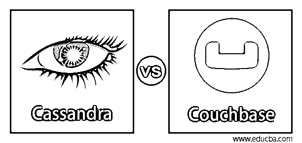
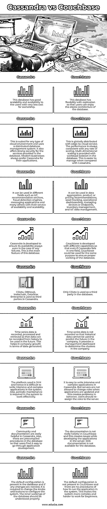

# 卡珊德拉 vs Couchbase

> 原文：<https://www.educba.com/cassandra-vs-couchbase/>

## Cassandra 和 Couchbase 的区别

用于以分布式格式在服务器中存储和管理数据的开源数据库系统被称为 Cassandra。可扩展，性能真的很好。它还提供了高可用性，服务器不容易出现故障。它属于 NoSQL 数据库。它由一组节点组成。致力于文档和数据库的开源服务器叫做 Couchbase。键值存储提供了更快的数据操作和执行 SQL 查询等的查询引擎。这是一个 NoSQL 数据库。应用程序数据始终保持完美的正常运行时间。

### Cassandra 与 Couchbase 的面对面比较(信息图)

以下是 Cassandra 和 Couchbase 的 6 大对比

<small>Hadoop、数据科学、统计学&其他</small>

### Cassandra 和 Couchbase 的主要区别

让我们从以下几点来讨论 Cassandra 与 Couchbase 之间的一些关键差异:

*   Cassandra 的数据库模型是宽列存储，而 Couchbase 的数据库模型是文档存储。Cassandra 中没有辅助数据库模型。辅助数据库模型是存储在 Couchbase 中的键值。
*   卡珊德拉是许多人喜欢的宽栏商店的第一名。Couchbase 在文档库中排名第三，总体排名第 24。卡珊德拉的排名整体 11。
*   Cassandra 是基于 BigTable 和 DynamoDB 开发的。Cassandra 于 2008 年发布，Couchbase 于 2011 年开发。Couchbase 是从 CouchDB 发展而来的，带有一个 Memcached 接口来处理数据。
*   Cassandra 和 Couchbase 都是开源的，但是 Cassandra 不提供任何数据库服务。Couchbase 提供 Couchbase cloud 即服务，以最少的工作来管理和部署数据库。
*   Cassandra 是用 Java 语言写的。Couchbase 是用 C，C++，Go，Erlang 语言写的。卡珊德拉在几乎所有的操作系统中都有操作。Couchbase 在除 BSD 之外的操作系统中运行。Cassandra 没有任何 XML 支持，而 Couchbase 有 XML 支持，并且无限制地支持二级索引。
*   Cassandra 中使用的查询语言是带有 DML 和 DDL 语句的 SQL。Couchbase 使用声明式查询语言 N1QL，这样 JSON 和 SQL 都可以使用。Couchbase 在他们的查询中第一次开始使用 SQL++。
*   所使用的 API 不太像 Cassandra 中的专有协议和节俭。在 Couchbase 中，搜索和分析 API 可以在本地语言绑定中使用。此外，在 Couchbase 中还使用了 JavaScript 的函数和定时器等服务器端脚本。这有助于理解服务器的功能和工作方式。
*   Cassandra 中使用的复制方法是可选择的复制因子。在 Couchbase 中，服务器使用主对主复制和主对从复制。Cassandra 中不使用事务概念，而 Couchbase 中使用诸如 ACID 之类的事务概念。
*   Cassandra 没有任何内存功能。Couchbase 具有内存功能。用户权限是根据 Cassandra 中的对象定义的。Couchbase 为用户和管理员提供了基于密码的访问，身份验证与 LDAP 集成在一起。

### Cassandra 与 Couchbase 对比表

下表总结了 Cassandra 与 Couchbase 的比较 **:**

| 卡桑德拉 | **沙发底座** |
| 该数据库具有良好的可扩展性和可用性，用户的拥有成本非常低。 | 该数据库具有复制的灵活性，因此用户可以享受数据库的弹性架构。 |
| 这适用于任何类型的云环境，并使用分布式数据库管理系统。它还为数据库中提供的服务提供了强大的安全性。现代企业总是更喜欢 Cassandra 的应用程序。 | 这是全球分布的边缘到云服务。性能始终与任何缩放率保持一致。多维扩展是通过数据库中的工作负载隔离提供的。与 Cassandra 相比，这更容易管理。 |
| 它可以应用于不同的领域，如物联网、推荐服务、欺诈检测引擎、消息应用以及其他许多具有可用性和可扩展性的服务。 | 它可以用于数据聚合、产品或定价建议、资产跟踪、操作仪表板、管理设备或端点、库存管理和物联网数据管理。 |
| Cassandra 的开发旨在确保即使在出现任何故障的情况下也始终可用。这是这个数据库的主要特点。 | Couchbase 开发了不同的功能，因此即使 Cassandra 在一个领域失败，Couchbase 也可以用于相同的目的，以确保数据库的正常工作。 |
| CData、DBHawk、Instaclustr、DataStax Enterprise 在 Cassandra 中作为第三方使用。 | 只有 CData 被用作数据库中的第三方。 |
| 时间序列数据被记录、处理和检索，以便可以从历史中记录数据供将来使用。就产生的数据而言，这有助于公司的增长。 | 不记录时间序列数据，因此历史数据不能用于预测公司的未来。它提供了一个管理仪表板来确定公司中的集群。 |
| 使用的平台是 JVM，因此很难在系统中编写密集和复杂的应用程序。此外，系统需要定期维护才能有效工作。 | 用 Cassandra 很容易编写密集而复杂的应用程序。但是当应用程序更新时，不允许服务器改变角色，这就在两者之间产生了问题。用户应该将角色重新分配给服务器。 |
| 在 Cassandra 中，社区和文档非常有用。此外，数据库中有预编译的过程，因此用户可以很容易地完成应用程序开发。 | 文档在 Couchbase 中并没有真正的帮助，这在服务器中开发应用程序时会产生问题。SDK 文档不适用于该数据库。 |
| 默认配置存在于数据库中，如果需要任何更改，需要更改旋钮和按钮来配置系统。应该正确理解数据库的内部工作方式。 | Couchbase 中没有默认配置，也没有如何在系统中运行应用程序的过程。这使得系统更加复杂，对于初学者来说更难操作。 |

### 结论

如果用户在管理和维护方面很好，那么使用 Cassandra 是很好的。并且它是许多组织更常用的数据库。Couchbase 更容易使用，因为不需要单独维护。基于这些差异，明智的做法是根据用户的需求进行选择。

### 推荐文章

这是一个卡桑德拉 vs Couchbase 的指南。在这里，我们讨论了 Cassandra 与 Couchbase 的主要区别，并提供了信息图表和比较表。您也可以看看以下文章，了解更多信息–

1.  [什么是 Apache Solr？](https://www.educba.com/apache-solr/)
2.  [Cassandra vs elastic search–最大差异](https://www.educba.com/cassandra-vs-elasticsearch/)
3.  [什么是 Elasticsearch？](https://www.educba.com/what-is-elasticsearch/)
4.  什么是 RESTful Web 服务？

