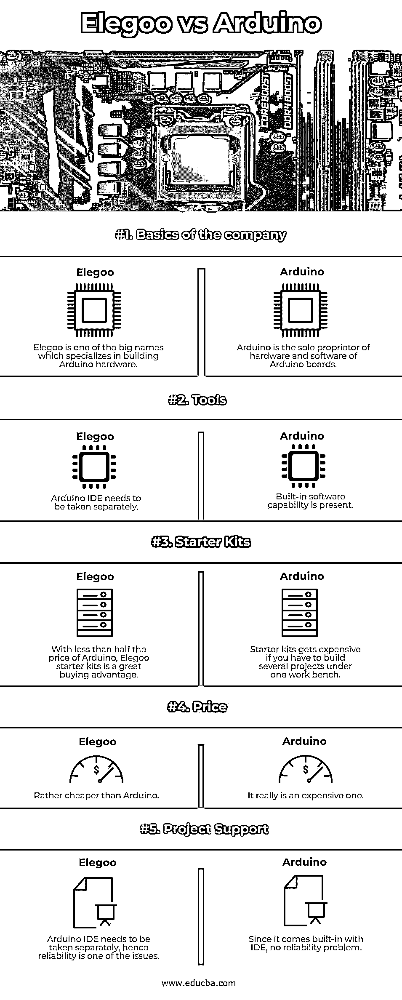

# Elegoo vs Arduino

> 原文：<https://www.educba.com/elegoo-vs-arduino/>

## Elegoo vs Arduino 简介

你有没有想过，如果你想到了一个革命性的技术，一眨眼的功夫，你的技术就变得非常强大，你成为了市场上唯一的王者。会有其他玩家试图进入你留下的空白空间，并看到成长的潜力！这是商业案例的正常场景。Arduino 的出发点也是为了帮助那些以前没有微控制器经验的人、学生和孩子，让他们有一个感兴趣的学习资源，并更深入、更广泛地学习。

### 历史和术语警告！!

我们知道 Arduino 开始的意图。它是由一群工程师领导的，这个公司是由 Ivrea 交互设计学院的 5 名学生作为一个研究项目成立的。现在，在 Arduino 开始流行的这些年里，其他公司也想抓住在这种类型中获得成功的机会，并开始制造假冒的 Arduino 套件，由于 IDE 本身是开源的，这些公司购买了自己的微控制器，涂上自己的品牌，然后作为自己的 Arduino 套件出售。Elegoo 就是这样一个品牌，它使用 Arduino 的开源蓝图大规模生产电路板，因为它是一个开源平台，所以没有支付版税。

<small>Hadoop、数据科学、统计学&其他</small>

现在让我们进入一些术语，以便更好地理解 Elegoo 或 Arduino 或任何其他生产此类套件的公司。第一学期是关于 started kit 的。初学者工具包是一组单独的组件，当它们绑定在一起时，可以协同工作，并使你在使用 Arduino 时想到的任何事情都成为可能。你可能制作的最后一件作品，可能能够对声音、触摸、光、振动等做出反应。这个工具包可能会激发孩子们学习更多电子产品的兴趣。接下来，是关于 Arduino 或 Elegoo 的电路板。这些板是一个小平台中的复杂微电路连接，称为板，能够读取输入，如传感器灯、按钮按压或可能是社交媒体消息，例如 twitter。当这些输入被馈送时，将有一组标准的指令要遵循，并且相应的输出必须通过这个复杂的连接来完成命令。

有了这些基础知识，我们就可以了解 Elegoo 和 Arduino 之间的区别了。让我们现在就开始吧！

### Elegoo 与 Arduino 的正面比较(信息图)

以下是 Elegoo 和 Arduino 的五大对比 **:**

### Elegoo 和 Arduino 的主要区别

让我们从以下几点来讨论 Elegoo 和 Arduino 之间的一些关键差异:

*   在这一节中，我们将比较 Elegoo 和 Arduino。令人感兴趣的是，作为这个行业的先驱和第一个征服的人，是如何面对这个流派姗姗来迟的整流罩的。
*   本质上的区别将基于 Arduino 和 Elegoo 的基础，其次是 Arduino 和 Elegoo 中的工具，最后是两者的初学者工具包之间的斗争。一旦我们理清了基本情况，我们就会从其他角度来看待成本、项目支持和许多类似的小观点。所以，不多费周折，让我们开始每一个单独。
*   Arduino 是一家开源硬件和软件公司，专注于构建交互式电子套件及其营销。这些电子套件是能够与物理世界互动的数字设备。而 Elegoo，设计和制造领域的另一个大品牌，专门生产 Arduino 板！Elegoo 是一家开源硬件研究公司。
*   现在来看 Arduino vs Elegoo 的工具视角。Arduino 应该是销售具有内置软件功能的 Arduino 套件的公司，因此没有或几乎没有软件经验的人在学习电子产品时不会遇到任何困难。Arduino 的内置特性允许人们构建能够与物理世界交互的计算机。而 Elegoo 是一家专门提供电子套件的公司，它也提供 Arduino 套件，但不支持 Arduino 项目，也不包含 Arduino IDE。
*   现在来看初学者工具包的最后一点。虽然 Arduino 和 Elegoo 在初学者工具包方面是相似的，但如果你需要在一个工作台下构建许多项目，Arduino UNOs 会变得越来越贵，但 Elegoo 即使只有初学者工具包的一半价格，也能为人们带来更大的购买优势。
*   现在进入第一次价格比较的后半部分。现在，Arduino 销售硬件和软件，定价高于任何其他替代品。虽然据信这笔款项将用于 Arduino 项目的进一步开发。
*   尽管与 Arduino 相比，Elegoo 非常便宜，但是您仍然需要 Arduino IDE 与 Elegoo 打包在一起。现在，当涉及到项目支持时，由于 Arduino 是 Arduino IDE 的唯一所有者，因此 Arduino 的集成是无缝的，而对于 Elegoo，则有可靠性问题的报告。

### Elegoo 与 Arduino 对比表

下表总结了 Elegoo 与 Arduino 的比较 **:**

| 型 | **Elegoo** | Arduino |
| **公司基本情况** | Elegoo 是专门开发 Arduino 硬件的知名公司之一。 | Arduino 是 Arduino 板的硬件和软件的唯一所有者。 |
| **工具** | Arduino IDE 需要单独带。 | 存在内置软件功能。 |
| **初学者工具包** | Elegoo 初学者工具包的价格不到 Arduino 的一半，是一个很大的购买优势。 | 如果您必须在一个工作台下构建几个项目，初学者工具包会变得很昂贵。 |
| **价格** | 比 Arduino 便宜多了。 | 它确实是一个昂贵的。 |
| **项目支持** | Arduino IDE 需要单独使用，因此可靠性是问题之一。 | 因为它内置了 IDE，所以没有可靠性问题。 |

### 结论

通过本文中的讨论，我们对 Arduino 和 Elegoo 之间所有复杂的差异都了如指掌。所以现在完全取决于用户，根据项目选择哪一个合适。例如，如果你把它作为一种爱好来寻找，也许 Elegoo 是一个更好的选择，但是如果你正在从事一些可靠的产品交付，那么 Arduino 是你应该记住的唯一名字！它们都是当今世界上制造精良的高质量电子套件，在质量方面，它们之间的质量差异可以忽略不计。

### 推荐文章

这是一本关于 Elegoo vs Arduino 的指南。在这里，我们用信息图和比较表来讨论 Elegoo 和 Arduino 的主要区别。您也可以看看以下文章，了解更多信息–

1.  [什么是 Apache Solr？](https://www.educba.com/apache-solr/)
2.  [Cassandra vs elastic search–最大差异](https://www.educba.com/cassandra-vs-elasticsearch/)
3.  [什么是 Elasticsearch？](https://www.educba.com/what-is-elasticsearch/)
4.  什么是 RESTful Web 服务？

