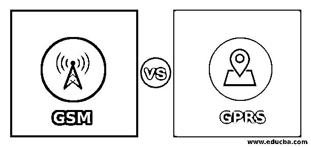
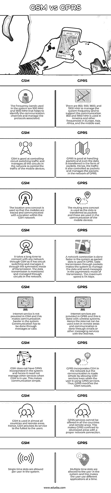

# GSM 与 GPRS

> 原文：<https://www.educba.com/gsm-vs-gprs/>

## **GSM 与 GPRS 的区别**

GSM 与 GPRS 相比，第二代移动网络的所有协议的标准被称为全球移动通信系统或 GSM。它是由 1991 年成立的欧洲电信标准协会开发的。所有的数据都经过 GSM 压缩后发送到有用的信道。作为网络工作以允许数据通过的架构被称为 GPRS 架构。它具有以 171 kbps 的更快速率传输分组数据的设置。多个用户可以进入网络并明智地使用资源。通用分组无线业务从 GPS 开始，提供 2G 或 3G 移动数据业务中的分组业务。

### GSM 与 GPRS 的面对面比较(信息图表)

以下是 GSM 和 GPRS 的 14 大对比:

<small>Hadoop、数据科学、统计学&其他</small>

### GSM 与 GPRS 的主要区别

让我们研究一下 GSM 和 GPRS 之间的一些重要区别:

*   2G 移动服务包括 GSM 下的所有基本服务，在 GSM 下处理数据，并将数据分成两个不同的流，以连接和收集信息。全世界的手机都是通过 GSM 连接的。GPRS 是将互联网数据纳入 GSM，并通过 GSM 的细节进行处理。有了互联网，手机可以通过 GSM 中的 GPRS 相互通信。
*   流量和信令在 GSM 和 GPRS 中有不同的标准。26 帧 MF 和 51 帧 MF 分别用于 GSM 中的业务和信令。一个复帧是一个单元，复帧遍布在 GSM 结构中。而在 GPRS 中，仅使用一个复帧，并且在整个结构中是 52 帧 MF。
*   通过用户设备，用户与网络通信，这有助于了解用户的需求。GSM 用户设备在通信中只有两种状态，它们是空闲和就绪。GPRS 用户设备有三种状态，例如空闲、就绪和待机。这些状态依赖于位置，并帮助网络通过状态跟踪其位置。当位置仅在 RA 级别已知时，状态为待机，当位置在网络和小区级别已知时，状态为就绪。当位置未被使用或未被修改时，则状态为空闲。
*   GSM 中的资源分配是对称的，而 GPRS 中的资源分配是不对称的。因为在 GSM 中，时隙被分配在上行链路和下行链路中，而在 GPRS 中，它仅被分配在下行链路中。从地面到卫星的通信称为上行链路，从卫星到地面的通信称为下行链路。当上行链路和下行链路都参与通信时，就会发生对称通信。
*   考虑到两种网络的通信速率，GPRS 提供的数据费用比 GSM 便宜。GSM 仅允许使用短消息进行通信，而 GPRS 提供即时消息和电子邮件来发送较长的消息并管理服务，因此与其他服务相比费用较低。
*   GPRS 以连续模式提供连接。由于 GPRS 可以在任何有 GSM 的地方使用，它提供了到 GPRS 和 GSM 的连接。但是 GSM 只在有 GSM 网络的时候才提供连接。GPRS 是 GSM 的升级，可以用于 GSM 及其应用的所有应用。

### GSM 与 GPRS 对比表

下面是对比表:

| **GSM** | **GPRS** |
| 系统中使用的频段为 900 MHz 和 1800 MHz，有助于识别通信信道和管理相关协议。 | 有 850、900、1800 和 1900 MHz 来管理系统频率和支持通信。850 和 1900 MHz 用于美国，其他频率用于欧洲、亚洲、非洲和中东。 |
| GSM 擅长控制电路交换流量，并管理网络中的所有电路来控制移动设备的流量。 | GPRS 擅长处理数据包，甚至数据也是以数据包的形式传输。因此，在 GPRS 网络中，业务也被控制为分组并管理分组。 |
| 使用位置区域的概念，使得移动台被跟踪并与 GSM 网络内的位置通信。 | 当数据作为分组传输时，使用路由区域概念，并且这些分组用于移动设备的通信中。 |
| 通过 GSM 与任何网络连接都需要很长时间，因为它有电路交换，并通过对称传输模式进行管理。数据传输通过网络中的电路进行监控和管理。 | 由于在 GPRS 中使用分组数据，网络连接在系统中完成得更快。通过数据包传输数据使得系统以非对称的传输方式管理数据和发送消息。最大速度为 114 kbps。 |
| GSM 不提供互联网服务，这使得系统中的通信更加困难。交流必须通过信息或电话进行。 | 互联网服务是在 GPRS 中提供的，这是通过无线系统完成的。因此，即使在偏远地区也可以使用互联网，通过电子邮件或其他互联网消息服务进行通信。 |
| GSM 系统中不包含 GPRS，因此当使用 GSM 时，它不需要管理其他服务。这使得交流变得简单。 | GPRS 在网络中结合了 GSM，但是通过允许 GSM 服务，即使用户正在使用 GPRS 服务，通信也变得简单。因此，GPRS 改变了 GSM 网络。 |
| 几乎所有国家和偏远地区都使用 GSM。因此，GSM 向用户提供最充分的服务。 | GPRS 服务不能在所有国家和偏远地区提供。这使得 GPRS 局限于具有适当网络连接的发达地区。 |
| 系统中每个用户允许单个时隙。 | 系统中允许用户使用多个时隙，这使得用户可以同时使用不同的应用。 |

### 结论

GSM 和 GPRS 用于许多新技术，包括物联网和人工智能，以便日常使用它们的人能够很好地管理和理解通信和交通控制。此外，新技术结合了充分发挥其潜力的方法。

### 推荐文章

这是 GSM 与 GPRS 的对比指南。这里我们讨论 GSM 和 GPRS 的区别，a；png 的主要区别，以及最重要的比较。您也可以浏览我们的其他相关文章，了解更多信息——

1.  [物联网技术](https://www.educba.com/iot-technology/)
2.  [物联网协议](https://www.educba.com/iot-protocols/)
3.  [什么是数据处理？](https://www.educba.com/what-is-data-processing/)
4.  [物联网通信协议](https://www.educba.com/iot-communication-protocol/)

