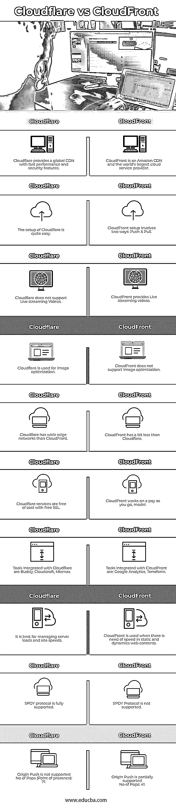

# Cloudflare vs CloudFront

> 原文：<https://www.educba.com/cloudflare-vs-cloudfront/>

## Cloudflare 与 CloudFront 的区别

作为世界上最大的网络之一，Cloudflare 提供的服务增加了网站和应用程序的安全性和性能问题。在早期，当使用互联网并试图访问网站或 web 信息时，最初是从系统向服务器发送请求，这将根据需要反映期望的输出。但是有时会出现系统崩溃的情况，或者当大量请求同时到达托管数据的服务器时，系统变得没有响应。为了克服这些困难并使他们的网站、应用程序安全可靠，使用了 Cloudflare 服务。Cloudflare 通过保护互联网财产免受恶意攻击、恶意僵尸程序等来提供安全性。

然而，Cloud Front 是一个内容交付网络(CDN ),它提供了一个全球分布式代理服务器网络，这些代理服务器缓存内容，从而提高了下载内容的速度性能。Cloud Front 采用“按使用量付费”的模式。

<small>Hadoop、数据科学、统计学&其他</small>

### Cloudflare 与 CloudFront 的直接对比(信息图)

以下是 Cloudflare 与 CloudFront 之间的 10 大差异:

### Cloudflare 与 CloudFront 的主要区别

以下是 Cloudflare 与 CloudFront 的主要区别:

#### 云耀斑

Cloudflare 的工作原理是一种反向代理的现象，我们用 Cloudflare 建立了一个站点；它为 Cloudflare 提供名称服务器。这使得 Cloudflare 能够控制您的站点，并将所有流量导向您的站点。除了 CDN 之外，Cloudflare 还提供了许多其他功能。

当任何人访问您的网站时，Cloudflare 将获取静态内容并将数据存储在世界各地的各种 Cloudflare 网络上，以便可以从他们想要的位置访问这些数据。

Cloudflare 的设置包括以下步骤:

*   注册 Cloudflare 帐户。
*   启动添加站点向导。
*   更改您的域名服务器(由于反向代理方法
*   完成后，我们可以从控制面板访问和管理 Cloudflare 设置。

Cloudflare 提供其他服务，如:

*   免费的 SSL 证书(但它的共享版本)
*   DDoS 保护
*   Web 应用防火墙
*   图像优化
*   移动优化

#### 云锋

CloudFront 是一种 CDN，它通过称为边缘位置的网络来交付数据，从而在用户提前请求数据时实现快速数据访问、低延迟和低网络流量。

在这里，我们不需要像 Cloudflare 那样更改名称服务器。云锋有一个推拉的方法。CloudFront 会自动将您的数据从原始位置提取出来，放在全球各种服务器网络上。Cloudflare 和 CloudFront 的主要区别如下:

就像 Cloudflare 控制名称服务器一样，CloudFront 不会这样做，因为它不能自动为任何站点提供来自任何边缘位置的内容。这就是单独的 URL 作为 cdn.yoursite.com(最近的 CloudFront Edge 服务器)发挥作用的地方，其中 yoursite.com 被称为 Cloudflare。

WordPress 上 CloudFront 和 Cloudflare 的偏好:

*   Cloudflare 的设置过程比 CloudFront 简单得多。
*   Cloudflare 的边缘网络比 CloudFront 稍大。
*   WordPress Rocket 提供了专门的 Cloudflare 集成。

CloudFront 提供了一些 WordPress 不太需要的特性，比如:

*   它提供对 HTTP 头和缓存失效的控制。
*   CloudFront 使用直播。

### Cloudflare 与 CloudFront 对比表

让我们讨论一下 Cloudflare 与 CloudFront 之间的主要比较:

| **Cloudflare** | **云锋** |
| Cloudflare 提供了具有快速性能和安全功能的全球 CDN。 | CloudFront 是亚马逊 CDN，也是全球最大的云服务提供商。 |
| Cloudflare 的设置非常简单。 | CloudFront 设置包括两种方式:推和拉 |
| Cloudflare 不支持实时流媒体视频 | CloudFront 提供实时流媒体视频 |
| Cloudflare 用于图像优化 | CloudFront 不支持图像优化。 |
| Cloudflare 拥有比 CloudFront 更宽的边缘网络。 | CloudFront 比 Cloudflare 少一点。 |
| 通过免费 SSL，Cloudflare 服务是免费的 | CloudFront 致力于一种随用随付的模式， |
| 与 Cloudflare 集成的工具有 Buddy、Cloudcraft、Mixmax。 | 与 CloudFront 集成的工具有:Google Analytics、Terraform |
| 它最适合管理服务器负载和站点速度。 | 当静态和动态 web 内容需要速度时，使用 CloudFront |
| 完全支持 SPDY 协议 | 不支持 SPDY 协议 |
| Origin Push is not supported

持久性有机污染物数量(存在点):71

 | Origin Push is partially supported持久性有机污染物数量:41 |

除了以上这些比较，Cloudflare 的界面比 CloudFront 好得多。Cloudflare 提供 24/7 全天候电话和电子邮件支持，而 CloudFront 提供同样的支持，但包括额外费用。Cloudflare 并不是一个真正的 CDN，而是一个反向代理，它接收整体流量，而 CloudFront 是一个适用于静态和动态内容的高级 CDN。Cloudflare 主要由 FounderLY、Stack Overflow 和 Code Guard 使用。CloudFront 没有公布网络容量，因为它相当大，而 Cloudflare 的网络容量为 15Tbps。

### 结论

Cloudflare 和 CloudFront 提供 CDN 服务，可以加快您的网站页面 web 负载的性能，并减少服务器上的负载。大多数 WordPress 用户使用具有简单设置过程的 Cloudflare，而 CloudFront 没有。两者相比，Cloudflare 在提供服务和安全性方面提供了比 CloudFront 更好的选择。

CloudFront 作为一种更快的内容交付服务，为最终用户提供了内容的可靠性和可用性，而 Cloudflare 则一直处于其发布的高峰期，提供不安全互联网协议的安全版本，并通过安全 HTTPS 服务(通用 SSL)免费提供这些版本。因此，Cloudflare 为所有最终用户提供了一个可靠、快速且安全的互联网。因此，CloudFront 和 Cloudflare 都适合用户，并且可以根据他们的需要和要求进行应用。所以 Cloudflare 比 CloudFront 灵活可靠得多。

### 推荐文章

这是 Cloudflare vs CloudFront 的指南。在这里，我们还将通过信息图和比较表来讨论 Cloudflare 与 CloudFront 的主要区别。您也可以看看以下文章，了解更多信息–

1.  [Cloudflare 替代品](https://www.educba.com/cloudflare-alternatives/)
2.  [Terraform vs Ansible](https://www.educba.com/terraform-vs-ansible/)
3.  [jQuery innerHeight()](https://www.educba.com/jquery-innerheight/)
4.  [GitLab vs GitHub](https://www.educba.com/gitlab-vs-github/)

