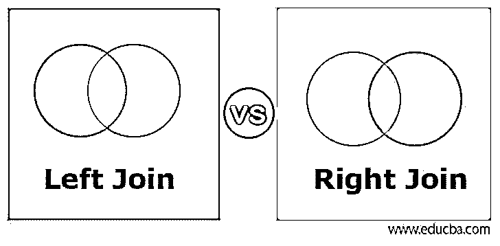
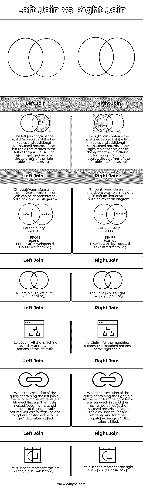
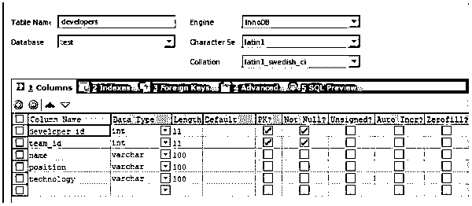
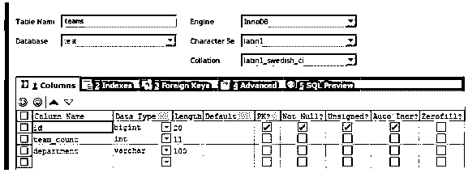
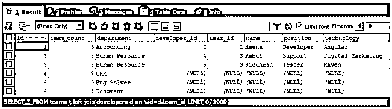
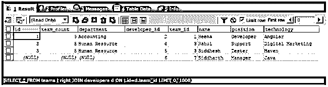
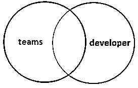
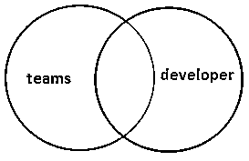

# 左连接与右连接

> 原文：<https://www.educba.com/left-join-vs-right-join/>

## 左连接和右连接的区别

在本文中，我们将了解左外部连接和右外部连接之间的主要区别。任何连接都有两种类型，即内部连接和外部连接。当我们只说左连接时，我们指的是左外连接，当指定为右连接时，它代表右外连接。当我们必须使用内部连接时，我们需要在左连接和右连接的情况下明确地提到它，比如左内部连接和右内部连接。简单地提到左连接和右连接，我们实际上指的是左外连接和右外连接。

### 左连接和右连接的比较(信息图)

以下是左连接和右连接的主要区别

<small>Hadoop、数据科学、统计学&其他</small>

### 左连接和右连接的主要区别

以下是左连接和右连接各自的主要区别:

当我们认为外部连接只是左连接和右连接时，关键的区别在于不匹配的记录被添加到匹配的记录中以准备最终的结果。在左连接的情况下，结果集中考虑左表中所有匹配的记录和不匹配的记录。

这里的左表是指 from 子句中使用的表，即位于 join 子句左侧的表，而右表是位于 SQL 查询中 join 子句右侧的表。右连接将考虑连接中两个表的所有匹配记录，以及最终结果集中右表的其他不匹配记录。

下面的维恩图说明了左右连接如何形成结果集

**示例—**

让我们考虑一个例子

我们有两个名为团队和开发人员的表格，结构如下

面向开发人员的表格–

对于团队表–

这两个表之间的关系是“developers”表的 team_id 与“teams”表的 id 列相同。除此之外，开发人员的表将 developer_id 作为开发人员表的主键列，以及其他必需的列，如名称、职位和技术。团队的表将列 id 作为主键，这有助于唯一地标识团队记录和其他细节，如 team_count 和 department。

我们在两个表中都插入了一些记录。让我们取回并看看里面的东西。

面向开发人员的表格–

`select * from developers;`

对于团队表–

`select * from teams;`

请注意，两个表中有一些记录没有匹配的记录。例如，开发人员的表中包含一个名为西达尔特、团队 id 为 7 的记录，但在团队的表中没有 id 为 7 的记录。类似地，团队的表具有部门 CRM、Bug Solver 和 id 分别为 4、5 和 6 的文档的记录，这些记录在表 developers 中没有任何匹配的记录。

现在，让我们以下面的方式对表团队和开发人员执行左连接

`SELECT * FROM teams t LEFT JOIN developers d ON t.id=d.team_id;`

这给出了以下输出–

请注意，将检索 teams 和 developers 表的所有匹配记录，同时，由于连接是左连接，并且 teams 表位于连接的左侧，因此还将检索左表 teams 的所有不匹配记录，在这种情况下，右表的列将填充为 NULL。

现在，让我们以下面的方式对表团队和开发人员执行正确的连接

`SELECT * FROM teams t RIGHT JOIN developers d ON t.id=d.team_id;`

这给出了以下输出–

在右连接的情况下，检索 teams 和 developers 表的所有匹配记录，并且还检索来自右表(即位于连接右侧的表，在我们的情况下是 developers)的不匹配记录。在我们的示例中，在右连接查询中检索来自西达尔特名的开发人员记录的不匹配记录，左表中的列填充为 null。

### 左连接与右连接的比较表

为了便于理解，让我们通过一个比较表来看看左连接和右连接之间的更多区别:

| **左连接** | **右连接** |
| 左连接包含两个表的匹配记录和位于连接子句左侧的左表的其他不匹配记录。对于此未匹配的记录，右表的列被填充为空。 | 右连接包含两个表的匹配记录和位于连接子句右侧的右表的其他不匹配记录。对于此未匹配的记录，左表中的列填写为空。 |
| Through Venn diagram of the above example, the left join can be demonstrated with below Venn diagram –

对于查询–`SELECT
*
FROM
teams t
LEFT JOIN developers d
ON t.id = d.team_id ;` | Through Venn diagram of the above example, the right join can be demonstrated with below Venn diagram –

对于查询–`SELECT
*
FROM
teams t
RIGHT JOIN developers d
ON t.id = d.team_id ;` |
| 左连接是 ANSI SQL 中的左外部连接。 | 右连接是 ANSI SQL 中的右外部连接。 |
| 左连接=左表所有匹配记录+未匹配记录 | 左连接=右表所有匹配记录+未匹配记录 |
| 在执行包含左连接的查询时，首先检索左表的所有记录，然后使用嵌套循环检索右表列值的匹配记录，对于其他不匹配的记录，填充空值。 | 当执行包含右连接的查询时，首先检索右表的所有记录，然后使用嵌套循环检索左表列值的匹配记录，对于其他不匹配的记录，填充空值。 |
| *=用于表示 Transact-SQL 中的左外部联接。 | =*用于表示 Transact-SQL 中的右外部联接。 |

### 结论

左外连接和右外连接之间最大的区别在于，除了匹配的记录之外，还获得了不匹配的记录。左连接获取左表的所有匹配记录和不匹配记录，而右连接获取右表的所有匹配记录和不匹配记录。

### 推荐文章

这是左连接和右连接的指南。这里我们用信息图和比较表来讨论左连接和右连接的关键区别。您也可以看看以下文章，了解更多信息–

1.  [内部连接与外部连接](https://www.educba.com/inner-join-vs-outer-join/)
2.  [卡珊德拉 vs Couchbase](https://www.educba.com/cassandra-vs-couchbase/)
3.  [吉拉 vs ServiceNow](https://www.educba.com/jira-vs-servicenow/)
4.  背对背

