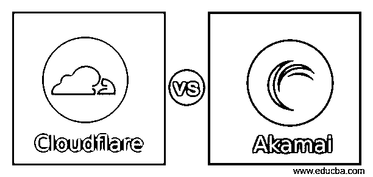
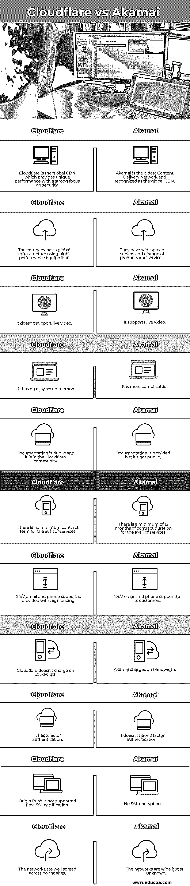

# 云辉 vs 阿卡迈

> 原文：<https://www.educba.com/cloudflare-vs-akamai/>

## Cloudflare 与 Akamai 的区别

Cloudflare 支持 web 和安全，提供内容交付网络、DDoS、互联网安全和域名服务器服务等服务。Cloudflare 的历史始于 2009 年，当时它是由 Matthew Prince、Lee Holloway 和 Michelle Zatlyn 创建的，后来在 2010 年的 Tech Crunch Disrupt 大会上推出。它在 2011 年引起注意，当时它为网站提供安全服务。

在 2012 年， [Cloudflare](https://www.educba.com/what-is-cloudflare/) 与几家 web 主机合作来提高性能。2014 年，它两次缓解了 [DDoS 攻击](https://www.educba.com/what-is-ddos-attack/)，峰值分别为 400 千兆位/秒、500 千兆位/秒。Cloudflare 作为最受欢迎的反向代理服务，为超过 1300 万个网站提供 DNS 服务。Cloudflare 提供多种服务，如 DDoS 保护、Web 应用防火墙、DNS 等。

<small>Hadoop、数据科学、统计学&其他</small>

另一方面，Akamai 是一家 CDN、网络安全和云服务提供商，总部位于美国剑桥。它是世界上最大的内容交付网络，提供大约 15 %到 30 %的网络流量。Akamai 于 1998 年进入市场，但后来在 2001 年被纳入罗素 2000，3000 指数时获得认可。截至 2019 年 12 月，Akamai 目前在百老汇设有基地。

Akamai 拥有多项技术，如 Akamai 智能平台、内容交付服务、对等网络、互联网状态、互联网可视化等。

### Cloudflare 与 Akamai 之间的直接比较(信息图)

以下是 Cloudflare 与 Akamai 之间的 11 大区别:

### Cloudflare 与 Akamai 的主要区别

Akamai 和 Cloudflare 都被归类为内容交付网络工具。Cloudflare 通过保护数百万连接到网络的网站、API 和 SaaS 来提高性能。Akamai 是移动、云、媒体和安全领域的领先供应商之一。偏爱 Cloudflare 的公司有 Udemy 数字海洋等，而 Akamai 则是 Linked In(一个专业的网络站点)的首选。有几种 Cloudflare 和 Akamai 的替代产品，如 CloudFront、Cloud CDN、Fastly 等。

Cloudflare 和 Akamai 的优缺点比较:

#### 云耀斑

*   Cloudflare 附带了一个免费的计划包，并在更高的附加计划上提供 DDoS 保护安全性。这是一个由潜在用户提供的包。
*   它有一个简单的设置安装过程与易于处理的界面。
*   Cloudflare 可以很好地处理静态和动态内容。
*   它具有广泛的应用程序支持选择的功能，允许用户通过 Cloudflare 而不是他们的网站安装应用程序。
*   它非常安全，并提供免费的 SSL 证书和 SSL 加密。
*   它适用于不同的内容交付网络。
*   它有自动 IPv6 和页面规则更强大。
*   它也提供了一个官方的 WordPress 插件，提供了简单的定制。

##### Cloudflare Demerits

*   匿名用户在使用 Cloudflare 访问每个站点时，总是需要输入验证码。有时这会导致不必要的障碍。
*   Cloudflare 主要依靠验证码屏幕来验证用户，这反过来会给潜在的合法用户带来问题。
*   使用“Https”与使用 Cloudflare 的不同站点进行的安全通信在其服务器中被拦截，并使用 Cloudflare 证书(SSL)进行加密和解密。
*   缺少缓存控制& cloud flare 的第 7 层必须由用户手动控制。

#### 阿卡迈

*   Akamai 在网络中有大量存在，负责处理批量攻击；
*   Akamai 有可定制的规则，其中 site defender 可定制为定期更新正在发生的事情和关于保护的视图。
*   Akamai 为 DDoS 吸收提供了每秒 2.3 太字节的专用带宽。
*   Akamai 提供了根据请求速率结果控制流量段速率的工具。
*   它规定了突发费用的上限，也就是说，如果一个突然的未知攻击损坏了大量带宽，那么带宽成本是有上限的。
*   Akamai 提供了一个 WAF (web 应用防火墙)来防止应用层攻击。
*   Akamai 拥有广泛的经销商计划，可以销售其服务。

##### Akamai 缺点

*   Akamai 非常昂贵，因为它的服务成本几乎是其他安全相关 CDN 服务的 3 倍。
*   由于其庞大的 CDN 网络结构，安全传播需要一些时间。

### Cloudflare 与 Akamai 对比表

让我们讨论一下 Cloudflare 与 Akamai 之间的主要比较:

| **Cloudflare** | **阿卡迈** |
| Cloudflare 是全球 CDN，它提供独特的性能，并高度关注安全性。 | Akamai 是历史最悠久的内容交付网络，被公认为全球 CDN。 |
| 该公司拥有使用高性能设备的全球基础设施。 | 他们有广泛的服务器和一系列产品和服务。 |
| 不支持视频直播。 | 它支持视频直播。 |
| 它有一个简单的设置方法。 | 它更复杂。 |
| 文档是公开的，位于 Cloudflare 社区中。 | 提供了文档，但不是公开的。 |
| 对于服务的有效性，没有最短的合同期限。 | 服务的合同期限至少为 12 个月。 |
| 以高价提供 24/7 全天候电子邮件和电话支持。 | 为客户提供 24/7 的电子邮件和电话支持。 |
| Cloudflare 不按带宽收费。 | Akamai 对带宽收费。 |
| 它具有双因素认证。 | 它没有双因素身份认证。 |
| 免费 SSL 认证。 | 没有 SSL 加密。 |
| 这些网络分布在世界各地。 | 网络很广，但仍不为人知。 |

### 结论

Cloudflare 和 Akamai 都是最好的 CDN 证明服务。Cloudflare 是网络安全和性能解决方案的组合，可提高网站的性能和网络速度，此外，它还提供具有负载平衡和 web 优化的安全 DNS。以 Akamai 为例，作为一个全球 CDN，它提供了一个高度安全的网络和移动体验。这里的定价模型具有足够的可伸缩性，因为它支持随用随付。与 Cloudflare 相比，Akamai 有许多优势，但这是通过付费服务实现的，与 Cloudflare 免费服务相比，付费服务非常昂贵。无论 akamai 自动为每个最终用户提供最佳图像。在为产品提供帮助和建议方面，Cloudflare 反应非常迅速。这两种 CDN 都很全面，设置过程简单，用户可以完全控制。

### 推荐文章

这是 Cloudflare vs Akamai 的攻略。在这里，我们还将通过信息图和比较表来讨论 Cloudflare 与 Akamai 的主要区别。您也可以看看以下文章，了解更多信息–

1.  [Cloudflare 替代品](https://www.educba.com/cloudflare-alternatives/)
2.  [包装引导程序](https://www.educba.com/wrap-bootstrap/)
3.  [自举余量](https://www.educba.com/bootstrap-margin/)
4.  [Terraform vs Ansible](https://www.educba.com/terraform-vs-ansible/)

