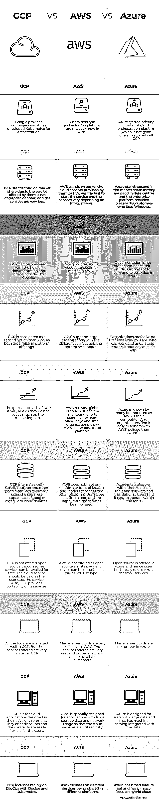

# GCP vs AWS vs Azure

> 原文：<https://www.educba.com/gcp-vs-aws-vs-azure/>

## GCP vs AWS vs Azure 的区别

谷歌提供的云计算服务组合使用与谷歌相同的基础设施，被称为谷歌云平台或 GCP。个人和企业都被提供了一个构建和测试软件的平台，互联网被用来将软件与用户连接起来。亚马逊在按使用付费的基础上提供的按需云计算平台被称为亚马逊网络服务或 AWS。微软的云计算服务被称为 Microsoft Azure，用于通过数据中心构建、测试、部署和管理应用程序。数据中心应该由微软管理。这篇文章一定会帮你找到 GCP 和 AWS 和 Azure 的区别

### GCP 与 AWS 和 Azure 的面对面比较(信息图)

以下是 GCP 与 AWS 和 Azure 的 10 大区别:

<small>Hadoop、数据科学、统计学&其他</small>

### GCP 与 AWS 和 Azure 的主要区别

以下是 GCP 与 AWS 和 Azure 的主要区别:

*   GCP 相对较新，没有强大的企业基础。AWS 有企业级支持，而 Azure 的企业级支持与其他相比是很棒的。
*   GCP 不与数据中心连接，因此互操作性不是这里的一个选项。AWS 更关注公共云，并不认为数据中心互操作性是他们的主要关注点。Azure 致力于数据中心的互操作性，并且非常了解数据中心。它主要在混合云上工作。
*   AWS 主要做公有云，Azure 做混合云，GCP 做公有云。
*   AWS 和 Azure 有各种各样的服务，而 GCP 提供的服务与其他公司相比非常少。GCP 在市场上相对较新，在用户看来是第三大云提供商。
*   AWS 成本结构很难理解，而且价格会根据所使用的服务而变化。因此，企业发现很难在 AWS 中管理云成本。GCP 和 Azure 的成本结构很容易理解并在组织中使用。
*   使用 Azure 时，很容易与使用中的平台链接，因为许多人都熟悉 Windows。作为忠实的消费者，企业倾向于采用 Azure 云平台。此外，微软向企业客户提供许多折扣。这种优势在 AWS 和 GCP 是不存在的。现在，用户倾向于权衡这两者之间的成本和提供的服务，并从中选择一个。
*   平台和文档在微软面临问题，这导致了用户的抱怨。虽然微软是一个平台供应商，但 Azure 平台的问题是需要提前考虑的。AWS 在这种情况下提供了一个更好的平台。GCP 为其云平台中提供的所有服务提供文档。

### GCP vs AWS vs Azure 对比表

我们来讨论一下 GCP vs AWS vs Azure 的顶级对比:

| **GCP** | **AWS** | **蔚蓝色** |
| Google 提供了容器，并开发了用于编排的 Kubernetes。 | 容器和编排平台在 AWS 中相对较新。 | Azure 开始提供容器和编排平台，这与 GCP 相比并不算好。 |
| GCP 在市场份额上排名第三，因为他们提供的服务不是面向企业的，而且服务非常少。 | AWS 站在他们提供的云服务的顶端，因为他们是第一个启动服务的，服务因客户而异。 | Azure 在市场份额中排名第二，因为他们擅长数据中心，提供的企业平台让使用 Windows 的客户感到满意。 |
| 借助谷歌提供的文档和视频，你可以掌握 GCP。 | 要成为 AWS 的大师，需要非常好的训练。 | 文档是不恰当的，因此自学对于学习和熟练 Azure 是很重要的。 |
| GCP 被认为是 AWS 之外的第二选择，因为两者的平台产品相似。 | AWS 通过不同的服务和企业支持来支持大型组织。 | 组织更喜欢使用 Windows 的 Azure，并且可以在没有任何外部帮助的情况下工作和理解 Azure。 |
| GCP 的全球拓展很少，因为他们不太注重营销部分。 | 由于团队的营销努力，AWS 在全球范围内拥有广泛的影响力。许多大大小小的组织都知道 AWS 是最好的云平台。 | 很多人都知道 Azure，但由于 AWS 是它的竞争对手，所以没有人使用它。组织发现遵守 AWS 的政策比 Azure 的政策更容易。 |
| GCP 集成了 Gmail、YouTube 和其他谷歌服务，为用户提供谷歌和云服务的无缝体验。 | AWS 没有自己的任何平台或工具，从其他平台提供服务。用户并不觉得这很难，并对所提供的服务感到满意。 | Azure 与其他微软工具和软件以及平台集成得很好。用户发现在工具内操作很容易。 |
| GCP 没有开放源代码，尽管有些服务是免费的。云服务应该随着用户使用服务而付费。此外，GCP 提供其服务的可移植性。 | AWS 并不是开源的，它的付费服务可以被描述为按使用量付费。 | Azure 提供开源，因此用户可以很容易地使用 Azure 提供小型服务。 |
| 所有的工具在 GCP 都管理得很好。但是在 GCP 提供的服务非常有限。 | 管理工具在 AWS 中非常有效。提供的服务非常广泛，非常适合所有客户的使用。 | 管理工具在 Azure 中不合适。 |
| GCP 适用于在本地环境中设计的云应用程序。他们提供折扣，合同对用户来说也很灵活。 | AWS 是专门为具有大量存储数据和网络使用的应用程序设计的，以便充分利用云服务。 | Azure 是为拥有大量数据的用户设计的，并且具有与数据集成的机器学习。 |
| GCP 与 Docker 和 Kubernetes 主要关注 DevOps。 | AWS 专注于在不同平台上提供的不同服务。 | Azure 拥有广泛的功能集，主要关注混合云。 |

云服务提供各种计算服务。所有的云平台都有其优缺点。因此，了解业务并关注需求非常重要，这样才能在产品中选择具有适当功能和成本削减的相关云。

### 推荐文章

这是 GCP vs AWS vs Azure 区别的指南。在这里，我们还讨论了 GCP 与 AWS 和 Azure 的主要区别，并提供了信息图表和对比表格。您也可以看看以下文章，了解更多信息–

1.  [AWS vs Azure vs Google Cloud](https://www.educba.com/aws-vs-azure-vs-google-cloud/)
2.  [AWS vs AZURE](https://www.educba.com/aws-vs-azure/)
3.  [MariaDB vs MongoDB](https://www.educba.com/mariadb-vs-mongodb/)
4.  [Saltstack vs Ansible](https://www.educba.com/saltstack-vs-ansible/)

