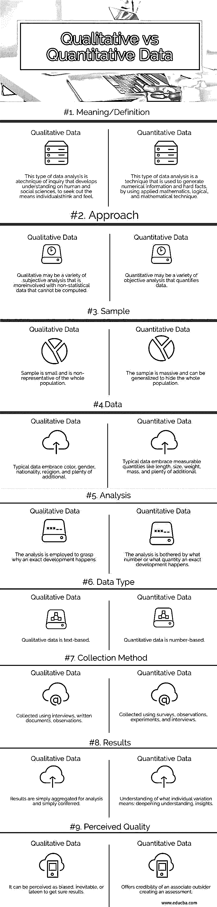

# 定性与定量数据

> 原文：<https://www.educba.com/qualitative-vs-quantitative-data/>

## 定性数据与定量数据之间的差异

任何研究项目中的分析都包括总结已经收集的大量信息，并以传达最重要的必要发现或选项的方式呈现最终结果。例如，如果 vesture complete 正试图发现年轻女孩中的最新趋势，则 complete 可以首先联系年轻女孩并提出她们与分析目标相关的疑问。一旦收集到这些信息，vesture 就可以分析这些数据来发现模式——例如，它应该会发现几乎所有年轻女孩都真的喜欢检查其他种类的牛仔裤。有许多可供选择的数据分析方法，但最常用的两种是定性和定量分析。

### 定性与定量数据的直接比较(信息图表)

以下是定性数据与定量数据之间的 8 大差异:

<small>Hadoop、数据科学、统计学&其他</small>

### 定性数据与定量数据的主要区别

一种数据是客观的、中肯的、结论性的。另一种数据是主观的，解释性的，很容易解释。定量数据可以用数字来计数、测量和表达。定性数据是描述性的和抽象的，可以根据特征和特性进行分类。定性和定量数据之间的主要差异如下所述:

*   基于属性(质量)对对象进行分类的数据类型称为定性数据。可以用数字和数值来计算和表达的信息类型称为定量数据。
*   定量数据依赖于数字。使用简单的算术或额外的高级应用数学分析来获得信息中的共性或模式。结果通常显示在图表中。像 Excel、SPSS 或 R 这样的应用程序可以用来计算平均分、给出特定答案的次数范围、两个或更多变量之间的相关性、可靠性以及结果的有效性。
*   在定性数据的情况下，调查的方法是主观的和整体的，而定量信息有一个相关的客观和有针对性的方法。
*   定性数据决定理解的深度，而定量数据确定流行程度。
*   在定性数据中，样本量很小，并且是从非代表性样本中抽取的。相反，从代表性样本中提取的定量数据的样本量是巨大的。
*   定性数据形成初步理解，即它定义了问题。与推荐最终行动方案的定量数据相反。
*   在定性方面，收集口头数据。相反，在定量类型中，收集可测量的数据。
*   进行定性分析和数据分析的目的是探索和发现连续过程中使用的概念。作为敌对的定量分析数据，目的是看变量之间的因果关系。
*   在定性研究的分析中使用的元素是文字、图片和物体，而定量分析是数字信息。
*   最后，定性数据形成最初的理解，而定量数据建议最终的行动方案。

### 定性与定量数据

| **标准** | **定性数据** | **定量数据** |
| **含义/定义** | 这种类型的数据分析是一种探究技术，它发展了对人类和社会科学的理解，以寻求个人思考和感受的方式。 | 这种类型的数据分析是一种技术，通过使用应用数学、逻辑和数学技术来生成数字信息和确凿的事实。 |
| **接近** | 定性分析可能是各种主观分析，更多地涉及无法计算的非统计数据。 | 定量可能是对数据进行量化的各种客观分析。 |
| **样品** | 样本很小，不能代表全部人口 | 样本是巨大的，可以推广到隐藏整个人口。 |
| **数据** | 典型的数据包括肤色、性别、国籍、宗教和大量其他信息。 | 典型的数据包含可测量的量，如长度、尺寸、重量、质量和大量其他数据。 |
| **分析** | 这种分析被用来理解为什么一个确切的发展会发生。 | 分析被一个确切的发展发生的数字或数量所困扰。 |
| **数据类型** | 定性数据是基于文本的。 | 定量数据是基于数字的。 |
| **收集方式** | 通过访谈、书面文件、观察收集。 | 通过调查、观察、实验和采访收集。 |
| **结果** | 结果被简单地汇总用于分析，并简单地交换。 | 理解个体差异的含义；加深理解，见识。 |
| **感知质量** | 它可以被认为是有偏见的，不可避免的，或迟到的，以获得确定的结果。 | 提供创建评估的外部人员的可信度。 |

### 定性与定量数据对比表

让我们讨论一下定性数据与定量数据之间的主要比较:

| **目的** | **定性数据** | **定量数据** |
| **假设** | 试验性的，不断发展的，支持特定的研究。 | 具体的，可测试的，明确的。 |
| **采样** | 有目的的:有意挑选出“小的”，而不是本质上有代表性的样本，以便引起深入的理解。 | 随机:意在挑选出“大的”、有代表性的样本，以便将结果推广到总体。 |
| **研究设置** | 不需要控制设置。 | 控制到度电位。 |
| **查询方法** | 主观的、整体的、面向过程的 | 客观、专注、以结果为导向。 |
| **数据解释** | 结论是试验性的(可以改变)，在持续的基础上进行审查，结论是概括的。干扰/概括的有效性是读者的责任。 | 研究结束时形成的结论和概括以预先确定的确定程度陈述。干扰/归纳是研究者的责任。 |
| **设计和方法** | 灵活，仅在研究前用一般术语说明，不干预，最小干扰，所有描述性的-历史，传记，人种学，现象学，扎根理论，案例研究。考虑许多变量，小团体。 | 结构化、不灵活、在研究干预、操作和控制之前详细说明、描述性相关、随机比较、实验性。考虑几个变量，大组。 |
| **测量** | 非标准化，叙述性(书面文字)，持续进行 | 标准化、数值化(测量值、数字)，在末尾。 |
| **统计分析** | 与定量数据相比，定性数据中的统计分析有点难以实现。 | 定量数据的统计分析比定性数据更容易实现。 |

定性数据和定量数据的主要区别在于，定性数据是描述性的，而定量数据是数值性的。通常，用定量数据进行统计分析比用定性数据更容易。统计学、社会科学、计算是使用这类数据的一些学科。你必须考虑到在定量工具中有定性的阴影，但是不要和定性的混淆，确切的原因已经说明了。

### 推荐文章

这是定性数据和定量数据之间最大差异的指南。在这里，我们还将讨论信息图和比较表的主要区别。您也可以看看以下文章，了解更多信息–

1.  连贯与衔接
2.  [什么是定性数据分析](https://www.educba.com/what-is-qualitative-data-analysis/)
3.  [基本面分析 vs 技术面分析](https://www.educba.com/fundamental-analysis-vs-technical-analysis/)
4.  [CFA vs CAIA](https://www.educba.com/cfa-vs-caia/)

