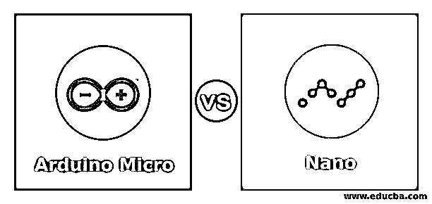
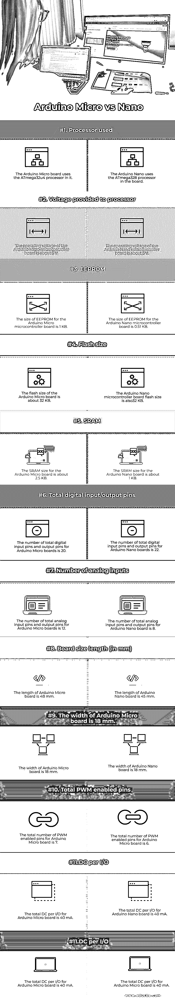

# Arduino Micro vs Nano

> 原文：<https://www.educba.com/arduino-micro-vs-nano/>

## Arduino Micro 与 Nano 的区别

以下文章提供了 Arduino Micro 与 Nano 的概要。Arduino micro 是 Arduino 产品的一种，也是这一类别中最小的产品。Arduino micro 包含内置 USB 功能，有助于与其他接口集成，并有助于保持与计算机系统的正确连接。它采用了 ATmega32U4 微控制器。Arduino Nano 也是一种微控制器板，内置 Atmega328 微控制器。该板与不同类型的应用兼容。电源通过 USB 端口或连接到 GND 提供，因为主板上没有 DC 插孔。

### Arduino Micro 与 Nano 的面对面比较(信息图)

以下是 Arduino Micro 和 Nano 之间的 12 大区别:

<small>Hadoop、数据科学、统计学&其他</small>

### Arduino Micro 与 Nano 的主要区别

让我们讨论一下 Arduino Micro 和 Nano 之间的一些主要区别:

*   Arduino Nano 板支持板载 USB 连接器和串行芯片，而另一方面，Arduino Micro 板可以轻松地放置在试验板上，并可以轻松使用。
*   Arduino 微板有 20 个数字 I/O 引脚，其中 12 个用作模拟输入，7 个用作 PWM 输出，而另一方面，Arduino Nano 板有 14 个数字 I/O 引脚，其中 8 个用作模拟输入，6 个用作 PWM 输出。
*   Arduino 微型板配备了电源插孔，可以轻松地为板充电。但是在 Arduino Nano 板中，板没有任何电源插孔，USB 插孔用于向板供电。
*   Arduino 微板使用 AVR109 协议进行通信。而另一方面，Arduino Nano 板使用 STK500 协议进行通信。
*   由于 Arduino Nano 板的尺寸较小，因此在考虑板的尺寸并认为其很重要的项目中，它是首选。项目的要求是减轻重量，在这种情况下，Arduino Nano 被认为是尺寸和重量方面的最佳选择。
*   Arduino 微型板通过 DC 插孔供电，与其他 Arduino 板相比，该板的功耗非常低。Arduino Nano 板采用无插孔设计，使用迷你 USB 端口获取电源。
*   与 Arduino Nano 板相比，Arduino 微板微控制器要好得多。Arduino 微板中使用的微控制器 ATMega32u4 比 Arduino 纳米板中使用的 ATMega328 微控制器具有更好的性能结果。
*   与 Arduino Nano 板相比，Arduino 微板的价格更低。这主要是因为 Arduino Nano 板使用的 RAM 的大小更多，增加了板的成本。
*   因为两种板都有 24 MHz 时钟周期，但 Arduino Nano 板的时钟周期可以增加到 20 MHz，以获得更好的性能结果。

### Arduino Micro 与 Nano 对比表

我们来讨论一下 Arduino Micro 与 Nano 的顶级对比:

| **因子** | **Arduino Micro** | **纳米** |
| **使用的处理器** | Arduino 微板使用 ATmega32u4 处理器。 | Arduino Nano 在主板中使用 ATmega328 处理器。 |
| **提供给处理器的电压** | Arduino 微控制器板的工作电压约为 5 V。 | Arduino Nano 微控制器板的工作电压约为 5 V。 |
| **EEPROM** | Arduino 微控制器板的 EEPROM 大小为 1 KB。 | Arduino Nano 微控制器板的 EEPROM 大小为 0.51 KB。 |
| **闪光大小** | Arduino 微板的闪存大小约为 32 KB。 | Arduino Nano 微控制器板的闪存大小也是 32 KB。 |
| **SRAM** | Arduino 微板的 SRAM 大小约为 2.5 KB。 | Arduino Nano 板的 SRAM 大小约为 1 KB。 |
| **数字输入/输出引脚总数** | Arduino 微板的数字输入引脚和输出引脚总数为 20 个。 | Arduino Nano 板的数字输入引脚和输出引脚总数为 22 个。 |
| **模拟输入的数量** | Arduino 微板的模拟输入引脚和输出引脚总数为 12 个。 | Arduino Nano 板的模拟输入引脚和输出引脚总数为 8 个。 |
| **板材尺寸长度(毫米)** | Arduino 微板的长度为 48 mm。 | Arduino 纳米板的长度为 45 mm。 |
| **板材尺寸宽度(毫米)** | Arduino 微板的宽度为 18 mm。 | Arduino 纳米板的宽度为 18 mm。 |
| **PWM 使能引脚总数** | Arduino 微板的 PWM 使能引脚总数为 7 个。 | Arduino 微板的 PWM 使能引脚总数为 6 个。 |
| **每个 I/O 的 DC** | Arduino 微板的每个 I/O 的总 DC 为 40 毫安。 | Arduino Nano 板的每个 I/O 的总 DC 为 40 毫安。 |
| **时钟(MHz)** | Arduino 微板的时钟周期为 16 MHz。 | Arduino Nano 板的时钟周期是 16 MHz.. |

### 结论

Arduino Micro board 和 Nano boards 具有相似类型的架构，并且也使用相同类型的编程语言和软件。用户可以根据项目要求使用任何一种板，因为两种板都有不同的规格和优势。

### 推荐文章

这是 Arduino Micro vs Nano 的指南。在这里，我们通过信息图和比较表来讨论 Arduino Micro 与 Nano 的主要区别。您也可以看看以下文章，了解更多信息–

1.  [树莓 Pi 3 vs Arduino](https://www.educba.com/raspberry-pi-3-vs-arduino/)
2.  [Elegoo vs Arduino](https://www.educba.com/elegoo-vs-arduino/)
3.  [树莓派 vs Arduino](https://www.educba.com/raspberry-pi-vs-arduino/)
4.  [蓝光与 DVD](https://www.educba.com/blu-ray-vs-dvd/)

