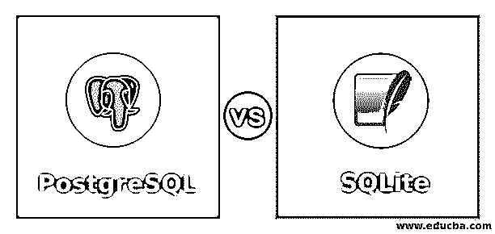
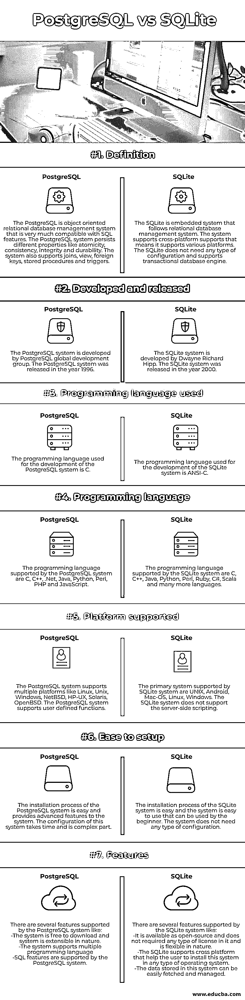

# PostgreSQL 与 SQLite

> 原文：<https://www.educba.com/postgresql-vs-sqlite/>

## PostgreSQL 与 SQLite 的区别

在 PostgreSQL vs SQLite 中，SQLite 被定义为一个开源的关系数据库管理系统，它是一个基于文件的系统，因其可靠性、可移植性、强大的性能和支持低内存环境的轻量级特性而广受欢迎，它还提供了一些功能，如在任何系统崩溃或断电时支持事务的事务性无服务器。PostgreSQL 是另一个开源关系数据库管理系统，它同时处理多个任务，并支持 ACID(原子性、一致性、完整性和持久性)定理。PostgreSQL 不如 SQLite 流行，也没有广泛用于存储数据。

### PostgreSQL 与 SQLite 的面对面比较(信息图表)

以下是 PostgreSQL 和 SQLite 之间的 7 大比较

<small>Hadoop、数据科学、统计学&其他</small>

### PostgreSQL 与 SQLite 的主要区别

以下是 PostgreSQL 和 SQLite 之间的关键区别

两个系统之间的一个显著区别是内存中的能力。SQLite 系统支持内存中功能，这有助于高效地执行数据操作，而在 PostgreSQL 系统中，没有这种内存中功能。

PostgreSQL 和 SQLite 系统之间的另一个区别是分区方法。SQLite 系统不支持任何分区方法。另一方面，PostgreSQL 系统支持各种类型的分区方法，如列表、范围和散列。

这两个系统的一个显著区别是服务器的使用。SQLite 系统不需要任何服务器来运行；因此，它被称为无服务器。另一方面，PostgreSQL 系统要求服务器运行并支持多个操作系统，如 FreeBSD、Windows、Solaris 等等。SQLite 系统不支持 XML 格式。PostgreSQL 系统支持 XML 格式。

这两个系统之间的另一个显著区别是身份验证和安全性。PostgreSQL 系统提供了各种高级安全特性和一些内置配置。另一方面，在 SQLite 系统中，任何人都可以访问没有身份验证系统用作数据库的文件。

这两个系统的另一个区别是用户管理。在 PostgreSQL 系统中，多个用户可以通过适当的授权访问系统。SQLite 系统不支持对各种用户的访问，因为 SQLite 系统中没有用户管理功能。PostgreSQL 函数提供的特性本质上是高级的，而另一方面，SQLite 系统为用户提供了基本的特性。

复制策略是 SQLite 和 PostgreSQL 系统之间的另一个重要区别。PostgreSQL 系统支持主从复制、流、级联和同步副本。另一方面，SQLite 系统中没有复制策略，这给这种类型的系统造成了限制。数据类型的兼容性是比较两个系统的另一个主要因素。PostgreSQL 系统基本上兼容所有使该系统流行的数据类型。另一方面，SQLite 系统不支持高级数据类型，只支持一些数据类型，如 Integer、Real、Blob、Text 和 Null。

系统之间的另一个显著区别是数据库的使用。PostgreSQL 系统提供了不受限制地处理复杂数据库的功能。另一方面，SQLite 系统是一个小型应用程序，它采用一个简单的数据库系统。PostgreSQL 系统的主要用途是当数据完整性和数据可靠性这两个功能成为关注点时。另一方面，当需要在独立应用程序中使用数据库时，SQLite 系统是首选。

### PostgreSQL 与 SQLite 的比较表

下面是对比表:

| **因素** | **PostgreSQL** | **SQLite** |
| **定义** | PostgreSQL 是一个面向对象的关系数据库管理系统，与 SQL 特性非常兼容。PostgreSQL 系统坚持不同的属性，如原子性、一致性、完整性和持久性。该系统支持联接视图、外键、存储过程和触发器。 | SQLite 是一个遵循关系数据库管理系统的嵌入式系统。系统支持跨平台支持，也就是说支持各种平台。SQLite 不需要任何类型的配置，并且支持事务数据库引擎。 |
| **开发发布** | PostgreSQL 系统由 PostgreSQL 全球开发小组开发。PostgreSQL 系统于 1996 年发布。 | SQLite 系统是由 Dwayne Richard Hipp 开发的。SQLite 系统于 2000 年发布。 |
| **使用的编程语言** | 用于开发 PostgreSQL 系统的编程语言是 c。 | 用于开发 SQLite 系统的编程语言是 ANSI-C。 |
| **编程语言** | PostgreSQL 系统支持的编程语言是 C、C++、。Net、Java、Python、Perl、PHP 和 JavaScript。 | The programming language supported by the SQLite system is C, C++, Java, Python, Perl, Ruby, C#, Scala, and many more languages. |
| **支持的平台** | PostgreSQL 系统支持多种平台，如 Linux、Unix、Windows、NetBSD、HP-UX、Solaris 和 OpenBSD。PostgreSQL 系统支持用户定义的函数。 | SQLite 系统支持的主要系统是 UNIX、Android、Mac-OS、Linux 和 Windows。SQLite 系统不支持服务器端脚本。 |
| **易于设置** | PostgreSQL 系统的安装过程非常简单，并且为系统提供了高级功能。该系统的配置需要时间，并且是一个复杂的部分。 | SQLite 系统的安装过程很简单，并且该系统易于使用，初学者也可以使用。该系统不需要任何类型的配置。 |
| **特性** | PostgreSQL 系统支持几个特性，比如。系统免费下载，系统可扩展。该系统支持多种编程语言。PostgreSQL 系统支持 SQL 特性。 | SQLite 系统支持几个特性:它是开源的，不需要任何许可，本质上是灵活的。SQLite 支持跨平台，这有助于用户在任何类型的操作系统中安装该系统。存储在这个系统中的数据很容易获取和管理。 |

### 结论

SQLite 和 PostgreSQL 数据库系统是一个开源的 RDBMS 系统，支持 ACID 定理并有助于管理数据。在物联网和嵌入式应用的情况下，SQLite 是首选，其中 PostgreSQL 系统被选择用于复杂的数据库系统。系统选择基于应用的使用案例和需求。

### 推荐文章

这是 PostgreSQL 与 SQLite 的对比指南。在这里，我们讨论 PostgreSQL 和 SQLite 之间的区别、主要区别和比较表。您也可以浏览我们的其他相关文章，了解更多信息——

1.  [PostgreSQL 更新连接](https://www.educba.com/postgresql-update-join/)
2.  [PostgreSQL 解码()](https://www.educba.com/postgresql-decode/)
3.  [MySQL vs SQLite](https://www.educba.com/mysql-vs-sqlite/)
4.  [PostgreSQL Like](https://www.educba.com/postgresql-like/)

