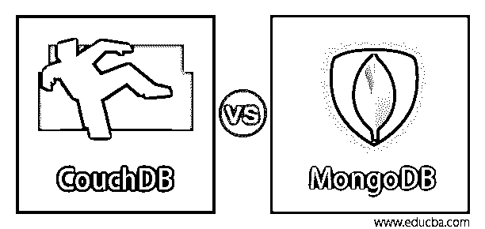
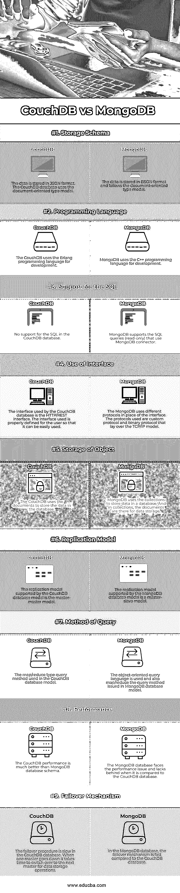

# CouchDB vs MongoDB

> 原文：<https://www.educba.com/couchdb-vs-mongodb/>

## CouchDB 和 MongoDB 的区别

CouchDB 是一个 NoSQL 类型的数据库，它是开源的，有助于提供 web 服务和 web 可访问性。CouchDB 数据库提供了与各种设备兼容的 web 服务。存储在 CouchDB 中的数据采用键值对和 JSON (JavaScript 对象通知)格式。MongoDB 是另一种类型的 NoSQL 数据库，用于存储大量数据。MongoDB 数据库能够存储大量数据。当需要在数据库中存储更多数据块时，MongoDB 数据库是可伸缩的。这里我们讨论 CouchDB vs MongoDB。

### CouchDB 与 MongoDB 的面对面比较(信息图表)

以下是 CouchDB 和 MongoDB 的 9 大区别:

<small>Hadoop、数据科学、统计学&其他</small>

### CouchDB 和 MongoDB 的主要区别

以下是 couchDB 和 MongoDB 之间的主要区别:

*   CouchDB 和 MongoDB 的主要区别在于数据库的可用性和一致性。MongoDB 数据库支持一致性因素，而另一方面，CouchDB 支持可用性因素。MongoDB 使用复制模型，其中有多个节点，并将数据存储在所有复制的节点中。在所有节点中，一个节点充当主节点，所有其他节点被视为次节点。通过这种模型，在 MongoDB 数据库中保持了一致性。CouchDB 数据库支持一致性因素，其中数据存储在一个节点中，所有节点彼此同步，以便数据在数据库中也可用。
*   这两种数据库的下一个区别是存储模式。CouchDB 使用文档模式，其中数据以 JSON 格式存储。CouchDB 提供了用于插入数据、编辑数据、读取数据和删除数据文档的 Restful APIs。在文档中，有些字段可以是布尔值、数字、列表等等。在 MongoDB 中，没有这样的模式，数据可以自由地以 BSON 格式存储。没有为 MongoDB 数据库定义结构，数据库的大小可以根据文档大小而变化。
*   CouchDB 和 MongoDB 之间的另一个区别是数据库中索引的使用。MongoDB 使用索引来读取数据，因为如果不使用索引，读取时间会增加，从而影响数据库性能。CouchDB 使用类似于 SQL 索引的索引。索引可以用来检索文档，以某种特定的顺序过滤文档。
*   用于开发数据库 CouchDB 和 MongoDB 的编程语言是不同的。CouchDB 数据库使用 Erlang 编程语言进行开发，并支持各种操作系统，如 Linux、OS、Windows、Android、iOS、Solaris 和 BSD。CouchDB 还支持各种其他语言，如 PHP、Perl、Ruby、Python、Smalltalk 等等。MongoDB 使用 C++编程语言开发数据库，支持的操作系统有 Solaris、Windows、Linux 和 OS。数据库支持的编程语言有 C，C++，C#，Delphi，Groovy，Java，MatLab，JavaScript，Python，Scala，PHP，Prolog，PowerShell 等等。
*   MongoDB 数据库和 CouchDB 数据库之间的另一个重要区别是对处理错误和 bug 的支持。bug 和错误支持对于数据库模式是必不可少的，因为数据操作是连续进行的，需要支持来处理错误。与 CouchDB 数据库相比，MongoDB 数据库能够更好地支持错误和 bug。对于数据存储操作，开发人员和程序员更喜欢 MongoDB 而不是 CouchDB。
*   区分 CouchDB 和 MongoDB 数据库可以考虑的另一个因素是安全标准。这两个数据库都遵循高标准的安全性，但是 CouchDB 有一些额外的安全特性，这使得 CouchDB 数据库比 MongoDB 数据库更安全。
*   在 MongoDB 数据库中使用容器作为附加层，而在 CouchDB 中，数据库中没有这样的功能。额外的容器层有助于更好地管理任务，并在 MongoDB 数据库中正确地执行操作。

### CouchDB 与 MongoDB 比较表

下面是一个比较表，显示了 CouchDB 和 MongoDB 之间的相似之处:

| **因子** | **CouchDB** | **MongoDB** |
| **存储模式** | 数据以 JSON 格式存储。CouchDB 数据库使用面向文档的类型模型。 | 数据以 BSON 格式存储，并遵循面向文档的类型模型。 |
| **编程语言** | CouchDB 使用 Erlang 编程语言进行开发。 | MongoDB uses the C++ programming language for development. |
| **对 SQL 的支持** | CouchDB 数据库中不支持 SQL。 | MongoDB 支持使用 MongoDB 连接器的 SQL 查询(只读)。 |
| **接口的使用** | CouchDB 数据库使用的接口是 HTTP/REST 接口。所使用的接口是为用户正确定义的，以便于使用。 | MongoDB 使用不同的协议来代替接口。所使用的协议是位于 TCP/IP 模型之上的自定义协议和二进制协议。 |
| **对象的存储** | CouchDB 使用文档将数据存储在数据库中。 | MongoDB 使用集合将数据存储在数据库中。在收藏中，文档是用来存储数据的。 |
| **复制模式** | CouchDB 数据库模型支持的复制模型是主-主模型。 | MongoDB 数据库模型支持的复制模型是主从模型。 |
| **查询方式** | CouchDB 数据库模型中使用的 map/reduce 类型查询方法。 | 使用了面向对象的查询语言，并映射/简化了 MongoDB 数据库模型中发布的查询方法。 |
| **性能** | CouchDB 的性能比 MongoDB 数据库模式好得多。 | MongoDB 数据库面临着性能问题，与 CouchDB 数据库相比，它有所欠缺。 |
| **故障转移机制** | CouchDB 数据库中的故障转移过程很慢。当一个主机停机时，切换到下一个主机进行数据存储操作需要时间。 | 在 MongoDB 数据库中，故障转移机制比 CouchDB 数据库快。 |

### 结论

MongoDB 数据库和 CouchDB 数据库是一个强大的数据库，可以存储大量的数据，并且可以立即执行数据存储操作。两个数据库都支持两种类型的数据，即结构化数据和非结构化数据。这两种数据库都广泛应用于全球各种组织中。

### 推荐文章

这是 CouchDB vs MongoDB 的指南。在这里，我们讨论 CouchDB 和 MongoDB 之间的区别，以及它们与信息图和比较表的主要区别。您也可以看看以下文章，了解更多信息–

1.  [MongoDB vs Postgres](https://www.educba.com/mongodb-vs-postgres/)
2.  [Hadoop vs MongoDB](https://www.educba.com/hadoop-vs-mongodb/)
3.  [卡珊德拉 vs Couchbase](https://www.educba.com/cassandra-vs-couchbase/)
4.  [DMongoDB vs DynamoDB](https://www.educba.com/mongodb-vs-dynamodb/)

