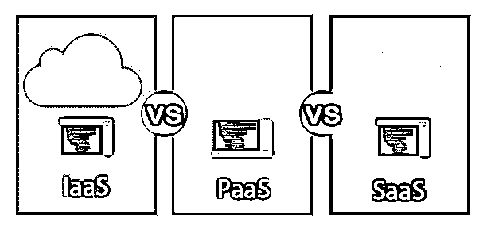
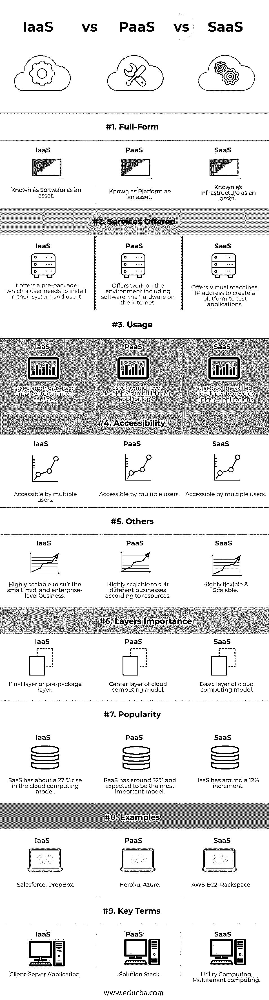

# IaaS vs PaaS vs SaaS

> 原文：<https://www.educba.com/iaas-vs-paas-vs-saas/>

## IaaS 与 PaaS 和 SaaS 的区别

云计算分为三种类型:SaaS、PaaS、IaaS。就受欢迎程度而言，PaaS 在 2019 年增长了 32 %，预计到 2020 年将会上升。SaaS 的受欢迎度为 27 %，IaaS 为 12 %。有了这些云，计算正成为终端企业的关键。这三种云计算技术解释了在企业中使用云的最佳方式。其中，SaaS 是通过互联网由第三方提供的软件平台。PaaS 是一种第三方通过互联网提供硬件和软件工具的模式。IaaS 也是如此，它是一种云计算服务，用户按照“按使用付费”的方案使用存储、网络等服务。

### IaaS vs PaaS vs SaaS 的面对面比较(信息图)

以下是 IaaS 与 PaaS 和 SaaS 之间的 9 大区别:

<small>Hadoop、数据科学、统计学&其他</small>

### IaaS 与 PaaS 和 SaaS 的主要区别

以下是 IaaS 与 PaaS 和 SaaS 之间的主要区别:

SaaS(软件即服务)提供对软件及其功能的访问。这里不需要投资额外的硬件，因为软件是远程托管的。SaaS 减少了硬件设置、安装和维护。也称为存储即服务，从第三方提供商处提供存储空间，当数据从用户传输到服务提供商时，用户会利用这些空间。

#### SaaS 的特色

*   无需手动安装硬件，因为只要我们登录，一切都可以在互联网上找到。它由可以通过您的个性化登录访问的软件应用程序组成。
*   无需任何技术专家来更新或升级软件应用程序。云会处理这些。
*   SaaS 服务的计费金额主要基于固定的月费。因此，它给出了软件和其他订阅的清晰估计。
*   SaaS 以软件应用程序的成本提供安全性和维护。

PaaS(平台即服务)提供硬件和软件工具来开发互联网上的应用程序。PaaS 云平台大多被开发者用来设计和开发软件应用。

#### PaaS 的特点

*   PaaS 提供了一个基于 Web 的用户界面，可供多个用户访问。
*   它提供了许多功能，比如开发测试、托管和维护的应用程序。
*   它非常灵活，可伸缩，可移植。
*   PaaS 云计算平台非常便携，因为当用户需要更多存储容量时，他可以选择公共云。
*   PaaS 非常安全，因为它提供了数据的安全性、备份和丢失数据的恢复。
*   IaaS(称为基础架构即服务)对存储、网络和虚拟化采用“按使用付费”或“随用随付”的模式。IaaS 服务是通过互联网交付的，用户只需为所接受的服务付费。在 IaaS 模式中，用户利用来自第三方服务提供商的软件、硬件和存储空间等资源，并且他们还托管用户应用程序并进行维护。在这里，消费者或用户节省了时间和金钱。

#### IaaS 的特点

*   IaaS 服务具有高度的可扩展性和灵活性。
*   这里，硬件由服务提供商配置，这减少了高额投资和时间。
*   不会浪费未使用的存储容量，无论何时需要更多存储空间，它都会及时提供。
*   不存在单点故障，因为这意味着如果网络、服务器或交换机出现任何故障，IaaS 服务仍会运行。
*   IaaS 提供了更多的安全性，因为它的服务是在外部托管的。

### IaaS vs PaaS vs SaaS 对比表

让我们看看 IaaS vs PaaS vs SaaS 的对比表。

| **特性** | **SaaS** | **PaaS** | **IaaS** |
| 完整形式的 | 被称为软件资产 | 被称为平台资产 | 被称为基础设施资产 |
| 提供的服务 | 它提供了一个预包，用户需要在他们的系统中安装并使用它。 | 提供环境方面的工作，包括互联网上的软件和硬件。 | 提供虚拟机、IP 地址来创建测试应用程序的平台。 |
| 使用 | 在电子邮件、娱乐服务的用户中使用。 | 由中级开发人员用来构建他们的应用程序。 | 由熟练的开发人员用来开发独特的应用程序。 |
| 易接近 | 可供多个用户访问。 | 可供多个用户访问。 | 可供多个用户访问。 |
| 其他人 | 高度可扩展，适合中小型企业。 | 根据资源高度可扩展以适应不同的业务。 | 高度灵活和可扩展 |
| 层重要性 | 最终层或预包装层。 | 云计算模型的中心层。 | 云计算模型的基础层。 |
| 流行 | SaaS 的云计算模式增长了约 27 %。 | PaaS 约占 32%,预计将成为最重要的型号 | IaaS 大约有 12%的增量。 |
| 例子 | Salesforce，DropBox | 蔚蓝海洛库 | AWS EC2，Rackspace |
| 关键术语 | 客户端-服务器应用程序 | 解决方案堆栈 | 效用计算、多租户计算 |

### 结论

云计算的概念源于网络图中提到的互联网是一朵云。任何一种云计算模式(即平台即服务、软件即服务和基础设施即服务)提供的服务都与移动性相关，并且取决于服务提供商为用户体验提供的服务质量和安全性。

选择最佳的服务交付模型，用户必须知道他的业务需求。每种服务模式都有其利弊，其中 SaaS 使用打包内容，因为它对维护问题没有任何控制权，而 PaaS 和 IaaS 并不适合所有类型的工作负载。云已经蓬勃发展了几年，许多公司将其 IT 基础设施转移到云平台。云计算技术有几种云产品，例如云存储，即公共云、私有云以及混合云。各种组织最近转向云计算解决方案仅取决于他们的需求。

### 推荐文章

这是 IaaS vs PaaS vs SaaS 的指南。在这里，我们还通过信息图和比较表讨论了 IaaS 与 PaaS 和 SaaS 的主要区别。您也可以看看以下文章，了解更多信息–

1.  [IaaS vs PaaS](https://www.educba.com/iaas-vs-paas/)
2.  [Azure Paas vs Iaas](https://www.educba.com/azure-paas-vs-iaas/)
3.  [Azure vs 谷歌云](https://www.educba.com/azure-vs-google-cloud/)
4.  [PAAS vs SAAS](https://www.educba.com/paas-vs-saas/)

