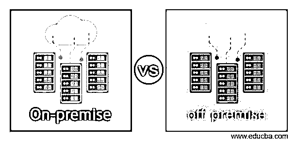
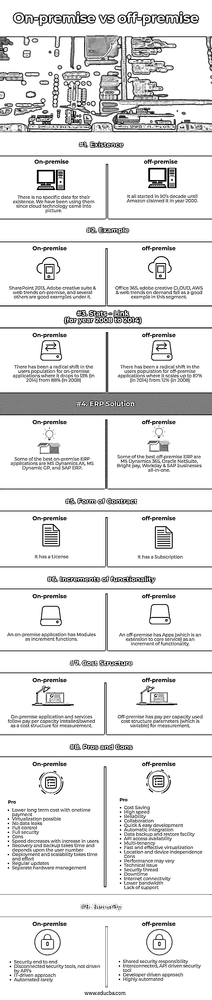

# 内部与外部

> 原文：<https://www.educba.com/on-premise-vs-off-premise/>

## 内部部署与外部部署简介

在过去的十年里，目前的 IT 行业在各个领域都发生了巨大的变化。谈到数据托管的概念，当几年前开始时，公司可以选择自己存储数据或让其他人负责数据，考虑到内部和外部术语，这是今天讨论的标题，看到全球范围内发生的巨大变化是非常有趣的。

**内部部署**是在用户/组织系统上运行或安装的建议解决方案，它可能由某个第三方提供支持(非强制)。

<small>Hadoop、数据科学、统计学&其他</small>

**异地**有一个完全不同的概念，其中托管和支持由一些其他第三方完成(这些第三方是不同的)。

**注意—**我们会根据需要交替使用这些术语“内部/内部”&“外部/内部”。

### 内部部署与外部部署的区别

在本地和非本地概念之间做出决定需要考虑多种因素，让我们看看其中一些突出的因素

*   借助本地软件，从实施、安装到应用程序自身运行，一切都在内部完成。应用程序维护(如安全和更新相关问题)也由内部人员负责，用户购买安装在服务器上的软件，这些软件还需要额外的电源备份、服务器管理、数据库管理以及操作系统，而外部人员则根据需求提出请求，包括维护、安全问题和管理相关基础设施等 it 方面的一切。用户可以通过向服务提供商(也称为第三方供应商)收取额外费用来要求额外的安全功能。
*   您是唯一的所有者，对您的应用程序和数据拥有完全的权限，而在异地，您不是创作主体，而是某个第三方为您创作。
*   内部部署没有任何子类别，而外部部署有几个子类别，即 SaaS、PaaS、IaaS 和其他几个类别。
*   在内部，您不一定需要互联网来使用应用程序，而在外部，您肯定需要互联网连接来运行应用程序。
*   内部部署的应用程序没有订阅功能，订阅功能按月或按年变化；这是一次性投资，而异地是基于订阅的使用。
*   内部部署更可靠、更安全，而外部部署的应用程序在这部分比较中不得不做出一点让步(因为您无法控制数据和应用程序&可能会发生数据泄漏)。
*   对于小公司来说，内部部署的应用程序成本最高，也不太实惠，而外部部署的应用程序更适合小公司。
*   软件更新也是一个问题，因为我们必须更新它们以提高效率，内部部署的应用程序必须担心这一点，因为这可能需要时间和金钱，而外部部署的应用程序用户不必担心，因为费用已包括在内，并且更新可以在短时间内完成，而且经常进行。
*   对于任何内部部署的应用程序，无论有无互联网，您都可以有效地使用它，而外部部署的应用程序只能通过互联网设施运行。这一点也可以以不同的方式推断，对于内部部署的应用程序，您不能在任何时间任何地点使用它，但对于外部部署的应用程序，这是可能的。
*   对于内部部署的应用程序来说，移动接入是不可能或很少可能的，而对于外部部署的应用程序来说，移动接入是非常容易实现的。

### 内部与外部的直接比较(信息图)

以下是内部部署与外部部署之间的 9 大差异:

### 内部与外部对比表

让我们来讨论一下内部部署与外部部署之间的主要比较:

| **参数** | **内部部署** | **异地** |
| 存在 | 它们的存在没有具体的日期。自从云技术出现以来，我们就一直在使用它们。 | 这一切都始于 90 年代，直到 2000 年亚马逊宣称拥有它。 |
| 例子 | SharePoint 2013、Adobe creative suite & web trends on-premise 以及其他几个产品就是很好的例子 | Office 365、adobe creative CLOUD、AWS & web trends on demand 就是这方面的一个很好的例子。 |
| Stats – Link(2008 年至 2014 年) | 本地应用程序的用户数量发生了巨大变化，从 2008 年的 88%下降到 2014 年的 13% | 异地应用的用户数量发生了巨大变化，从 2008 年的 12%上升到 2014 年的 87% |
| ERP 解决方案 | 一些最好的内部 ERP 应用程序是 MS Dynamics AX、MS Dynamic GP 和 SAP ERP | 一些最好的异地 ERP 是 MS Dynamics 365、Oracle NetSuite、Bright pay、Workday 和 SAP businesses all-in-one |
| 合同形式 | 它有执照 | 它有订阅 |
| 功能的增加 | 内部部署应用程序具有作为增量功能的模块。 | 外部部署将应用程序(核心服务的扩展)作为功能的增量。 |
| 费用结构 | 内部部署的应用程序和服务遵循按安装/拥有的容量付费作为衡量的成本结构。 | 异地已使用按容量付费成本结构参数(可变)进行衡量。 |
| 利弊 | Pros一次性付款降低长期成本虚拟化成为可能没有数据泄露完全控制完全安全骗局速度随着用户的增加而降低恢复和备份需要时间，并且取决于用户数量部署和可伸缩性需要时间和精力定期更新独立的硬件管理 | Pros成本节约高速的

可靠性

合作

快速简单的开发

自动集成

数据备份和恢复设施

API 访问可用性

多租户

快速有效的虚拟化

位置和设备独立性

骗局

性能可能会有所不同

技术问题

安全线程

停工期

互联网连接

较低带宽

缺乏支持

 |
| 安全性 | · security end to end不相连的安全工具，不是由 API 驱动的IT 驱动的方法很少自动化 | · Shared security responsibility互联、API 驱动的安全工具开发者驱动的方法高度自动化 |

### 结论

一旦任何组织决定针对某个应用程序的需求来增强其功能，下一步就是确定哪种解决方案将起作用，除了组织选择的众多技术之外，他们还必须思考和决定内部或外部工具和服务是否最适合他们的需求。我们已经看到了它们自身拥有的可能性，以及它们可能向用户提供的产品。

### 推荐文章

这是一个关于内部部署与外部部署之间最大差异的指南。这里我们讨论信息图和比较表的主要区别。您也可以看看以下文章，了解更多信息–

1.  [SaaS vs 内部部署](https://www.educba.com/saas-vs-on-premise/)
2.  [内部部署与私有云](https://www.educba.com/on-premise-vs-private-cloud/)
3.  [云 vs 数据中心](https://www.educba.com/cloud-vs-data-center/)
4.  [本地 vs 云端](https://www.educba.com/on-premise-vs-cloud/)

