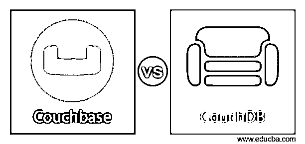
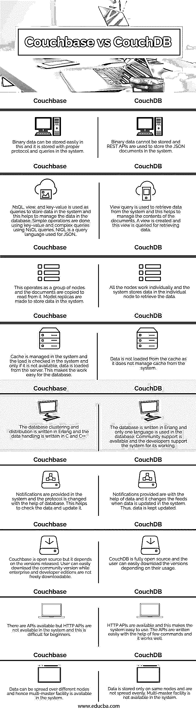

# Couchbase vs CouchDB

> 原文：<https://www.educba.com/couchbase-vs-couchdb/>

## Couchbase vs CouchDB 简介

具有 NoSQL 的面向文档的数据库称为 Couchbase 或 membase。它是开源的，具有分布式架构。它使用存储在数据库中的文档，并使每个人都可以使用它。交互式应用程序可以在数据库中创建，因为它是一个完整的包。CouchDB 由 Apache 开发，在数据库中工作和存储数据方面类似于 MongoDB。文档以任何形式存储，并且可以使用 JavaScript 转换成所需的格式。这也赋予了文档的重要性，任何人都可以轻松获取。

### Couchbase 和 CouchDB 的面对面比较(信息图)

以下是 Couchbase 和 CouchDB 之间的 9 大区别:

<small>Hadoop、数据科学、统计学&其他</small>

### Couchbase 和 CouchDB 的主要区别

*   虽然两者都是开源和开放文档的，但是键值存储只存在于 Couchbase 上。键值存储具有存储、检索和管理数组的能力，还可以像管理字典一样管理数据存储。这有助于 Couchbase 使用关联数组作为非关系数据库来存储数据。这有助于存储多媒体和大量数据。
*   Couchbase 具有很强的一致性，而 CouchDB 的一致性取决于数据库中存储的数据。存储在 Couchbase 中的所有数据都可以以相同的一致性进行检索，但在 CouchDB 中，这取决于数据的大小、存储时间和存储位置。尽管它不能提供完全相同的一致性，但最终数据会具有一致性。
*   Couchbase 的拓扑是分布式的，而 CouchDB 的拓扑是附加的。当附加拓扑将不同的组件组合成一个组件以帮助工作时，分布式拓扑有助于将组件分布在所有站点中。在分布式拓扑中，节点组是从零开始形成的，并建立在另一个节点之上。
*   Couchbase 通过自动处理来优雅地处理故障转移。当故障转移发生时，Couchbase 将数据转移到附近的任何系统进行管理，因此数据不会丢失。CouchDB 没有这个选项，如果发生任何故障，数据就会丢失，应该使用其他方法检索。自动故障转移有助于系统地管理数据。
*   Couchbase 集成了缓存，数据存储在系统本身中。只有系统恢复后，数据才会从系统中丢失。否则，数据是安全的。CouchDB 没有这种集成的缓存，数据必须总是被检索。此外，Couchbase 兼容 Memcached 数据。CouchDB 不兼容，管理系统内的数据。
*   Couchbase 有乐观锁定和悲观锁定，而 CouchDB 只有乐观锁定。乐观锁定使用户能够在更新数据之前检查数据库，而悲观锁定首先更新数据，并确保没有人再更新它。CouchDB 支持 MVCC 锁定。这使得在执行更新时数据能够被隔离。此外，数据可以由任何用户更新，并且不能被锁定。
*   Couchbase 在数据库中使用一种查询语言，而 CouchDB 没有任何查询语言。查询语言是 SQL，用于 JSON 脚本。这有助于在 SQL 的帮助下更新和管理数据，而 CouchDB 必须检查系统中可用的语言。

### Couchbase 与 CouchDB 比较表

我们来讨论一下 Couchbase 和 CouchDB 的顶级对比:

| **沙发底座** | **CouchDB** |
| 二进制数据可以很容易地存储在这个系统中，并通过适当的协议和查询进行存储。 | 不能存储二进制数据，REST APIs 用于在系统中存储 JSON 文档。 |
| N1QL、view 和 key-value 用作查询来存储系统中的数据，这有助于管理数据库中的数据。简单的操作使用键值来完成，复杂的查询使用 N1QL 查询。NIQL 是一种用于 JSON 的查询语言。 | 视图查询用于从系统中检索数据，这有助于管理文档的内容。创建一个视图，并查询该视图以检索数据。 |
| 它作为一组节点运行，文档被复制并从中读取。制作模型复制品是为了在系统中存储数据。 | 所有节点都单独工作，系统将数据存储在单个节点中以检索数据。 |
| 缓存在系统中管理，负载在系统中检查，只有当缓存不可用时，才从服务器加载数据。这使得数据库的工作变得容易。 | 不会从缓存中加载数据，因为它不会从系统中管理缓存。 |
| 数据库集群和分布用 Erlang 编写，数据处理用 C 和 C++编写。 | 数据库是用 Erlang 编写的，数据库中只使用一种语言。社区支持是可用的，开发者支持系统的工作。 |
| 在系统中提供通知，并且在数据库的帮助下改变协议。这有助于检查数据和更新数据。 | 通知是在数据的帮助下提供的，当系统中的数据更新时，它会更改提要。因此，数据保持更新。 |
| Couchbase 是开源的，但是它依赖于发布的版本。用户可以轻松下载社区版，而企业版和开发者版则不能免费下载。 | CouchDB 是完全开源的，用户可以根据自己的使用情况轻松下载各个版本。 |
| 有可用的 API，但系统中没有 HTTP APIs，这对初学者来说很困难。 | HTTP APIs 是可用的，这使得系统易于使用。借助几个命令就可以很容易地编写 API，而且效果很好。 |
| 数据可以分布在不同的节点上，因此在系统中可以使用多主设备。 | 数据仅存储在相同的节点上，并且不均匀分布。多主设备在系统中不可用。 |

Couchbase 是 CouchDB 和 membase 的组合，因此与其他产品相比性能更好。此外，与其他软件相比，Couchbase 运行速度更快。我们可以将 CouchDB 用于较小的应用程序，这有助于很好地维护系统。

### 推荐文章

这是 Couchbase 和 CouchDB 之间最大区别的指南。这里我们讨论信息图和比较表的主要区别。您也可以看看以下文章，了解更多信息–

1.  [卡珊德拉 vs Couchbase](https://www.educba.com/cassandra-vs-couchbase/)
2.  [CouchDB vs MongoDB](https://www.educba.com/couchdb-vs-mongodb/)
3.  [卡珊德拉 vs MySQL](https://www.educba.com/cassandra-vs-mysql/)
4.  [Cassandra vs Redis](https://www.educba.com/cassandra-vs-redis/)

