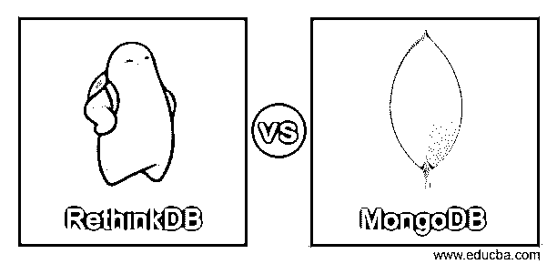
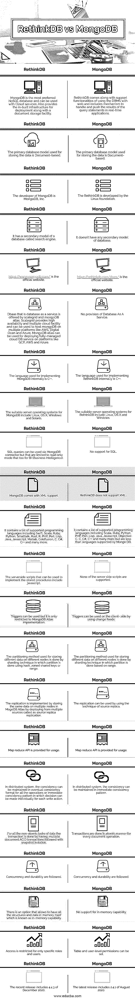

# RethinkDB vs MongoDB

> 原文：<https://www.educba.com/rethinkdb-vs-mongodb/>

## RethinkDB vs MongoDB 简介

RethinkDB 和 MongoDB 是帮助以有效的方式管理数据库和存储数据的数据库工具。MongoDB 是开源工具，旨在处理海量数据和想法。数据以类似 JSON 的格式存储，这种格式被称为文档，允许灵活地存储数据结构。MongoDB 的额外特性使得它非常适合使用，包括对自动分片的支持和存储数据的内置复制。与 RethinkDB 相比，MongoDB 更受欢迎、被接受和使用。

另一方面，RethinkDB 也以 JSON 格式存储数据，并且是开源的。RethinkDB 的一个重要特性是可以轻松地将设置扩展到多台机器上，只需要很少的工作。RethinkDB 还具有支持各种有用的查询语句的优势，其中一些语句包括 group by 和表连接，这些语句非常容易学习和设置。

<small>Hadoop、数据科学、统计学&其他</small>

在本文中，我们将研究这两种数据库工具的技术差异。

### RethinkDB 与 MongoDB 的面对面比较(信息图表)

以下是 RethinkDB 与 MongoDB 之间的 21 大区别:

### **RethinkDB 与 MongoDB** 对比表

| **MongoDB** | **重新思考 DB** |
| MongoDB 是最受欢迎的 NoSQL 数据库，可以用于云服务。还提供了用于部署的内置基础设施以及文档存储设施。 | RethinkDB 附带了在 web 上使用 DBMS 的支持功能，并包括一种在实时应用程序中处理和推送查询语句结果的机制。 |
| 用于存储数据的主要数据库模型是基于文档的。 | 用于存储数据的主要数据库模型是基于文档的。 |
| MongoDB 的开发者是 MongoDB，Inc . | RethinkDB 是由 Linux 基金会开发的。 |
| 它有一个数据库的二级模型，叫做搜索引擎。 | 它没有数据库的任何辅助模型。 |
| [https://www.mongodb.com/](https://www.mongodb.com/)是官方网站。 | [https://rethinkdb.com/docs/](https://rethinkdb.com/docs/)是官方网站。 |
| Dbaas 是数据库即服务，由 scalegrid 和 mongoDB atlas 提供。Scalegrid 提供高可用性和多种云设施，可用于在多种平台上托管 mongoDB，如 AWS、Digital Ocen 和 Azure。MongoDB atlas 可用于在 GCP、AWS 和 Azure 等平台上部署完全托管的云数据库服务。 | 不提供数据库即服务。 |
| 用于内部实现 MongoDB 的语言是 C++。 | 用于在内部实现 RethinkDB 的语言是 C++。 |
| 适合 MongoDB 的服务器操作系统包括 Linux、OS X、Windows 和 Solaris。 | 适用于 RethinkDB 的服务器操作系统包括 Linux、OS X 和 Windows。 |
| SQL 查询可以通过 MongoDB 连接器使用，但是它们仅限于只读模式，对于 BI(商业智能)也是如此。 | 不支持 SQL。 |
| MongoDB 附带了 XML 支持。 | RethinkDB 不支持 XML。 |
| 它包含了一系列受支持的编程语言，包括 Swift、Scala、Ruby、Python、Smalltalk、Rust、R、PHP、Perl、Lisp、Java、Javascript、Matlab、Coldfusion、C、C#、C++等等。 | 它包含了一系列受支持的编程语言，包括 Scala、Ruby、Python、PHP、Perl、Lisp、Java、Javascript、Objective C、C、C#、C++，以及其他许多受 Mongo DB 支持的语言。 |
| 可用于实现存储过程的服务器端脚本包括 javascript。 | 不支持任何服务器端脚本。 |
| 可以使用触发器，但仅限于 MongoDB Atlas 实现。 | 通过使用更改提要，可以在客户端使用触发器。 |
| 用于在不同节点上存储不同数据的分区方法是通过分片技术来完成的，其中使用散列、分区共享键或范围来完成分区。 | 用于在不同节点上存储不同数据的分区方法是通过分片技术完成的，其中分区是基于范围完成的。 |
| 通过从多个源部署，将相同的数据存储在 MogoDB Atlas 中的多个节点上来实现复制，称为源副本复制。 | 可以通过使用源副本技术来使用复制。 |
| 提供 Map reduce API 以供使用。 | 为用户提供了 Map reduce API。 |
| 在分布式系统中，一致性可以以所有操作的最终一致性格式或即时一致性模式来维护，在即时一致性模式中，可以为每个写操作单独做出决定。 | 在分布式系统中，一致性可以通过即时一致性模式来维护。 |
| 对于所有非原子的数据任务，事务是通过多个文档 ACID 事务以及随后的快照隔离来完成的。 | 对于每个文档操作，事务都是以原子方式完成的。 |
| 遵循并发性和持久性。 | 遵循并发性和持久性。 |
| 有一个选项允许将所有结构和数据保存在内存中，这就是所谓的内存中功能。 | 不支持内存功能。 |
| 访问权限仅限于特定角色和用户。 | 可以设置表级和用户级权限。 |
| 最近的版本包括 2020 年 12 月的 4.4.3。 | 最新版本包括 2020 年 8 月的 2.4.1。 |

### 结论

MongoDB 和 rethinkDB 都是开源数据库工具，可以用来处理大量数据。两者各有利弊。

大多数开发人员更喜欢 MongoDB 而不是 RethinkDB，因为它的自动分片和复制功能。此外，MongoDB 提供了一种动态灵活的数据结构，存储在类似 JSON 的文档存储中。对于需要分布式系统和多个节点来存储副本和数据的大型和巨大的数据库系统，它是最优选的。MongoDB 的另一个优势是它的高可用性和可伸缩性。

当需要大量机器来轻松存储数据时，可以使用 RethinkDB。使用 RethinkDB 的优势之一是使用查询语言，这有助于使用复杂的东西，如表的连接和基于某些参数的数据分组。学习这种语言并在您的设备上设置它变得非常容易，这增加了一个好处。大多数情况下，由于事务对非原子文档操作的非 ACID 支持，MongoDB 比 RethinkDB 更受大多数开发人员的青睐。

### 推荐文章

这是 RethinkDB vs MongoDB 的指南。在这里，我们讨论介绍，用信息图进行面对面的比较，以及比较表。您也可以看看以下文章，了解更多信息–

1.  [MongoDB vs Elasticsearch](https://www.educba.com/mongodb-vs-elasticsearch/)
2.  [MongoDB vs SQL server](https://www.educba.com/mongodb-vs-sql-server/)
3.  [MongoDB vs SQL](https://www.educba.com/mongodb-vs-sql/)
4.  [蒙戈布 vs 巴塞](https://www.educba.com/mongodb-vs-hbase/)

