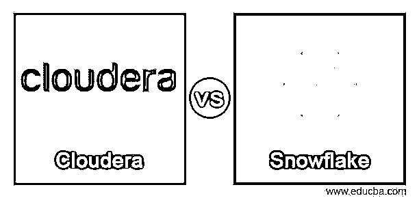
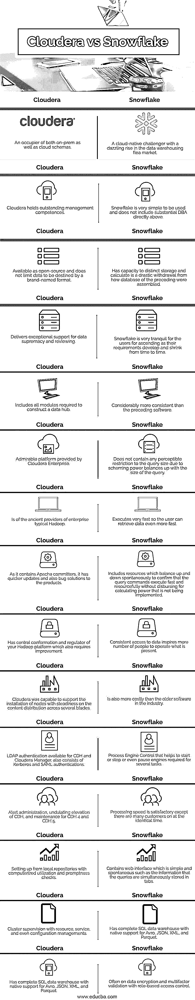

# Cloudera vs 雪花

> 原文：<https://www.educba.com/cloudera-vs-snowflake/>

## 云时代与雪花时代的定义

Cloudera 被定义为一个为大数据开发的企业平台。这个 Cloudera 企业由 CDH(众所周知是最流行的以开源 Hadoop 为中心的平台)组成，此外还有创新的系统控制和数据管理工具，以及来自我们世界一流的 Hadoop 开发人员和专家团队的更坚定的支持和公共推广。

另一方面，雪花被认为是为云构建的数据仓库，有助于消除过时的数据仓库和大数据平台的管理负担。雪花被定义为一个精确的数据仓库，表示亚马逊网络服务(AWS)上的一个连续服务，它不包括要转动的把手和要成功的子结构。

<small>Hadoop、数据科学、统计学&其他</small>

### Cloudera 与 Snowflake 的直接对比(信息图)

以下是 Cloudera 与雪花之间的 15 大对比:

### Cloudera 与 Snowflake 对比表

| **Cloudera** | **雪花** |
| 本地模式和云模式的用户。 | 一个在数据仓库跳蚤市场上令人眼花缭乱地崛起的云原生挑战者。 |
| Cloudera 拥有出色的管理能力 | 雪花是非常简单的使用，并不包括大量的 DBA 直接以上 |
| 作为开放源代码提供，并且不限制数据以品牌命名的格式为目的地。 | 具有独特的存储和计算能力，是对之前数据库组装方式的重大改变。 |
| 为数据优势和审查提供出色的支持。 | 雪花对于提升的用户来说是非常平静的，因为他们的需求不时地发展和收缩 |
| 包括构建数据中心所需的所有模块 | 比之前的软件更加一致 |
| Cloudera Enterprise 提供的卓越平台 | 不包含对查询大小的任何可察觉的限制，因为计划的能力与查询的大小相平衡。 |
| 是企业典型 Hadoop 的古老提供商。 | 执行速度非常快，因此用户可以更快地检索数据 |
| 因为它包含 Apache 提交者，所以它有更快的更新和产品的错误解决方案 | 包括自发地向上和向下平衡的资源，以确认查询命令快速且有资源地执行，而无需支付未实现的计算能力。 |
| 具有您的 Hadoop 平台的中央配置和调节器，这也需要改进 | 对数据的一致访问激励更多的人去操作现有的东西。 |
| Cloudera 能够支持跨多个刀片稳定地安装内容分发节点。 | 也比行业中的旧软件更昂贵 |
| LDAP 身份验证可用于 CDH 和 Cloudera Manager，也包括 Kerberos 和 SAML 身份验证。 | 流程引擎控制，帮助启动、停止甚至暂停几项任务所需的引擎。 |
| 警报管理，CDH 起伏的海拔，以及 CDH 4 和 CDH 5 的维护。 | 处理速度是令人满意的，除了有许多客户在同一时间。 |
| 通过计算机化的利用和及时性检查从本地储存库建立。 | 包含简单和自然的 web 界面，例如查询同时存储在选项卡中的信息。 |
| 通过资源、服务甚至配置管理进行集群监控 | 拥有完整的 SQL 数据仓库，支持 Avro、JSON、XML 和 Parquet |
| 使用 Cloudera navigator 数据控制进行观察和诊断。 | 通常使用基于角色的访问控制进行数据加密和多因素验证 |

### Cloudera 与雪花的主要区别

在评估了将数据和分析能力加速到云位置以实现对数据存储和计算的极其可访问、灵活和经济高效的替代的两种解决方案之后，审查者发现雪花数据仓库更易于实施、部署和管理。因此，评论者也普遍希望应用雪花做生意。

这两种技术的几个不同点如下:

用户感到雪花遇到的业务需求比 Cloudera 企业增强了。

基于正在进行的产品供应的关联质量，得出的结论是雪花是最受欢迎的选择。

为了支持功能路线图和更新，许多评论者选择了雪花仓库的方向，而不是使用 Cloudera。

Cloudera 提供服务、软件和支持，由内部和众多云供应商提供的五个组件组成。

Cloudera 的特征是大数据分析、关键值数据库和大数据集成平台，而 Snowflake 的特征是数据库管理系统，即 DBMS 和柱状数据库。

Cloudera Enterprise 中包含的工具被激活，以便我们执行持续的促销活动并观察集群。

可以灵活计算甚至更多的供应订阅费用，并期待 Impala 和 Oozia 的合并。

随着 Scala、Python 或 Java 在这个雪花基础仓库上的本地执行的补充，雪花在前沿分析实践案例中仍有发展的空间。

对于那些有 RDBMS 背景的客户来说，Snowflake 可能有点不直观，因为很少有想法被认为是重大的偏离。

此外，雪花并不特别适合于 OLTP 场景等用例中的几个数据库。

在 Snowflake 中，如果在相似的时间系统上有几个客户，性能可能会有所不同，或者可能会产生问题。此外，雪花的支持可能偶尔是坚定的范围。

雪花已经成为第四个竞争者，它提供了驻留在所有主流选项之间的独特功能合并，因为数据仓库在行业中是一个不精确的术语。

Cloudera 数据平台(即 CDP)结合了 Hortonworks 的最佳技术以及 Cloudera 交付行业初始企业数据云的技能。

CDP 提供了 IT 和数据领导者要求的有影响力的自助服务分析、对角混合和多种云设置，以及有教养的粒状安全和优势策略。

### 结论

云企业和雪花可以说是技术堆栈的“大数据即服务”类别，其中 Cloudera 提供了一个值得信赖的数据服务提供商，而雪花则定义了专业知识 spotlight 向云转移的一个功能良好的产品。

因此，我们开始了解两个知名平台之间的差异，这两个平台目前由最广泛的开发人员团队和专家组运行。

### 推荐文章

这是 Cloudera vs Snowflake 的指南。这里我们讨论信息图和比较表的主要区别。您也可以看看以下文章，了解更多信息–

1.  [网页 vs 网站](https://www.educba.com/webpage-vs-website/)
2.  [PhoneGap vs Ionic](https://www.educba.com/phonegap-vs-ionic/)
3.  [Docker 容器 vs 图片](https://www.educba.com/docker-containers-vs-images/)
4.  [Korn Shell vs Bash](https://www.educba.com/korn-shell-vs-bash/)

