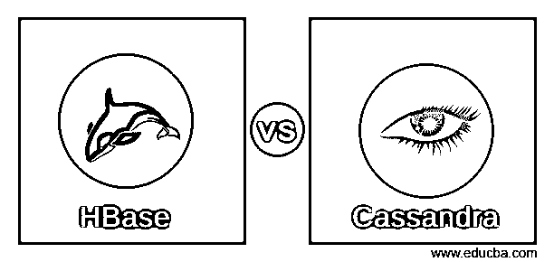
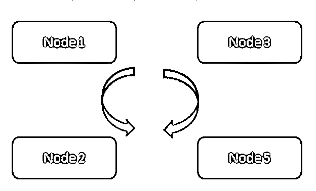
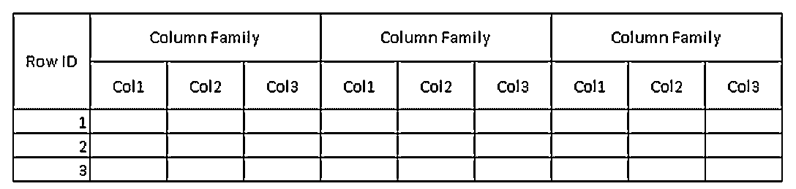
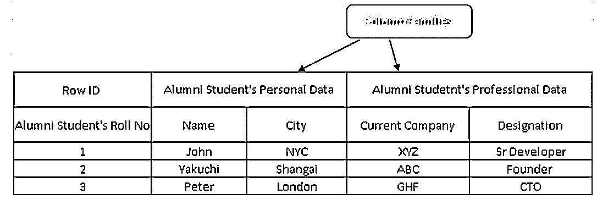
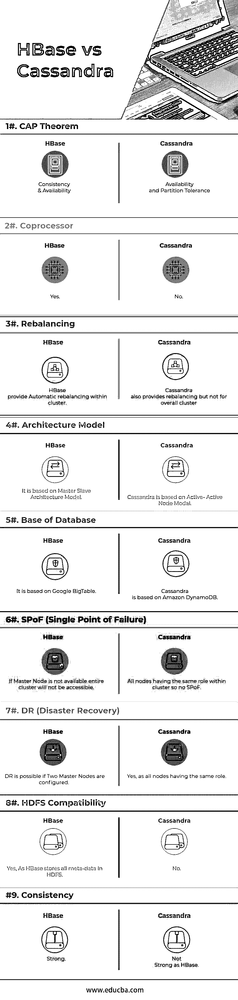

# HBase vs 卡桑德拉

> 原文：<https://www.educba.com/hbase-vs-cassandra/>

## 【HBase 与 Cassandra 的区别

[HBase 是一个数据库](https://www.educba.com/what-is-hbase/)，它使用 Hadoop 分布式文件系统进行存储。HBase 是 HDFS 的重要组成部分，运行在 Hadoop 集群之上。HBase 不是传统的关系数据库，它需要不同的数据建模方法。Cassandra 使用数据复制模型，因此在任何节点不可用的情况下，都不会丢失数据。Cassandra 是一个分布式数据库，意味着客户端可以从任何群集和任何节点访问数据

### 卡桑德拉

它是由脸书发起的，因为它总是在应用程序的需求上。Cassandra 始于 2005 年，于 2008 年向公众开放。Cassandra 是为永远在线的应用程序开发的，如脸书和 Twitter 这样的社交网络。

<small>Hadoop、数据科学、统计学&其他</small>

Cassandra 基于**“永远在线”**架构，采用主动-主动节点模式，因此不存在单点故障。CQL (Cassandra 查询语言)[是 Cassandra 的查询语言，但是语法](https://www.educba.com/is-cassandra-nosql/)与 [SQL](https://www.educba.com/courses/all/sql-technology/) 相同。它支持所有主流操作系统，如 Linux、Unix、OSX 和 windows。

**始终开启:**

[Cassandra 是一个具有分布模型的数据库](https://www.educba.com/what-is-cassandra/)，集群中的所有节点都是相同的。数据在可配置的节点上复制，因此在一些节点出现故障的情况下，不会导致数据丢失。

**(始终开启模式)**

**

** 

在**图 1** 中，所有四个节点彼此同步&复制集群内的数据。所有这些都采用主动-主动模式，因此任何节点故障都不会导致数据丢失。客户端可以从剩余的可用节点中读取数据。

### HBase

HBase 是一个基于 [NoSQL](https://www.educba.com/software-development/courses/sql-training-certification/) 的数据库，设计用于处理具有数十亿行、数百万列的大型表中的查询，并在一个商用/普通硬件集群上运行。它以**键/值存储**的速度为您提供实时查询功能。****

 ****HBase 实际上基于四维数据模型。

*   行 ID/行键
*   柱族。
*   键值对。

(图 2，HBase 中表的示例模式。)

在图 2 中，表是列族的集合&列族是列的集合。列是键值对的集合

(图 3，HBase 中的示例表)

在图 3 中，列 families 是校友学生数据的集合，行 id(行键)包含学生的学号。

事实上，行键包含列族数据的唯一值。通过使用行键，可以提取全部细节，这就是面向列的数据库比传统数据库快得多的原因。

Apache HBase 可用于随机读/写访问，并提供故障支持。它还支持复制&在分布式数据库模型上工作。

### HBase 和 Cassandra 的对比(信息图表)

以下是 HBase 和 Cassandra 的 9 大区别:

### HBase 和 Cassandra 的主要区别

以下是要点列表，描述了 HBase 和 Cassandra 之间的主要区别:

1)对于内部节点通信， [Cassandra 使用 GOSSIP 协议](https://www.educba.com/install-cassandra/)而 HBase 基于 Zookeeper。GOSSIP 协议的服务与 Cassandra 集成在一起，Zookeeper 是一个完全独立的分发应用程序。

2)在 Cassandra 架构中，所有节点都作为主动节点工作，而 HBase architect 遵循主从节点模型。在主动-主动节点模型中，没有 SPoF(单点故障)。在 HBase 中，如果主节点出现故障，整个群集将无法访问。

3) HBase 支持[二叉树](https://www.educba.com/what-is-a-binary-tree-in-java/)搜索模型虽然 Cassandra 不支持没有 B 树的 B 树模型，但是你不能为每个在 4 月有纪念日的人搜索用户的列族，而你可以搜索每个在 4 月有纪念日的住在北京的人。

4) HBase，支持 C，C++，Java，Python，Scala 脚本语言，同时 Cassandra 也支持 JavaScript & Ruby。

5) HBase 有一个称为协处理器的功能，而 Cassandra 目前还没有这样的功能。协处理器为在 HBase 区域服务器和主进程中执行用户代码提供了库和运行时环境。

6) HBase 旨在支持数据仓库，而 Cassandra 将非常适合所有时间运行的应用程序，如 [Web](https://www.educba.com/courses/all/web-design-courses/) 和[移动应用程序。](https://www.educba.com/mobile-application-testing-basics/)

7) HBase 查询语言是一种自定义语言，需要[学习，而 Cassandra](https://www.educba.com/cassandra-data-modeling/) 使用自己开发的 [CQL (Cassandra 查询语言)](https://www.educba.com/cassandra-query-language/)，这是一种类似于 [SQL](https://www.educba.com/is-sql-microsoft/) 的语言

8)管理 [Cassandra 比 HBase](https://www.educba.com/what-is-cassandra/) 容易得多。在 Cassandra 中，每个节点需要运行一个 Java 进程，而对于 HBase，需要完全可操作的 HDFS、几个 HBase 进程和 Zookeeper 系统。

9) HBase 支持端到端校验和以及自动重新平衡，而 Cassandra 不支持整个集群的重新平衡。

10)基于“ **CAP 定理”**，Cassandra 工作于 AP 模型，HBase 为 CP 模型。

**上限定理**

这个[定理用于](https://www.educba.com/cap-theorem/)分布式系统。c 代表一致性，A 代表可用性& P 代表分区容忍度。上限定理解释如下:

**C(一致性):**一致性是指如果有人向数据库写入了一个值，其他人可以立即读取相同的值。

**A** (可用性) **:** 可用性是指如果您的集群中的一些节点不可用(由于某些问题，节点停止运行/不在集群中)，不会影响整个集群，分布式系统/数据库将可以访问数据。所有类型的任务都可以访问群集。

**P(分区容差):**分区容差是指如果一个数据中心仍然出现故障，不应该影响节点上的数据，并且所有数据应该可以随时访问。也就是说，分区容差允许将数据更好地复制到集群环境中的其他数据中心。

### HBase 和 Cassandra 对照表

下面是 HBase 和 Cassandra 的对比表。

| **分** | **HBase** | 卡桑德拉 |
| **上限定理** | 一致性和可用性 | 可用性和分区容差 |
| **协处理器** | 是 | 不 |
| **再平衡** | HBase 提供集群内的自动重新平衡。 | Cassandra 还提供重新平衡，但不是针对整个集群 |
| **架构模型** | 它基于主从结构模型 | Cassandra 基于主动-主动节点模式 |
| **数据库的基础** | 它基于 Google BigTable | Cassandra 基于亚马逊 DynamoDB |
| **SPoF(单点故障)** | 如果主节点不可用，整个群集将无法访问 | 所有节点在群集内具有相同的角色，因此没有 SPoF |
| **灾难恢复(DR)** | 如果配置了两个主节点，灾难恢复是可能的。 | 是的，因为所有节点都具有相同的角色 |
| **HDFS 兼容性** | 是的，因为 HBase 在 HDFS 存储所有元数据 | 不 |
| **一致性** | 强烈的 | 不如 HBase 强大 |

### 结论

脸书&另一个社交网络方面更喜欢 HBase(早先双方都在使用 Cassandra，参考脸书[帖子](https://www.facebook.com/notes/facebook-engineering/the-underlying-technology-of-messages/454991608919/))因为它的可用性另一方银行领域部门为其每笔金融交易寻求安全，所以他们会选择 Cassandra 而不是 HBase。

Cassandra 的主要特征包括高可用性、最少的管理和无 SPoF(单点故障)。另一方面，HBase 有利于以线性可伸缩性更快地读写数据。

威瑞森、彭博、美洲银行等公司都在使用 HBase，而 Cassandra 则被 Twitter、脸书等主要社交网站使用

我们不能断定哪一个是最好的，HBase 和 Cassandra 都有自己的优点和缺点。在生产环境中可以看到 HBase 和 Cassandra 数据库的实际性能。

### 推荐文章

这是 HBase vs Cassandra 的指南。在这里，我们讨论了 HBase 与 Cassandra 的直接比较、关键差异以及信息图和比较表。您也可以阅读以下文章，了解更多信息——

1.  [Hadoop vs Apache Spark——你需要知道的有趣事情](https://www.educba.com/hadoop-vs-apache-spark/)
2.  [如何破解 Hadoop 开发者面试？](https://www.educba.com/hadoop-developer-interview-questions/)
3.  [五大大数据趋势](https://www.educba.com/trends-of-big-data/)
4.  [大数据分析的 5 大挑战](https://www.educba.com/challenges-of-big-data-analytics/)

****